# 🚀 frys - 现代化工作流管理系统

<div align="center">

<br>


[](https://github.com/zycxfyh/frys/actions)
[](https://codecov.io/gh/zycxfyh/frys)
[](https://www.npmjs.com/package/frys)
[](https://github.com/zycxfyh/frys/stargazers)

<br>

<h1 style="border: none; background: linear-gradient(45deg, #667eea 25%, transparent 25%), linear-gradient(-45deg, #667eea 25%, transparent 25%), linear-gradient(45deg, transparent 75%, #667eea 75%), linear-gradient(-45deg, transparent 75%, #667eea 75%); background-size: 20px 20px; background-position: 0 0, 0 10px, 10px -10px, -10px 0px; -webkit-background-clip: text; -webkit-text-fill-color: transparent; background-clip: text;">🌟 基于优秀开源项目的轻量化企业级工作流平台 🌟</h1>

<p><em>站在巨人肩膀上，集成业界领先开源解决方案，构建高性能、可扩展的企业级工作流管理系统</em></p>

<br>

[🚀 快速开始](GETTING_STARTED.md) • [📖 完整文档](docs/) • [🐛 问题反馈](https://github.com/zycxfyh/frys/issues) • [💬 社区讨论](https://github.com/zycxfyh/frys/discussions)

[](https://opensource.org/licenses/MIT)
[](CONTRIBUTING.md)
[](https://github.com/prettier/prettier)

---

</div>

## ✨ 项目特色

<div align="center">

<table>
  <tr>
    <td align="center" width="25%">
      <h3>🪶 轻量化设计</h3>
      <p>模块化 + 可配置，资源占用最小化</p>
    </td>
    <td align="center" width="25%">
      <h3>🔄 可迁移性</h3>
      <p>容器化 + 标准化，环境间无缝迁移</p>
    </td>
    <td align="center" width="25%">
      <h3>🎛️ 高度适配</h3>
      <p>功能开关 + 插件系统，灵活适配需求</p>
    </td>
    <td align="center" width="25%">
      <h3>📦 模块化架构</h3>
      <p>微服务化 + 组件化，易于维护扩展</p>
    </td>
  </tr>
</table>

</div>

## 🪶 轻量化功能特性

### ⚡ 轻量化启动模式

frys提供了多种启动模式，支持不同场景的资源优化：

```bash
# 完整模式 - 全部功能启用
npm run light:start

# 微服务模式 - 最小化依赖，快速启动
LIGHT_MODE=micro npm run light:start

# 最小化模式 - 禁用非必要功能
LIGHT_MODE=minimal npm run light:start
```

### 🏗️ 轻量化构建系统

基于esbuild的现代化构建，支持多目标编译：

```bash
# Node.js构建
npm run light:build

# 浏览器构建
BUILD_TARGET=browser npm run light:build

# 多目标构建
BUILD_TARGET=both npm run light:build
```

### 🧪 智能测试策略

根据环境和需求选择合适的测试策略：

```bash
# 智能测试 - 根据变更自动选择测试范围
npm run light:test

# 快速测试 - 只运行关键测试
TEST_MODE=fast npm run light:test

# 完整测试 - 运行所有测试类型
TEST_MODE=full npm run light:test
```

### 🚀 零停机部署

支持多种部署策略，确保服务连续性：

```bash
# 滚动部署
npm run light:deploy

# 蓝绿部署
DEPLOY_STRATEGY=blue-green npm run light:deploy

# 金丝雀部署
DEPLOY_STRATEGY=canary npm run light:deploy
```

### 🔍 模块化健康检查

全面的系统健康监控和诊断：

```bash
# 完整健康检查
npm run module:check

# 快速健康检查
npm run quality:quick

# 开发环境监控
npm run test:stability
```

## 📋 轻量化配置系统

### 环境自适应配置

```javascript
// config/lightweight.config.js
import { generateLightweightConfig } from './config/lightweight.config.js';

const config = generateLightweightConfig();

// 自动适配不同环境
console.log(config.environment); // { env: 'development', isDev: true, ... }
console.log(config.adapters);    // { database: 'sqlite', cache: 'memory', ... }
```

### 功能开关控制

```javascript
// 按需启用功能
const features = {
  ai: process.env.ENABLE_AI !== 'false',
  monitoring: process.env.ENABLE_MONITORING !== 'false',
  security: process.env.ENABLE_SECURITY !== 'false'
};
```

## 🏗️ 企业级架构
      <p>完整的DevOps流程，99.9%可用性保障</p>
    </td>
  </tr>
</table>

</div>

### 🏆 核心优势

- **🔧 集成优秀开源项目**: Axios、Bull.js、Sentry等业界领先解决方案
- **📦 开箱即用**: 内置工作流引擎、用户管理、权限控制等企业级功能
- **🧪 完整测试体系**: 单元测试、集成测试、E2E测试覆盖率90%+
- **🐳 云原生支持**: Docker容器化，Kubernetes部署就绪
- **📊 可观测性**: Prometheus监控，Grafana可视化面板

---

## 🚀 快速开始

### 📦 安装

```bash
# 克隆项目
git clone https://github.com/zycxfyh/frys.git
cd frys

# 安装依赖
npm install

# 启动开发环境
npm run dev
```

### 🎮 基本使用

```javascript
import { WorkflowEngine, UserService } from 'frys';

// 创建工作流引擎
const engine = new WorkflowEngine();

// 定义简单工作流
const workflow = {
  name: '用户注册流程',
  steps: [
    {
      id: 'validate-input',
      name: '验证输入',
      type: 'validation',
      config: { required: ['email', 'password'] },
    },
    {
      id: 'create-user',
      name: '创建用户',
      type: 'service',
      config: { service: 'userService.createUser' },
    },
  ],
};

// 执行工作流
const result = await engine.execute(workflow, {
  email: 'user@example.com',
  password: 'secure123',
});
```

> 💡 **更多示例**: 查看 [完整快速开始指南](GETTING_STARTED.md)

---

## 📊 系统架构

<div align="center">



</div>

### 🏗️ 核心技术栈

| 组件           | 技术选型   | 说明                  |
| -------------- | ---------- | --------------------- |
| **Web框架**    | Fastify    | 高性能Node.js Web框架 |
| **依赖注入**   | Awilix     | 轻量级DI容器          |
| **HTTP客户端** | Axios      | 企业级HTTP请求库      |
| **消息队列**   | Bull.js    | Redis驱动的任务队列   |
| **数据库**     | PostgreSQL | 关系型数据库          |
| **缓存**       | Redis      | 高性能缓存存储        |
| **监控**       | Sentry     | 错误追踪和性能监控    |

> 📖 **详细架构文档**: [系统架构设计](docs/architecture/system-architecture.md)

---

## 📖 文档与资源

- **[完整文档](docs/)** - 详细的使用指南和 API 文档
- **[架构设计](docs/architecture/)** - 系统架构和技术决策
- **[部署指南](docs/deployment/)** - 生产环境部署说明
- **[开发指南](docs/development/)** - 开发环境设置和贡献指南

---

## 📈 项目状态

<div align="center">

### 🎯 当前版本: v1.0.0

| 状态            | 说明                           | 进度   |
| --------------- | ------------------------------ | ------ |
| ✅ **核心架构** | 依赖注入、工作流引擎、插件系统 | 100%   |
| ✅ **基础功能** | 用户管理、工作流执行、API服务  | 95%    |
| 🚧 **AI集成**   | 多供应商AI API管理             | 80%    |
| 🚧 **高级功能** | 记忆系统、实时通信             | 60%    |
| 📋 **企业功能** | SSO、审计、多租户              | 规划中 |

> 📊 **详细状态**: 查看 [项目状态面板](STATUS.md)

</div>

---

## 🤝 社区与贡献

我们欢迎各种形式的贡献！请查看我们的 [贡献指南](CONTRIBUTING.md) 了解详细信息。

### 💡 贡献方式

- 🐛 [报告 Bug](https://github.com/zycxfyh/frys/issues/new?template=bug-report.md)
- 💡 [提出功能请求](https://github.com/zycxfyh/frys/issues/new?template=feature-request.md)
- 📚 [改进文档](https://github.com/zycxfyh/frys/issues/new?template=documentation.md)
- 🚀 [提交 Pull Request](https://github.com/zycxfyh/frys/compare)

### 📜 行为准则

本项目采用 [贡献者公约](CODE_OF_CONDUCT.md) 作为行为准则。

---

## 📄 许可证

本项目采用 [MIT 许可证](LICENSE)。

---

_最后更新: 2025年11月_
