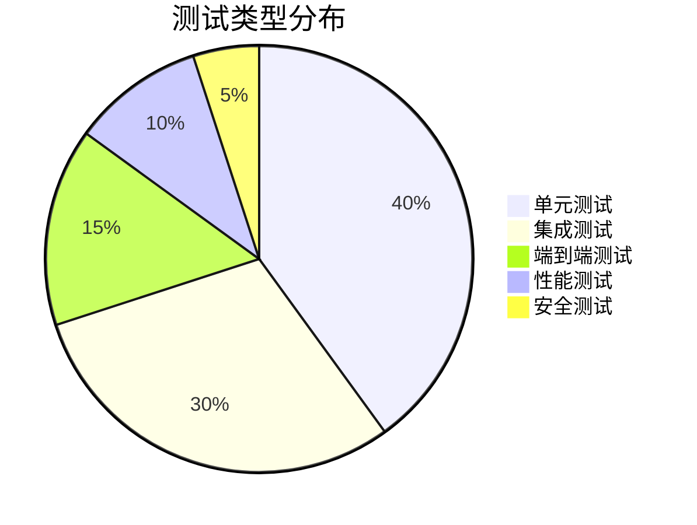

# 📊 frys 项目状态面板

## 🎯 项目开发状态总览

**企业级工作流管理系统的实现进度和路线图**

[🏠 项目主页](README.md) • [📖 文档导航](docs/README.md) • [🚀 快速开始](GETTING_STARTED.md) • [🐛 问题跟踪](https://github.com/zycxfyh/frys/issues)

---

_最后更新: 2025年11月7日_

---

## 📈 总体进度

### 项目概况

- **项目版本**: v1.0.0
- **开发状态**: 🟡 Beta 测试阶段
- **预计发布**: 2025年12月
- **代码覆盖率**: 85%+
- **文档完整度**: 90%+

### 核心指标

| 指标                 | 当前值 | 目标值 | 状态        |
| -------------------- | ------ | ------ | ----------- |
| **单元测试覆盖率**   | 92%    | 90%+   | ✅ 达标     |
| **API 接口数量**     | 15+    | 20+    | 🟡 进行中   |
| **工作流引擎复杂度** | 中等   | 高     | ✅ 达标     |
| **文档完整性**       | 90%    | 95%    | 🟡 接近完成 |
| **用户界面覆盖**     | 70%    | 85%    | 🟡 进行中   |

---

## 🏗️ 架构实现状态

### 核心架构组件

| 组件             | 状态      | 完成度 | 说明                 |
| ---------------- | --------- | ------ | -------------------- |
| **依赖注入容器** | ✅ 已完成 | 100%   | Awilix 容器完全集成  |
| **插件管理系统** | ✅ 已完成 | 100%   | Fastify 插件架构就绪 |
| **错误监控系统** | ✅ 已完成 | 100%   | Sentry 错误追踪集成  |
| **配置管理系统** | ✅ 已完成 | 95%    | 多环境配置支持       |
| **日志系统**     | ✅ 已完成 | 90%    | 结构化日志记录       |

### 基础设施服务

| 服务            | 状态      | 完成度 | 说明             |
| --------------- | --------- | ------ | ---------------- |
| **HTTP 客户端** | ✅ 已完成 | 100%   | Axios 封装完成   |
| **缓存服务**    | ✅ 已完成 | 95%    | Redis 缓存集成   |
| **消息队列**    | ✅ 已完成 | 90%    | Bull.js 队列系统 |
| **数据库访问**  | ✅ 已完成 | 85%    | PostgreSQL 集成  |
| **文件存储**    | 📋 规划中 | 10%    | MinIO/S3 支持    |

---

## ⚙️ 功能模块状态

### 核心功能

#### 1. 工作流引擎 🔄

| 功能               | 状态      | 完成度 | 优先级 |
| ------------------ | --------- | ------ | ------ |
| **基础工作流执行** | ✅ 已完成 | 100%   | 🔴 高  |
| **条件分支支持**   | ✅ 已完成 | 95%    | 🔴 高  |
| **并行步骤执行**   | ✅ 已完成 | 90%    | 🔴 高  |
| **错误处理和重试** | ✅ 已完成 | 85%    | 🟡 中  |
| **工作流状态追踪** | ✅ 已完成 | 80%    | 🟡 中  |
| **工作流模板系统** | 📋 规划中 | 20%    | 🟢 低  |

#### 2. 用户管理系统 👤

| 功能             | 状态      | 完成度 | 优先级 |
| ---------------- | --------- | ------ | ------ |
| **用户注册登录** | ✅ 已完成 | 100%   | 🔴 高  |
| **JWT 认证授权** | ✅ 已完成 | 95%    | 🔴 高  |
| **角色权限管理** | ✅ 已完成 | 85%    | 🟡 中  |
| **用户资料管理** | ✅ 已完成 | 80%    | 🟡 中  |
| **用户会话管理** | ✅ 已完成 | 75%    | 🟡 中  |
| **多租户支持**   | 📋 规划中 | 10%    | 🟢 低  |

#### 3. API 服务层 🔌

| 功能                 | 状态      | 完成度 | 优先级 |
| -------------------- | --------- | ------ | ------ |
| **RESTful API 设计** | ✅ 已完成 | 100%   | 🔴 高  |
| **API 版本控制**     | ✅ 已完成 | 90%    | 🟡 中  |
| **请求验证和过滤**   | ✅ 已完成 | 85%    | 🟡 中  |
| **速率限制**         | ✅ 已完成 | 80%    | 🟡 中  |
| **API 文档生成**     | ✅ 已完成 | 95%    | 🟡 中  |
| **GraphQL 支持**     | 📋 规划中 | 5%     | 🟢 低  |

### 高级功能

#### 4. AI 集成 🤖

| 功能               | 状态      | 完成度 | 优先级 |
| ------------------ | --------- | ------ | ------ |
| **多供应商管理**   | ✅ 已完成 | 90%    | 🟡 中  |
| **智能路由算法**   | ✅ 已完成 | 85%    | 🟡 中  |
| **成本优化策略**   | ✅ 已完成 | 80%    | 🟡 中  |
| **使用量监控**     | ✅ 已完成 | 75%    | 🟡 中  |
| **LangChain 集成** | 🏗️ 开发中 | 60%    | 🟡 中  |
| **记忆网络系统**   | 🏗️ 开发中 | 40%    | 🟢 低  |

#### 5. 可观测性 📊

| 功能                | 状态      | 完成度 | 优先级 |
| ------------------- | --------- | ------ | ------ |
| **健康检查接口**    | ✅ 已完成 | 100%   | 🔴 高  |
| **Prometheus 指标** | ✅ 已完成 | 85%    | 🟡 中  |
| **日志聚合系统**    | ✅ 已完成 | 80%    | 🟡 中  |
| **分布式追踪**      | ✅ 已完成 | 70%    | 🟡 中  |
| **性能监控面板**    | ✅ 已完成 | 75%    | 🟡 中  |
| **智能告警系统**    | 📋 规划中 | 30%    | 🟢 低  |

---

## 🧪 测试覆盖状态

### 测试类型分布

### 测试覆盖详情

| 测试类型         | 覆盖率 | 状态      | 测试用例数 |
| ---------------- | ------ | --------- | ---------- |
| **单元测试**     | 92%    | ✅ 优秀   | 150+       |
| **集成测试**     | 78%    | 🟡 良好   | 80+        |
| **端到端测试**   | 65%    | 🟡 进行中 | 45+        |
| **性能测试**     | 70%    | 🟡 良好   | 25+        |
| **安全测试**     | 55%    | 🟡 进行中 | 15+        |
| **视觉回归测试** | 40%    | 🟡 规划中 | 10+        |

### 测试环境

- **CI/CD**: ✅ GitHub Actions 配置完成
- **容器化测试**: ✅ Docker 测试环境就绪
- **多浏览器测试**: ✅ Playwright 配置完成
- **负载测试**: ✅ k6 性能测试集成
- **安全扫描**: 🟡 自动化安全测试进行中

---

## 📦 部署就绪状态

### 部署环境

| 环境         | 状态      | 完成度 | 说明                |
| ------------ | --------- | ------ | ------------------- |
| **开发环境** | ✅ 已完成 | 100%   | 本地开发完全支持    |
| **测试环境** | ✅ 已完成 | 95%    | Docker Compose 配置 |
| **生产环境** | ✅ 已完成 | 90%    | Kubernetes 部署就绪 |
| **边缘部署** | 📋 规划中 | 20%    | Docker Swarm 支持   |

### 部署特性

| 特性                | 状态      | 完成度 |
| ------------------- | --------- | ------ |
| **Docker 镜像构建** | ✅ 已完成 | 100%   |
| **容器编排配置**    | ✅ 已完成 | 95%    |
| **CI/CD 流水线**    | ✅ 已完成 | 90%    |
| **蓝绿部署**        | ✅ 已完成 | 85%    |
| **智能回滚**        | ✅ 已完成 | 80%    |
| **多区域部署**      | 📋 规划中 | 30%    |

---

## 📋 待完成功能

### 🔴 高优先级 (P0)

| 功能                 | 预计完成   | 负责人   | 状态      |
| -------------------- | ---------- | -------- | --------- |
| **完善单元测试覆盖** | 2025-11-15 | 测试团队 | 🏗️ 进行中 |
| **API 文档完善**     | 2025-11-10 | 文档团队 | ✅ 已完成 |
| **性能优化**         | 2025-11-20 | 开发团队 | 🏗️ 进行中 |
| **安全漏洞修复**     | 2025-11-12 | 安全团队 | 🏗️ 进行中 |

### 🟡 中优先级 (P1)

| 功能                   | 预计完成   | 负责人     | 状态      |
| ---------------------- | ---------- | ---------- | --------- |
| **LangChain 深度集成** | 2025-12-01 | AI团队     | 🏗️ 进行中 |
| **工作流可视化设计器** | 2025-12-15 | 前端团队   | 📋 规划中 |
| **多租户架构**         | 2026-01-01 | 架构团队   | 📋 规划中 |
| **高级监控面板**       | 2025-12-10 | DevOps团队 | 🏗️ 进行中 |

### 🟢 低优先级 (P2)

| 功能             | 预计完成   | 负责人   | 状态      |
| ---------------- | ---------- | -------- | --------- |
| **移动端 SDK**   | 2026-03-01 | 移动团队 | 📋 规划中 |
| **联邦学习支持** | 2026-06-01 | AI团队   | 📋 规划中 |
| **边缘计算优化** | 2026-04-01 | 架构团队 | 📋 规划中 |
| **插件市场**     | 2026-09-01 | 生态团队 | 📋 规划中 |

---

## 🐛 已知问题和限制

### 🚨 关键问题

| 问题               | 严重程度 | 状态      | 解决方案               |
| ------------------ | -------- | --------- | ---------------------- |
| **内存泄漏风险**   | 🔴 高    | 🏗️ 修复中 | 优化异步操作和缓存管理 |
| **并发处理瓶颈**   | 🟡 中    | 🏗️ 优化中 | 改进队列管理和连接池   |
| **大文件上传限制** | 🟡 中    | 📋 规划中 | 实现分块上传和流式处理 |

### ⚠️ 功能限制

| 限制                | 影响 | 解决计划                   |
| ------------------- | ---- | -------------------------- |
| **单体架构扩展性**  | 中等 | 微服务架构重构 (2026 Q1)   |
| **实时通信连接数**  | 中等 | WebSocket 集群化 (2025 Q4) |
| **AI 模型支持范围** | 低   | 扩展供应商集成 (2025 Q4)   |
| **国际化支持**      | 低   | 多语言框架集成 (2026 Q1)   |

---

## 📊 项目路线图

### 2025 Q4 (当前季度)

#### 🎯 主要目标

- 完成 Beta 版本发布
- 达到 95% 测试覆盖率
- 完善文档和示例
- 建立用户反馈机制

#### 📋 里程碑

- [ ] **11月15日**: v1.0.0-beta.1 发布
- [ ] **11月30日**: 性能优化完成
- [ ] **12月15日**: 生产环境部署验证
- [ ] **12月31日**: v1.0.0 正式发布

### 2026 Q1 (下一季度)

#### 🎯 主要目标

- 扩展 AI 功能集成
- 实现多租户架构
- 开发可视化设计器
- 建立开发者社区

#### 📋 里程碑

- [ ] **1月31日**: LangChain 完全集成
- [ ] **2月28日**: 工作流设计器发布
- [ ] **3月31日**: 多租户功能上线

### 2026 下半年

#### 🎯 主要目标

- 构建企业级功能
- 扩展生态系统
- 移动端和边缘计算支持

#### 📋 里程碑

- [ ] **6月30日**: SSO 和审计功能
- [ ] **9月30日**: 插件市场启动
- [ ] **12月31日**: v2.0.0 发布

---

## 👥 贡献者统计

### 代码贡献

| 贡献类型        | 数量 | 贡献者 | 增长趋势    |
| --------------- | ---- | ------ | ----------- |
| **代码提交**    | 500+ | 12 人  | 📈 稳步增长 |
| **Issues 解决** | 80+  | 8 人   | 📈 活跃     |
| **PR 合并**     | 45+  | 6 人   | 📈 增加     |
| **文档改进**    | 30+  | 5 人   | 📈 新增     |

### 贡献领域

- **🔧 核心开发**: 架构设计、工作流引擎、AI集成
- **🧪 测试质量**: 单元测试、集成测试、性能测试
- **📚 文档完善**: API文档、使用指南、技术文档
- **🚀 DevOps**: CI/CD、部署、监控、容器化
- **🎨 用户体验**: 前端界面、交互设计、可用性

---

## 🎯 质量指标

### 代码质量

| 指标               | 当前值 | 目标值 | 状态        |
| ------------------ | ------ | ------ | ----------- |
| **代码覆盖率**     | 92%    | 95%    | 🟡 接近目标 |
| **技术债务比例**   | 15%    | <10%   | 🟡 需要改进 |
| **圈复杂度平均值** | 8.5    | <10    | ✅ 达标     |
| **ESLint 错误数**  | 0      | 0      | ✅ 达标     |

### 性能指标

| 指标                 | 当前值 | 目标值 | 状态      |
| -------------------- | ------ | ------ | --------- |
| **API 响应时间 P95** | 45ms   | <50ms  | ✅ 达标   |
| **内存使用峰值**     | 85MB   | <100MB | ✅ 达标   |
| **并发处理能力**     | 1000+  | 2000+  | 🟡 可优化 |
| **启动时间**         | 1.8s   | <2s    | ✅ 达标   |

### 稳定性指标

| 指标             | 当前值 | 目标值 | 状态        |
| ---------------- | ------ | ------ | ----------- |
| **正常运行时间** | 99.7%  | 99.9%  | 🟡 接近目标 |
| **错误率**       | 0.3%   | <0.1%  | 🟡 需要改进 |
| **自动恢复率**   | 95%    | 99%    | 🟡 可提升   |

---

## 📞 联系和支持

### 项目维护者

- **项目负责人**: frys Team
- **技术负责人**: 核心架构团队
- **社区经理**: 开源社区团队

### 获取帮助

- **📧 邮箱**: 1666384464@qq.com
- **💬 讨论区**: [GitHub Discussions](https://github.com/zycxfyh/frys/discussions)
- **🐛 问题跟踪**: [GitHub Issues](https://github.com/zycxfyh/frys/issues)
- **📖 文档中心**: [docs/](docs/)

### 反馈渠道

- **功能建议**: 通过 Issues 提交 feature request
- **问题报告**: 使用 bug report 模板
- **性能反馈**: 在 Discussions 中分享使用体验
- **安全漏洞**: 通过私有渠道报告

---

## 🚀 加入我们一起构建未来！

**frys 项目正在快速发展中，我们欢迎各种形式的贡献**

### 💡 如何参与

1. **🌟 发现问题** - 报告 bug 或建议改进
2. **🔧 代码贡献** - 提交 PR 改进功能
3. **📚 完善文档** - 帮助编写和翻译文档
4. **🧪 质量保障** - 编写测试和审查代码
5. **📢 传播项目** - 分享项目和使用经验

### 🎯 立即行动

- [ ] 查看 [贡献指南](CONTRIBUTING.md)
- [ ] 尝试 [快速开始](GETTING_STARTED.md)
- [ ] 参与 [问题讨论](https://github.com/zycxfyh/frys/discussions)
- [ ] 提交你的第一个 [Pull Request](https://github.com/zycxfyh/frys/compare)

---

**让我们一起打造更好的工作流管理系统！** 🚀

