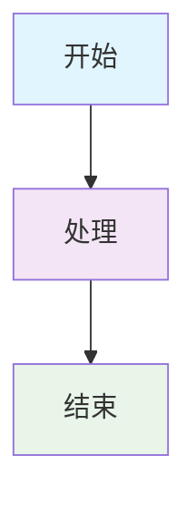
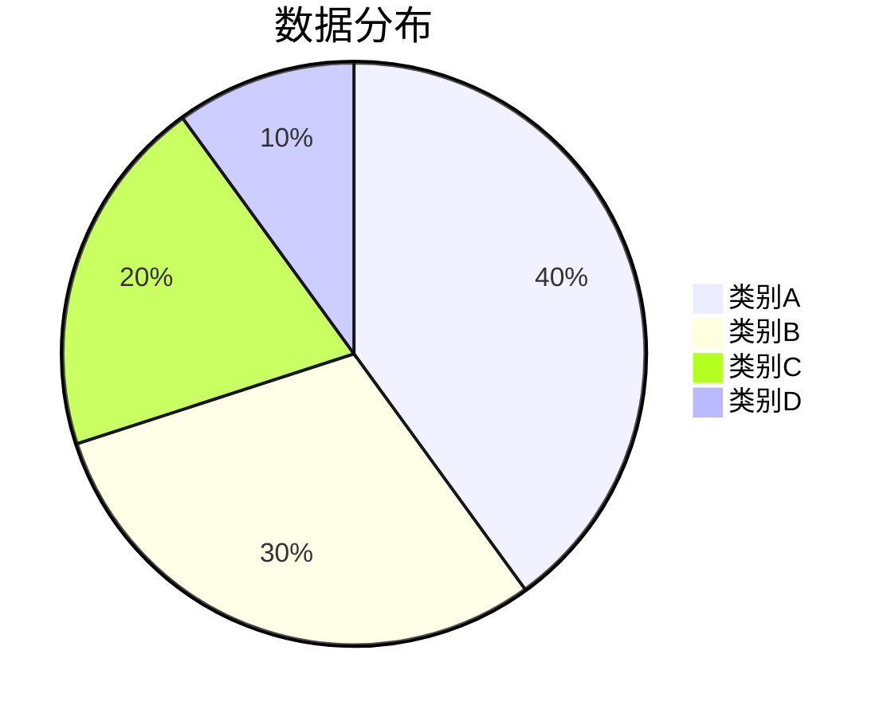
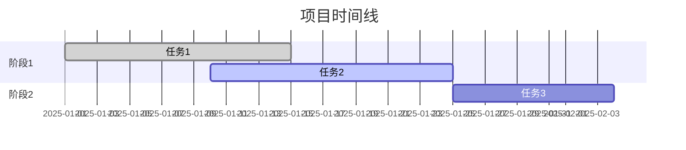

# 📝 frys 文档风格指南

<div align="center">

## 🎨 文档编写规范与最佳实践

**统一的文档格式和风格指南，确保高质量、一致性的文档体验**

[🏠 返回文档主页](README.md) • [📖 文档导航](README.md)

---

</div>

## 🎯 概述

本指南定义了 frys 项目文档的编写规范、格式标准和风格约定。遵循这些规范可以确保文档的一致性、可读性和专业性。

## 📋 基本原则

### 1. 内容优先

- **用户中心**: 以读者需求为导向
- **实用价值**: 提供可操作的实际指导
- **逻辑清晰**: 结构合理，层次分明

### 2. 格式统一

- **标准一致**: 使用统一的 Markdown 语法
- **样式规范**: 遵循预定义的格式约定
- **工具友好**: 支持自动化检查和生成

### 3. 持续维护

- **及时更新**: 功能变更时同步文档
- **版本对应**: 文档版本与代码版本对应
- **反馈循环**: 收集用户反馈持续改进

---

## 📝 Markdown 格式规范

### 文档结构

````markdown
# 📖 文档标题

<div align="center">

## 🌟 子标题

**描述性副标题**

[🏠 导航链接](#) • [📖 相关文档](#)

---

</div>

## 📋 主要内容

### 1. 一级章节

#### 1.1 二级章节

##### 1.1.1 三级章节

内容段落...

> 💡 **提示**: 重要的提示信息

```javascript
// 代码示例
console.log('Hello, World!');
```
````

### 2. 表格示例

| 列1   | 列2   | 列3   |
| ----- | ----- | ----- |
| 数据1 | 数据2 | 数据3 |

---

## 📊 图表规范

### Mermaid 图表



### 饼图



### 甘特图



---

## 🎨 视觉元素规范

### 图标使用

#### 功能图标

- 🎯 **目标/要点**
- 📋 **清单/步骤**
- ⚙️ **配置/设置**
- 🚀 **启动/执行**
- ✅ **完成/成功**
- ❌ **失败/错误**
- 💡 **提示/建议**
- ⚠️ **警告/注意**

#### 状态图标

- ✅ **已完成**
- 🏗️ **开发中**
- 📋 **规划中**
- 🟡 **进行中**
- 🔴 **高优先级**
- 🟢 **低优先级**

### 徽章规范

```markdown


```

### 颜色规范

#### 状态颜色

- 🔴 **红色**: 错误、危险、高风险
- 🟡 **黄色**: 警告、中等风险、进行中
- 🟢 **绿色**: 成功、安全、低风险
- 🔵 **蓝色**: 信息、一般状态

#### 主题颜色

- **主色**: #667eea (蓝色渐变)
- **辅助色**: #f093fb (粉色)
- **背景色**: #f8f9fa (浅灰)
- **文字色**: #333333 (深灰)

---

## 📏 格式约定

### 标题层级

```markdown
# 📖 一级标题 (文档标题)

## 🎯 二级标题 (主要章节)

### 📋 三级标题 (子章节)

#### 🔧 四级标题 (详细内容)

##### 📝 五级标题 (具体说明)

###### ℹ️ 六级标题 (补充信息)
```

### 列表格式

#### 无序列表

- **项目1**: 描述信息
- **项目2**: 描述信息
  - 子项目2.1
  - 子项目2.2
- **项目3**: 描述信息

#### 有序列表

1. **第一步**: 执行操作
2. **第二步**: 配置设置
3. **第三步**: 验证结果

#### 任务列表

- [x] 已完成的任务
- [ ] 进行中的任务
- [ ] 待完成的任务

### 引用块

#### 提示信息

> 💡 **提示**: 这是重要的提示信息

#### 警告信息

> ⚠️ **警告**: 这是一个重要的警告

#### 错误信息

> ❌ **错误**: 避免这样做

#### 成功信息

> ✅ **成功**: 操作完成

---

## 💻 代码规范

### 代码块格式

#### JavaScript/TypeScript

```javascript
// 正确的注释和格式
class UserService {
  constructor(dependencies = {}) {
    this.userRepository = dependencies.userRepository;
    this.logger = dependencies.logger;
  }

  async createUser(userData) {
    // 1. 输入验证
    const validatedData = await this.validateUserData(userData);

    // 2. 创建用户
    const user = await this.userRepository.create({
      ...validatedData,
      status: 'active',
    });

    return user;
  }
}
```

#### Shell 命令

```bash
# 正确的命令格式
# 1. 克隆项目
git clone https://github.com/zycxfyh/frys.git

# 2. 进入目录
cd frys

# 3. 安装依赖
npm install

# 4. 启动服务
npm run dev
```

#### JSON 配置

```json
{
  "name": "frys",
  "version": "1.0.0",
  "scripts": {
    "start": "node src/index.js",
    "dev": "node --watch src/index.js",
    "test": "vitest run"
  }
}
```

#### SQL 示例

```sql
-- 用户表创建
CREATE TABLE users (
  id UUID PRIMARY KEY DEFAULT gen_random_uuid(),
  email VARCHAR(255) UNIQUE NOT NULL,
  username VARCHAR(100) UNIQUE NOT NULL,
  password_hash VARCHAR(255) NOT NULL,
  role VARCHAR(50) NOT NULL DEFAULT 'user',
  status VARCHAR(20) NOT NULL DEFAULT 'active',
  created_at TIMESTAMP WITH TIME ZONE NOT NULL DEFAULT NOW(),
  updated_at TIMESTAMP WITH TIME ZONE NOT NULL DEFAULT NOW()
);

-- 创建索引
CREATE INDEX idx_users_email ON users(email);
CREATE INDEX idx_users_username ON users(username);
```

### 代码注释规范

```javascript
// ✅ 推荐的注释风格

/**
 * 用户服务类
 * 处理用户相关的业务逻辑
 */
class UserService {
  /**
   * 创建新用户
   * @param {Object} userData - 用户数据
   * @param {string} userData.email - 用户邮箱
   * @param {string} userData.password - 用户密码
   * @returns {Promise<User>} 创建的用户对象
   */
  async createUser(userData) {
    // 验证输入数据
    const validatedData = await this.validateUserData(userData);

    // 检查用户是否已存在
    const existingUser = await this.userRepository.findByEmail(
      validatedData.email,
    );
    if (existingUser) {
      throw new Error('用户已存在');
    }

    // 创建用户
    const user = await this.userRepository.create({
      ...validatedData,
      status: 'pending_verification',
    });

    return user;
  }
}
```

---

## 📊 表格规范

### 标准数据表格

| 属性          | 类型     | 必需 | 描述       |
| ------------- | -------- | ---- | ---------- |
| `id`          | `string` | ✅   | 唯一标识符 |
| `name`        | `string` | ✅   | 名称       |
| `description` | `string` | ❌   | 详细描述   |
| `createdAt`   | `Date`   | ✅   | 创建时间   |

### 状态表格

| 组件       | 状态      | 完成度 | 负责人 |
| ---------- | --------- | ------ | ------ |
| 用户服务   | ✅ 已完成 | 100%   | 张三   |
| 工作流引擎 | 🟡 进行中 | 80%    | 李四   |
| API 文档   | 📋 规划中 | 20%    | 王五   |

### 对比表格

| 特性   | 方案A | 方案B | 推荐  |
| ------ | ----- | ----- | ----- |
| 性能   | 高    | 中    | 方案A |
| 易用性 | 中    | 高    | 方案B |
| 成本   | 高    | 低    | 方案B |

---

## 🔗 链接规范

### 内部链接

```markdown
<!-- 相对链接 -->

[快速开始](../GETTING_STARTED.md)
[API 文档](api/README.md)

<!-- 锚点链接 -->

[安装要求](#安装要求)
[配置选项](#配置选项)
```

### 外部链接

```markdown
<!-- 完整的外部链接 -->

[GitHub 仓库](https://github.com/zycxfyh/frys)
[官方文档](https://docs.frys.dev)

<!-- 引用链接 -->

[Node.js 官网][nodejs]
[Docker 文档][docker]

[nodejs]: https://nodejs.org/
[docker]: https://docs.docker.com/
```

### 导航链接

```markdown
<!-- 页眉导航 -->

[🏠 返回主页](README.md) • [📖 文档导航](docs/README.md) • [🚀 快速开始](GETTING_STARTED.md)

## <!-- 页脚导航 -->

<div align="center">

[⬆️ 返回顶部](#) • [🏠 项目主页](../README.md) • [💬 讨论区](https://github.com/zycxfyh/frys/discussions)

</div>
```

---

## 📅 文档维护规范

### 版本管理

- **文档版本**: 与项目版本保持同步
- **更新频率**: 功能变更时及时更新
- **版本标记**: 在文档底部标注最后更新时间

```markdown
---

_最后更新: 2025年11月7日_
```

### 内容更新流程

1. **功能开发**: 同步编写或更新相关文档
2. **代码审查**: 包含文档变更的 PR 审查
3. **发布前检查**: 确保文档与代码版本一致
4. **用户反馈**: 根据用户反馈持续改进文档

### 文档审查清单

- [ ] 格式符合规范
- [ ] 内容准确无误
- [ ] 示例代码可运行
- [ ] 链接有效可用
- [ ] 图片正常显示
- [ ] 拼写和语法正确
- [ ] 结构逻辑清晰

---

## 🛠️ 工具和自动化

### 推荐工具

#### 编辑器插件

- **Markdown Preview**: 实时预览效果
- **Markdown Linter**: 检查格式规范
- **Prettier**: 自动格式化

#### 质量检查

```bash
# 使用 markdownlint 检查格式
npm install -g markdownlint-cli
markdownlint docs/**/*.md

# 使用 prettier 格式化
npx prettier --write docs/**/*.md
```

#### 文档生成

```bash
# 生成 API 文档
npx @apidevtools/swagger-markdown openapi.yaml

# 生成目录索引
npx doctoc README.md
```

### CI/CD 集成

```yaml
# .github/workflows/docs.yml
name: Docs Check
on: [push, pull_request]
jobs:
  docs:
    runs-on: ubuntu-latest
    steps:
      - uses: actions/checkout@v3
      - name: Check Markdown
        run: |
          npm install -g markdownlint-cli
          markdownlint docs/**/*.md --config .markdownlint.json
      - name: Format Check
        run: |
          npx prettier --check docs/**/*.md
```

---

## 📈 文档质量指标

### 可读性指标

- ** Flesch Reading Ease**: > 60 (容易阅读)
- **平均段落长度**: < 5 句
- **标题密度**: 每 300-500 字一个标题
- **列表使用率**: > 30% 的信息使用列表

### 完整性指标

- **功能覆盖率**: > 95% 的功能有对应文档
- **示例完整率**: > 80% 的 API 有使用示例
- **链接有效率**: 100% 的内部链接有效
- **更新及时率**: < 7 天的功能文档更新延迟

### 用户体验指标

- **平均阅读时间**: < 10 分钟/文档
- **用户满意度**: > 4.0/5.0
- **搜索成功率**: > 90%
- **反馈响应时间**: < 24 小时

---

## 🎯 常见问题

### Q: 如何保持文档风格一致？

**A**: 使用编辑器插件和自动化工具，定期进行格式检查，建立文档审查流程。

### Q: 文档应该写多详细？

**A**: 提供足够信息让用户完成任务，但避免过度细节。包含关键步骤、使用示例和故障排除。

### Q: 如何处理多语言文档？

**A**: 建立翻译流程，使用专门的翻译工具，确保术语一致性和本地化准确性。

### Q: 如何衡量文档质量？

**A**: 收集用户反馈，进行可用性测试，监控使用指标，定期进行质量评估。

---

<div align="center">

## 📚 相关资源

- **[文档导航](README.md)** - 完整的文档目录
- **[快速开始](../GETTING_STARTED.md)** - 新手入门指南
- **[贡献指南](../CONTRIBUTING.md)** - 如何参与文档改进

---

_最后更新: 2025年11月7日_

</div>
