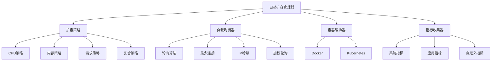

# 智能扩容策略

## 概述

frys 的智能扩容策略提供了一个完整的自动扩容解决方案，包括基于指标的扩容决策、多种负载均衡算法、容器编排集成以及实时监控和告警功能。该系统能够根据应用负载自动调整服务实例数量，确保高可用性和资源优化。

## 架构概览



## 核心组件

### 1. 自动扩容管理器 (AutoScalingManager)

负责协调整个扩容过程，包括指标监控、策略评估、扩容执行和状态管理。

**主要功能：**
- 启动和停止扩容监控
- 执行自动扩容/缩容决策
- 管理扩容历史和告警
- 提供手动扩容接口

**配置选项：**
```javascript
const autoScalingManager = new AutoScalingManager({
  serviceName: 'wokeflow-app',        // 服务名称
  minInstances: 1,                    // 最小实例数
  maxInstances: 10,                   // 最大实例数
  initialInstances: 2,                // 初始实例数
  policies: [cpuPolicy, memoryPolicy], // 扩容策略列表
  metricsInterval: 30000,             // 指标收集间隔(ms)
  healthCheckInterval: 30000,         // 健康检查间隔(ms)
  orchestrator: dockerOrchestrator     // 容器编排器实例
});
```

### 2. 扩容策略 (ScalingPolicy)

定义扩容决策的规则和阈值，支持多种预定义策略和自定义策略。

#### 内置策略

##### CPU 使用率策略
```javascript
const cpuPolicy = new CpuScalingPolicy({
  scaleUpThreshold: 0.75,    // CPU > 75% 时扩容
  scaleDownThreshold: 0.25,  // CPU < 25% 时缩容
  cooldownPeriod: 300000,    // 冷却期 5 分钟
  scaleFactor: 1.5           // 扩容倍数 1.5x
});
```

##### 内存使用率策略
```javascript
const memoryPolicy = new MemoryScalingPolicy({
  scaleUpThreshold: 0.80,    // 内存 > 80% 时扩容
  scaleDownThreshold: 0.30   // 内存 < 30% 时缩容
});
```

##### 请求率策略
```javascript
const requestPolicy = new RequestScalingPolicy({
  scaleUpThreshold: 0.85,    // 请求率 > 85% 时扩容
  scaleDownThreshold: 0.20   // 请求率 < 20% 时缩容
});
```

##### 复合策略
```javascript
const compositePolicy = new CompositeScalingPolicy([
  new CpuScalingPolicy({ scaleUpThreshold: 0.7 }),
  new MemoryScalingPolicy({ scaleUpThreshold: 0.8 })
]);
```

#### 自定义策略
```javascript
class CustomScalingPolicy extends ScalingPolicy {
  _calculateThreshold(metrics) {
    // 自定义指标计算逻辑
    return (metrics.cpuUsage * 0.4) + (metrics.memoryUsage * 0.4) + (metrics.errorRate * 0.2);
  }
}
```

### 3. 负载均衡器 (LoadBalancer)

负责在多个服务实例之间分配请求流量。

#### 支持的算法

##### 轮询 (Round Robin)
```javascript
const loadBalancer = new LoadBalancer({
  algorithm: 'round_robin'
});
```

##### 最少连接 (Least Connections)
```javascript
const loadBalancer = new LoadBalancer({
  algorithm: 'least_connections'
});
```

##### IP 哈希 (IP Hash)
```javascript
const loadBalancer = new LoadBalancer({
  algorithm: 'ip_hash'
});
```

##### 加权轮询 (Weighted Round Robin)
```javascript
const loadBalancer = new LoadBalancer({
  algorithm: 'weighted_round_robin'
});

// 添加带权重的实例
loadBalancer.addInstance('high-weight', 'http://localhost:3001', { weight: 3 });
loadBalancer.addInstance('low-weight', 'http://localhost:3002', { weight: 1 });
```

#### 健康检查
```javascript
await loadBalancer.startHealthChecks(); // 启动健康检查

const stats = loadBalancer.getStats();
console.log(`健康实例: ${stats.healthyInstances}/${stats.totalInstances}`);
```

### 4. 指标收集器 (ScalingMetrics)

收集系统和应用指标，用于扩容决策。

#### 系统指标
- CPU 使用率
- 内存使用率
- 磁盘 I/O
- 网络 I/O
- 系统负载

#### 应用指标
- 请求响应时间
- 请求错误率
- 请求率
- 活跃连接数

#### 自定义指标
```javascript
const metrics = new ScalingMetrics();

// 记录自定义指标
metrics.recordCustomMetric('queue_length', 150);
metrics.recordCustomMetric('cache_hit_rate', 0.85);

// 记录请求指标
metrics.recordRequest({
  responseTime: 250,
  statusCode: 200,
  method: 'GET',
  url: '/api/users'
});
```

### 5. 容器编排器 (ContainerOrchestrator)

抽象容器管理接口，支持多种编排平台。

#### Docker 实现
```javascript
const dockerOrchestrator = new DockerContainerOrchestrator({
  imageName: 'wokeflow-app:latest',
  basePort: 3000,
  containerPrefix: 'wokeflow-app-',
  network: 'wokeflow-network',
  environment: {
    NODE_ENV: 'production',
    DATABASE_URL: process.env.DATABASE_URL
  }
});

// 启动实例
const instance = await dockerOrchestrator.startInstance('wokeflow-app', {
  index: 1
});

// 停止实例
await dockerOrchestrator.stopInstance(instance.id);
```

## 使用指南

### 基本设置

1. **初始化组件**
```javascript
import { AutoScalingManager } from './infrastructure/scaling/AutoScalingManager.js';
import { CpuScalingPolicy, MemoryScalingPolicy } from './infrastructure/scaling/ScalingPolicy.js';
import { DockerContainerOrchestrator } from './infrastructure/scaling/DockerContainerOrchestrator.js';

// 创建编排器
const orchestrator = new DockerContainerOrchestrator({
  imageName: 'wokeflow-app:latest',
  basePort: 3000
});

// 创建扩容策略
const cpuPolicy = new CpuScalingPolicy();
const memoryPolicy = new MemoryScalingPolicy();

// 创建自动扩容管理器
const autoScaler = new AutoScalingManager({
  serviceName: 'wokeflow-app',
  minInstances: 2,
  maxInstances: 10,
  policies: [cpuPolicy, memoryPolicy],
  orchestrator
});
```

2. **启动自动扩容**
```javascript
await autoScaler.start();
console.log('自动扩容已启动');
```

3. **监控状态**
```javascript
setInterval(() => {
  const stats = autoScaler.getStats();
  console.log(`当前实例数: ${stats.currentInstances}`);
  console.log(`负载均衡器状态: ${stats.loadBalancer.healthyInstances}/${stats.loadBalancer.totalInstances}`);
}, 30000);
```

### 手动扩容

```javascript
// 手动扩容到指定实例数
await autoScaler.manualScale(5, '流量高峰期手动扩容');

// 扩容 2 个实例
const currentInstances = autoScaler.getStats().currentInstances;
await autoScaler.manualScale(currentInstances + 2, '增加实例处理负载');
```

### 配置管理

```javascript
// 更新扩容策略
autoScaler.updateConfig({
  maxInstances: 20,
  policies: [new CpuScalingPolicy({ scaleUpThreshold: 0.8 })]
});

// 获取当前配置
const config = autoScaler.getConfig();
console.log('当前配置:', config);
```

## 监控和告警

### 扩容历史
```javascript
const history = autoScaler.getScaleHistory(10); // 最近10个事件
history.forEach(event => {
  console.log(`${event.type}: ${event.fromInstances} -> ${event.toInstances} (${event.reason})`);
});
```

### 告警管理
```javascript
const alerts = autoScaler.getActiveAlerts();
alerts.forEach(alert => {
  console.log(`[${alert.severity}] ${alert.message}`);
  if (alert.severity === 'critical') {
    // 发送紧急告警
    sendEmergencyAlert(alert);
  }
});

// 清除已处理的告警
autoScaler.clearAlert(alertId);
```

### 性能指标
```javascript
const metricsStats = autoScaler.getStats().metrics;

// CPU 使用率趋势
console.log('CPU 统计:', metricsStats.cpu);

// 内存使用率趋势
console.log('内存统计:', metricsStats.memory);

// 请求统计
console.log('请求统计:', metricsStats.requests);
```

## 故障排除

### 常见问题

1. **扩容不生效**
   - 检查扩容策略阈值设置
   - 验证指标收集是否正常
   - 确认容器编排器配置正确

2. **扩容过慢**
   - 调整指标收集间隔
   - 减少冷却期
   - 检查容器启动时间

3. **负载均衡不均衡**
   - 检查实例权重配置
   - 验证健康检查状态
   - 确认算法选择是否合适

4. **容器启动失败**
   - 检查镜像可用性
   - 验证网络配置
   - 查看容器日志

### 调试模式

```javascript
// 启用详细日志
process.env.LOG_LEVEL = 'debug';

// 查看详细状态
const detailedStats = autoScaler.getStats();
console.log(JSON.stringify(detailedStats, null, 2));

// 手动触发指标收集
await autoScaler.metrics._collectMetrics();
```

## 最佳实践

### 1. 策略配置
- 设置合理的阈值，避免过度扩容
- 使用复合策略提高决策准确性
- 配置适当的冷却期防止抖动

### 2. 资源规划
- 预留足够的系统资源
- 考虑容器启动时间
- 规划最大实例数限制

### 3. 监控告警
- 设置关键指标告警
- 监控扩容历史趋势
- 定期审查扩容策略效果

### 4. 高可用性
- 至少保留2个实例
- 配置健康检查
- 准备回滚方案

## API 参考

### AutoScalingManager

| 方法 | 参数 | 描述 |
|------|------|------|
| `start()` | - | 启动自动扩容 |
| `stop()` | - | 停止自动扩容 |
| `manualScale(target, reason)` | target: number, reason: string | 手动扩容 |
| `getStats()` | - | 获取状态统计 |
| `getScaleHistory(limit)` | limit: number | 获取扩容历史 |
| `getActiveAlerts()` | - | 获取活跃告警 |
| `clearAlert(alertId)` | alertId: string | 清除告警 |
| `updateConfig(config)` | config: object | 更新配置 |

### LoadBalancer

| 方法 | 参数 | 描述 |
|------|------|------|
| `addInstance(id, url, options)` | id: string, url: string, options: object | 添加实例 |
| `removeInstance(id)` | id: string | 移除实例 |
| `getNextInstance(request)` | request: object | 获取下一个实例 |
| `startHealthChecks()` | - | 启动健康检查 |
| `stopHealthChecks()` | - | 停止健康检查 |
| `getStats()` | - | 获取统计信息 |

### ScalingMetrics

| 方法 | 参数 | 描述 |
|------|------|------|
| `startCollection()` | - | 开始收集指标 |
| `stopCollection()` | - | 停止收集指标 |
| `recordRequest(metrics)` | metrics: object | 记录请求指标 |
| `recordCustomMetric(name, value, metadata)` | name: string, value: number, metadata: object | 记录自定义指标 |
| `getCurrentMetrics()` | - | 获取当前指标 |
| `getMetricsStats()` | - | 获取指标统计 |

## 扩展开发

### 自定义扩容策略
```javascript
class BusinessLogicScalingPolicy extends ScalingPolicy {
  constructor(config = {}) {
    super({
      name: 'business_logic_policy',
      type: 'custom',
      ...config
    });
  }

  _calculateThreshold(metrics) {
    // 基于业务逻辑计算扩容阈值
    const queueLength = metrics.queueLength || 0;
    const errorRate = metrics.errorRate || 0;

    return (queueLength / 1000) + (errorRate * 2);
  }
}
```

### 自定义容器编排器
```javascript
class KubernetesOrchestrator extends ContainerOrchestrator {
  async startInstance(serviceName, options) {
    // Kubernetes 部署逻辑
    const deployment = await this.createDeployment(serviceName, options);
    return {
      id: deployment.metadata.name,
      url: `http://${deployment.spec.template.spec.containers[0].name}`,
      // ...
    };
  }

  async stopInstance(instanceId) {
    // Kubernetes 删除逻辑
    await this.deleteDeployment(instanceId);
    return true;
  }
}
```

### 集成外部监控系统
```javascript
class PrometheusScalingMetrics extends ScalingMetrics {
  async _gatherSystemMetrics() {
    // 从 Prometheus 查询指标
    const cpuMetrics = await this.queryPrometheus('cpu_usage_percent');
    const memoryMetrics = await this.queryPrometheus('memory_usage_percent');

    return {
      cpuUsage: cpuMetrics.value,
      memoryUsage: memoryMetrics.value,
      // ...
    };
  }
}
```

## 总结

智能扩容策略为 frys 提供了强大的自动化能力，能够根据实际负载智能调整资源分配。通过合理的策略配置和监控，可以显著提高应用的可用性、性能和资源利用率。

系统设计遵循了模块化、可扩展的原则，支持多种扩容策略、负载均衡算法和容器编排平台，为不同场景下的自动化运维需求提供了灵活的解决方案。
