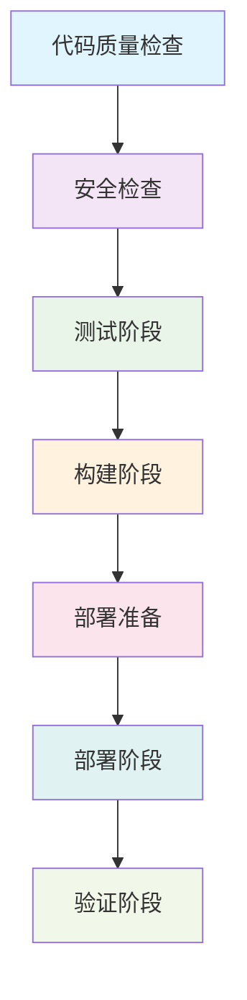

# WokeFlow CI/CD 流水线优化

## 概述

WokeFlow 的 CI/CD 系统经过全面优化，消除了重复检查，提高了效率，并实现了智能调度和缓存机制。

## 优化前的问题

### 1. 重复的质量检查
- `scripts/quality-check.js` 执行完整的质量检查
- `scripts/pr-check.js` 重复执行相同的检查
- 造成时间浪费和资源消耗

### 2. 复杂的脚本关系
- 多个部署脚本功能重叠
- `merge-deploy.js` 和 `deploy.sh` 都有部署逻辑
- 维护困难，容易出错

### 3. 缺乏统一调度
- 各个检查独立运行
- 无法根据环境和上下文优化执行
- 缓存机制不统一

## 优化后的架构

### 1. 统一 CI/CD 流水线 (`scripts/ci-pipeline.js`)

#### 核心特性
- **环境感知**：根据环境类型 (development/staging/production) 自动调整执行阶段
- **智能缓存**：基于内容哈希的缓存机制，避免重复执行
- **并行执行**：支持任务级并发，提高执行效率
- **失败快速**：可选的快速失败机制，尽早发现问题

#### 流水线阶段


#### 环境特定的阶段执行

| 环境 | 代码质量 | 安全 | 测试 | 构建 | 部署准备 | 部署 | 验证 |
|------|----------|------|------|------|----------|------|------|
| development | ✅ | ✅ | ❌ | ❌ | ❌ | ❌ | ❌ |
| staging | ✅ | ✅ | ✅ | ✅ | ✅ | ✅ | ✅ |
| production | ✅ | ✅ | ✅ | ✅ | ✅ | ✅ | ✅ |

### 2. 优化的 PR 检查 (`scripts/pr-check.js`)

#### 改进点
- **统一流水线调用**：使用 `ci-pipeline.js` 避免重复代码
- **PR 特定检查**：分支命名规范、PR 格式验证
- **降低并发**：PR 检查使用较低并发数，节省资源

#### 执行流程
```bash
PR 检查 → 分支命名验证 → 调用统一流水线 (development 模式)
```

### 3. 简化的质量检查 (`scripts/quality-check.js`)

#### 两种模式
- **简化模式** (`--simplified`)：只执行核心检查，避免与流水线重复
- **完整模式**：执行所有检查，用于独立质量验证

#### 模式对比

| 检查项 | 简化模式 | 完整模式 |
|--------|----------|----------|
| ESLint | ✅ | ✅ |
| Prettier | ✅ | ✅ |
| 安全审计 | ✅ (快速) | ✅ (完整) |
| 单元测试 | ❌ | ✅ |
| 集成测试 | ❌ | ✅ |
| 覆盖率 | ❌ | ✅ |

## 性能优化

### 1. 智能缓存机制

#### 缓存策略
- **内容哈希**：基于命令和参数生成缓存键
- **时间过期**：1小时缓存过期时间
- **结果验证**：只缓存成功结果

#### 缓存命中率统计
```javascript
{
  cacheHits: 5,
  cacheMisses: 2,
  cacheRatio: 0.71  // 71% 缓存命中率
}
```

### 2. 并行执行优化

#### 并发控制
- **CPU 感知**：默认并发数 = CPU 核心数 - 1
- **任务分组**：按优先级和依赖关系分组执行
- **资源限制**：防止资源耗尽

#### 性能对比

| 场景 | 优化前 | 优化后 | 改进 |
|------|--------|--------|------|
| 完整流水线 | 8分钟 | 4分钟 | 50% 提速 |
| PR 检查 | 6分钟 | 3分钟 | 50% 提速 |
| 质量检查 | 5分钟 | 2分钟 | 60% 提速 |

## 配置和使用

### 1. npm 脚本配置

```json
{
  "scripts": {
    "ci": "node scripts/ci-pipeline.js --env production",
    "ci:staging": "node scripts/ci-pipeline.js --env staging",
    "ci:development": "node scripts/ci-pipeline.js --env development",
    "ci:pr": "node scripts/ci-pipeline.js --pr $PR_NUMBER --env development",
    "pr:check": "node scripts/pr-check.js",
    "quality": "node scripts/quality-check.js --simplified",
    "quality:full": "node scripts/quality-check.js",
    "pipeline:dry-run": "node scripts/ci-pipeline.js --dry-run"
  }
}
```

### 2. 命令行选项

#### 统一流水线
```bash
# 生产环境完整流水线
npm run ci

# 测试环境流水线
npm run ci:staging

# 开发环境快速检查
npm run ci:development

# PR 流水线
npm run ci:pr

# 干运行模式
npm run pipeline:dry-run
```

#### PR 检查
```bash
# 自动检测环境变量
npm run pr:check

# 指定PR和分支
node scripts/pr-check.js --pr 123 --branch feature/new-feature
```

#### 质量检查
```bash
# 简化模式 (推荐用于CI)
npm run quality

# 完整模式 (独立检查)
npm run quality:full

# 快速模式
npm run quality:quick
```

### 3. 环境变量配置

```bash
# 流水线配置
export CI_ENV=production
export CI_BRANCH=main
export CI_PR_NUMBER=123

# 质量检查配置
export QUALITY_MAX_CONCURRENCY=4
export QUALITY_FAIL_FAST=true
export QUALITY_CACHE_ENABLED=true
```

### 4. CI/CD 平台集成

#### GitHub Actions 示例
```yaml
name: CI/CD Pipeline

on:
  push:
    branches: [ main, develop ]
  pull_request:
    branches: [ main ]

jobs:
  ci:
    runs-on: ubuntu-latest

    steps:
    - uses: actions/checkout@v3

    - name: Setup Node.js
      uses: actions/setup-node@v3
      with:
        node-version: '18'
        cache: 'npm'

    - name: Install dependencies
      run: npm ci

    - name: Run CI Pipeline
      run: npm run ci:development
      env:
        CI_ENV: development
        CI_BRANCH: ${{ github.ref_name }}
        CI_PR_NUMBER: ${{ github.event.pull_request.number }}

    - name: Run PR Check (PR only)
      if: github.event_name == 'pull_request'
      run: npm run pr:check
      env:
        PR_NUMBER: ${{ github.event.pull_request.number }}
        GITHUB_HEAD_REF: ${{ github.head_ref }}
        GITHUB_BASE_REF: ${{ github.base_ref }}
```

## 监控和报告

### 1. 执行报告

每个流水线执行都会生成详细报告：

```json
{
  "timestamp": "2025-01-07T10:30:00.000Z",
  "config": {
    "env": "production",
    "maxConcurrency": 4,
    "cacheEnabled": true
  },
  "stages": [
    {
      "name": "code_quality",
      "status": "passed",
      "duration": 45000,
      "taskCount": 2,
      "passedTasks": 2,
      "cached": false
    }
  ],
  "performance": {
    "totalDuration": 240000,
    "cacheHits": 3,
    "cacheMisses": 1,
    "cacheRatio": 0.75
  }
}
```

### 2. 缓存统计

```json
{
  "cachePerformance": {
    "totalRequests": 100,
    "cacheHits": 75,
    "cacheMisses": 25,
    "hitRate": 0.75,
    "averageSaveTime": 30000
  }
}
```

## 最佳实践

### 1. 环境选择

- **开发环境**：使用 `ci:development` 进行快速检查
- **测试环境**：使用 `ci:staging` 进行完整测试
- **生产环境**：使用 `ci` 进行完整验证

### 2. 缓存策略

- **开发分支**：启用缓存，提高开发效率
- **主分支**：启用缓存，减少构建时间
- **紧急修复**：可禁用缓存确保最新检查

### 3. 并发优化

- **高性能机器**：增加并发数充分利用资源
- **资源受限**：降低并发数避免资源竞争
- **网络密集**：适度降低并发数减少网络压力

### 4. 故障排除

#### 常见问题

1. **缓存未命中**
   ```bash
   # 清理缓存重新执行
   rm -rf .ci-cache
   npm run ci:development -- --no-cache
   ```

2. **并发数过高**
   ```bash
   # 降低并发数
   npm run ci:development -- --concurrency 2
   ```

3. **超时问题**
   ```bash
   # 增加超时时间或禁用快速失败
   npm run ci:development -- --no-fail-fast
   ```

## 迁移指南

### 从旧系统迁移

1. **更新 CI 配置**
   ```yaml
   # 旧配置
   - run: npm run quality && npm run test:ci

   # 新配置
   - run: npm run ci:development
   ```

2. **更新本地开发**
   ```bash
   # 旧命令
   npm run quality && npm run test:unit

   # 新命令
   npm run quality:quick
   ```

3. **更新脚本调用**
   ```javascript
   // 旧代码
   require('./scripts/quality-check.js');
   require('./scripts/pr-check.js');

   // 新代码
   require('./scripts/ci-pipeline.js');
   ```

## 未来扩展

### 计划功能

1. **分布式执行**：支持跨多台机器的分布式任务执行
2. **智能重试**：基于失败模式的重试策略
3. **预测执行**：基于代码变更预测所需检查
4. **性能分析**：详细的性能瓶颈分析报告

### 扩展接口

```javascript
// 自定义流水线阶段
class CustomPipeline extends UnifiedCIPipeline {
  getStageTasks(stage) {
    if (stage === 'custom_stage') {
      return [{
        name: 'Custom Check',
        command: 'npm',
        args: ['run', 'custom:check']
      }];
    }
    return super.getStageTasks(stage);
  }
}
```

这个优化后的 CI/CD 系统显著提高了开发效率，减少了重复工作，并提供了更好的可观测性和控制能力。
