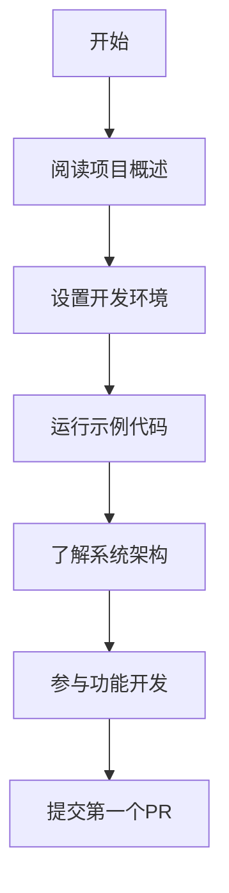
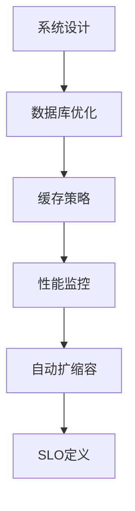
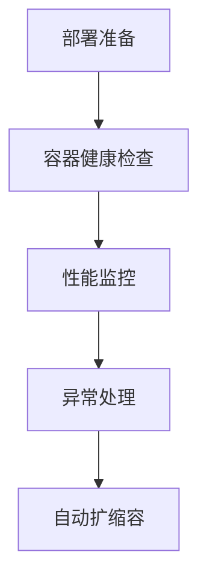
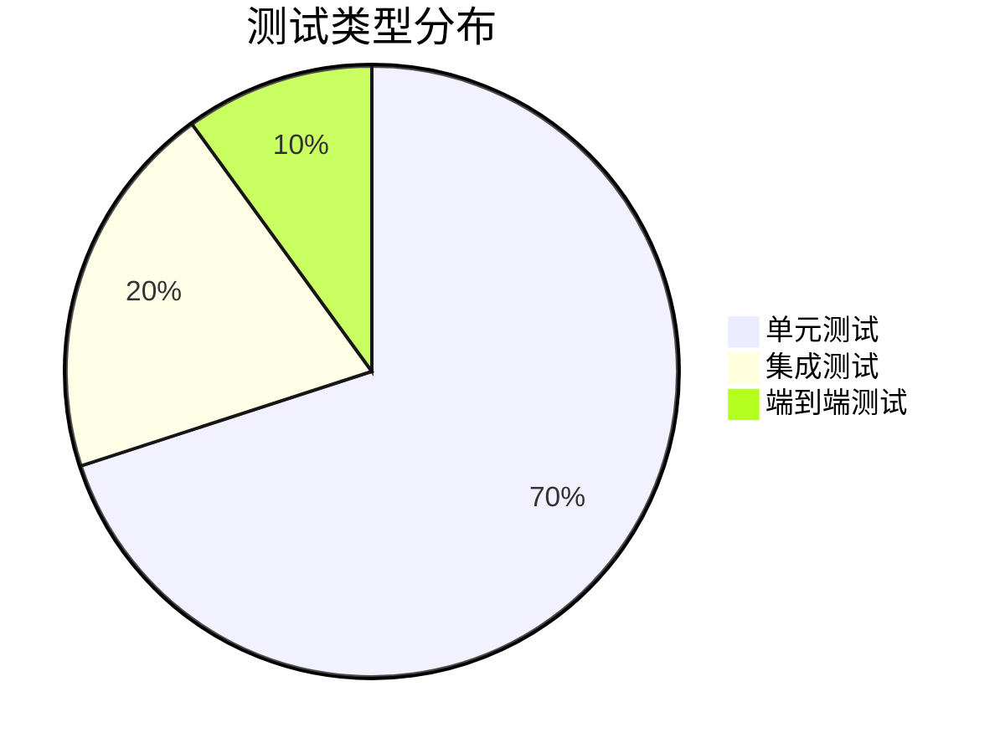

# 🔧 开发者指南

<div align="center">

## 🛠️ frys 开发环境设置和最佳实践

**从环境搭建到生产部署的完整开发指南**

[🏠 返回项目主页](../../README.md) • [📖 文档导航](../README.md) • [🚀 快速开始](../../GETTING_STARTED.md)

---

</div>

## 📋 目录导航

### 🚀 快速开始

| 文档                                     | 说明             | 适用场景     |
| ---------------------------------------- | ---------------- | ------------ |
| **[环境设置](environment-setup.md)**     | 本地开发环境配置 | 新开发者入职 |
| **[环境变量](environment-variables.md)** | 配置管理和说明   | 部署配置     |

### 🏗️ 系统架构

| 文档                                            | 说明               | 适用场景   |
| ----------------------------------------------- | ------------------ | ---------- |
| **[认证授权](authentication-authorization.md)** | 用户认证和权限管理 | 安全开发   |
| **[缓存策略](caching-strategy.md)**             | 缓存设计和优化     | 性能优化   |
| **[数据库优化](database-optimization.md)**      | 数据库设计和调优   | 数据层开发 |
| **[异常处理](exception-handling-flow.md)**      | 错误处理和日志     | 稳定性保障 |

### 📊 可观测性

| 文档                                            | 说明               | 适用场景 |
| ----------------------------------------------- | ------------------ | -------- |
| **[性能监控](performance-monitoring.md)**       | 应用性能追踪       | 性能调优 |
| **[分布式追踪](distributed-tracing-system.md)** | 请求链路追踪       | 问题诊断 |
| **[容器健康检查](container-health-checks.md)**  | 容器监控和健康检查 | DevOps   |

### ⚡ 高级特性

| 文档                                                | 说明           | 适用场景   |
| --------------------------------------------------- | -------------- | ---------- |
| **[自动扩缩容](auto-scaling-strategy.md)**          | 自动扩缩容策略 | 高可用架构 |
| **[性能基线测试](performance-baseline-testing.md)** | 性能基准测试   | 性能验证   |
| **[SLO 定义](slo-definition.md)**                   | 服务水平目标   | 质量保障   |

### 📈 项目管理

| 文档                                             | 说明         | 适用场景 |
| ------------------------------------------------ | ------------ | -------- |
| **[改进路线图](project-improvement-roadmap.md)** | 项目优化计划 | 技术规划 |

---

## 🎯 开发者路线图

### 🆕 新人开发者



**推荐阅读顺序:**

1. [环境设置](environment-setup.md) - 10分钟
2. [环境变量](environment-variables.md) - 5分钟
3. [认证授权](authentication-authorization.md) - 15分钟
4. [缓存策略](caching-strategy.md) - 10分钟

### 🏗️ 架构师



**核心关注点:**

- [数据库优化](database-optimization.md)
- [分布式追踪](distributed-tracing-system.md)
- [自动扩缩容](auto-scaling-strategy.md)

### 🚀 DevOps 工程师



**关键技能:**

- [容器健康检查](container-health-checks.md)
- [性能监控](performance-monitoring.md)
- [异常处理](exception-handling-flow.md)

---

## 🛠️ 开发工具链

### 必需工具

| 工具        | 用途              | 安装方式                                                |
| ----------- | ----------------- | ------------------------------------------------------- |
| **Node.js** | JavaScript 运行时 | [nodejs.org](https://nodejs.org/)                       |
| **Git**     | 版本控制          | [git-scm.com](https://git-scm.com/)                     |
| **Docker**  | 容器化            | [docker.com](https://docker.com/)                       |
| **VS Code** | 代码编辑器        | [code.visualstudio.com](https://code.visualstudio.com/) |

### 推荐扩展

```json
{
  "recommendations": [
    "ms-vscode.vscode-typescript-next",
    "esbenp.prettier-vscode",
    "davidanson.vscode-markdownlint",
    "ms-vscode.vscode-json",
    "redhat.vscode-yaml",
    "ms-azuretools.vscode-docker"
  ]
}
```

### 命令行工具

```bash
# 项目管理
npm run dev          # 开发服务器
npm run build        # 生产构建
npm test            # 运行测试
npm run lint        # 代码检查

# 质量保证
npm run quality     # 质量检查
npm run security    # 安全审计

# 部署相关
npm run staging     # 部署到测试环境
npm run production  # 部署到生产环境
```

---

## 📋 开发工作流

### 🔄 标准开发流程


#### 1. 创建功能分支

```bash
# 从主分支创建功能分支
git checkout -b feature/your-feature-name

# 或者修复bug
git checkout -b fix/bug-description
```

#### 2. 编写代码

```bash
# 遵循代码规范
npm run lint        # 检查代码风格
npm run format      # 自动格式化

# 运行测试
npm run test:unit   # 单元测试
npm run test:integration  # 集成测试
```

#### 3. 提交代码

```bash
# 添加变更
git add .

# 提交时使用规范的提交信息
git commit -m "feat: 添加用户登录功能

- 实现JWT认证
- 添加密码验证
- 集成用户服务

Closes #123"
```

#### 4. 创建 Pull Request

```bash
# 推送分支到远程
git push origin feature/your-feature-name

# 在GitHub上创建PR
# 填写PR模板，描述变更内容
```

---

## 🧪 测试策略

### 测试金字塔



### 测试覆盖要求

| 测试类型       | 覆盖率目标 | 执行时机 |
| -------------- | ---------- | -------- |
| **单元测试**   | ≥ 90%      | 每次提交 |
| **集成测试**   | ≥ 80%      | 每日构建 |
| **端到端测试** | ≥ 70%      | 发布前   |

### 运行测试

```bash
# 运行所有测试
npm test

# 运行特定类型测试
npm run test:unit
npm run test:integration
npm run test:e2e

# 带覆盖率报告
npm run test:coverage

# 调试模式
npm run test:debug
```

---

## 🔒 安全开发指南

### 代码安全

- **输入验证**: 所有用户输入必须验证
- **SQL注入防护**: 使用参数化查询
- **XSS防护**: 转义用户输入内容
- **CSRF防护**: 使用CSRF令牌

### 认证授权

```javascript
// 正确的认证检查
const user = await authenticate(request);
if (!user) {
  throw new AuthenticationError('用户未认证');
}

// 正确的权限检查
const hasPermission = await authorize(user, 'resource:action');
if (!hasPermission) {
  throw new AuthorizationError('权限不足');
}
```

### 敏感信息处理

- **环境变量**: 不要在代码中硬编码密钥
- **日志记录**: 不要记录敏感信息
- **数据传输**: 使用HTTPS传输敏感数据

---

## 📊 性能优化指南

### 前端优化

```javascript
// 组件懒加载
const UserProfile = lazy(() => import('./UserProfile'));

// 图片优化
import optimizedImage from './image.jpg?width=800&height=600';

// API调用优化
const { data } = useQuery('users', fetchUsers, {
  staleTime: 5 * 60 * 1000, // 5分钟
  cacheTime: 10 * 60 * 1000, // 10分钟
});
```

### 后端优化

```javascript
// 数据库查询优化
const users = await User.findAll({
  where: { status: 'active' },
  include: ['profile'], // 避免N+1查询
  limit: 20,
  offset: page * 20,
});

// 缓存策略
const cacheKey = `user:${userId}`;
let user = await redis.get(cacheKey);

if (!user) {
  user = await User.findByPk(userId);
  await redis.setex(cacheKey, 3600, JSON.stringify(user)); // 1小时缓存
}
```

### 监控指标

```javascript
// 应用指标
const responseTime = metrics.histogram({
  name: 'http_request_duration_seconds',
  help: 'HTTP request duration',
  labelNames: ['method', 'route', 'status'],
});

// 业务指标
const userRegistrations = metrics.counter({
  name: 'user_registrations_total',
  help: 'Total user registrations',
});
```

---

## 🚀 部署流程

### 环境说明

| 环境     | 用途     | 访问方式                   |
| -------- | -------- | -------------------------- |
| **本地** | 开发调试 | `http://localhost:3000`    |
| **开发** | 功能测试 | `https://dev.frys.app`     |
| **测试** | 集成测试 | `https://staging.frys.app` |
| **生产** | 线上服务 | `https://frys.app`         |

### 部署命令

```bash
# 本地部署
npm run dev

# 测试环境部署
npm run staging:deploy

# 生产环境部署
npm run production:deploy

# 回滚部署
npm run rollback
```

---

## 📞 获取帮助

### 常见问题

**Q: 如何设置开发环境？**
A: 参考 [环境设置](environment-setup.md)，按照步骤操作即可。

**Q: 遇到代码冲突怎么办？**
A: 先拉取最新代码，然后解决冲突，最后推送。

```bash
git pull origin main --rebase
# 解决冲突后
git add .
git rebase --continue
git push origin feature/your-branch
```

**Q: 如何调试应用？**
A: 使用VS Code调试器或添加console.log，生产环境使用日志系统。

**Q: 性能问题怎么排查？**
A: 查看 [性能监控](performance-monitoring.md) 和 [分布式追踪](distributed-tracing-system.md)。

### 联系支持

- **📧 邮箱**: 1666384464@qq.com
- **💬 讨论区**: [GitHub Discussions](https://github.com/zycxfyh/frys/discussions)
- **🐛 Issues**: [GitHub Issues](https://github.com/zycxfyh/frys/issues)

---

<div align="center">

## 🎉 欢迎加入 frys 开发团队！

**让我们一起构建更好的工作流管理系统**

[📚 查看所有文档](../README.md) • [🚀 开始开发](../../GETTING_STARTED.md)

---

_最后更新: 2025年11月7日_

</div>
