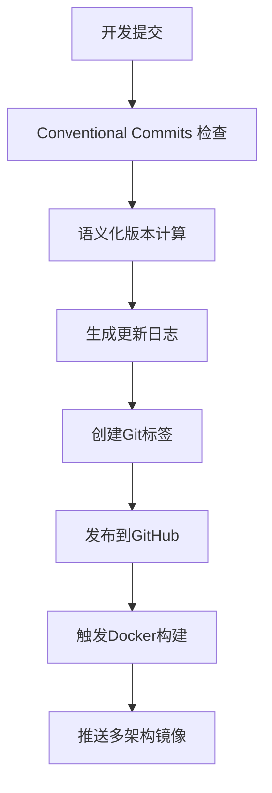

# 🤖 自动化依赖管理和发布

frys 集成了先进的自动化依赖管理和语义化发布系统，确保项目的依赖安全和版本控制的规范化。

## 🔄 Dependabot 自动依赖更新

### 配置概述

Dependabot 会自动监控项目依赖的安全漏洞和版本更新，并创建相应的 Pull Request。

```yaml
# .github/dependabot.yml
version: 2
updates:
  - package-ecosystem: 'npm'
    directory: '/'
    schedule:
      interval: 'weekly'
      day: 'monday'
    groups:
      security-updates:
        applies-to: security-updates
      patch-updates:
        applies-to: version-updates
        update-types: ['patch']
```

### 支持的依赖类型

- **📦 npm/pnpm** - Node.js 包管理器
- **🐳 Docker** - 容器镜像
- **🤖 GitHub Actions** - 工作流模板

### 更新策略

#### 🔒 安全更新

- 立即处理和合并
- 自动运行测试验证
- 自动构建验证

#### 🩹 补丁更新

- 自动合并到主分支
- 触发 CI/CD 流水线
- 生成更新日志

#### ⬆️ 次版本更新

- 自动合并 (向后兼容)
- 触发完整测试套件
- 构建多架构镜像

#### 🚀 主版本更新

- 需要人工审查
- 详细的兼容性报告
- 迁移指南评估

## 🚀 Semantic Release 语义化发布

### 提交规范

项目采用 [Conventional Commits](https://conventionalcommits.org/) 规范：

```bash
# 功能提交
feat: add new workflow engine

# 修复提交
fix: resolve memory leak in cache service

# 重构提交
refactor: optimize plugin loading mechanism

# 文档提交
docs: update deployment guide

# 测试提交
test: add unit tests for config validation

# 构建提交
build: update webpack configuration

# CI提交
ci: add multiarch build workflow

# 杂项
chore: update dependencies
```

### 版本计算

基于提交类型自动计算版本号：

| 提交类型          | 版本影响         | 示例          |
| ----------------- | ---------------- | ------------- |
| `fix:`            | 补丁版本 (0.0.x) | 1.2.3 → 1.2.4 |
| `feat:`           | 次版本 (0.x.0)   | 1.2.3 → 1.3.0 |
| `BREAKING CHANGE` | 主版本 (x.0.0)   | 1.2.3 → 2.0.0 |

### 发布流程

#### 自动发布流程



#### 发布产物

每次发布自动生成：

- 📦 **源码包** - 完整的源代码压缩包
- 🐳 **Docker镜像** - 多架构容器镜像
- 📋 **更新日志** - 详细的变更记录
- 🔖 **Git标签** - 版本标识
- 📝 **发布说明** - 自动生成的发布描述

## 🛠️ 本地开发

### 测试Dependabot配置

```bash
# 验证Dependabot配置语法
curl -X POST \
  -H "Authorization: token YOUR_TOKEN" \
  -H "Accept: application/vnd.github.v3+json" \
  https://api.github.com/repos/YOUR_ORG/YOUR_REPO/dependency-graph/snapshots \
  -d @dependency-snapshot.json
```

### 测试Semantic Release

```bash
# 干运行发布
pnpm run release:dry-run

# 查看将要发布的版本
pnpm run release:dry-run -- --no-ci

# 本地测试发布流程
pnpm run release:ci -- --dry-run
```

### 手动触发发布

```bash
# 强制补丁版本发布
git commit -m "fix: minor bug fix" --allow-empty
git push origin main

# 强制次版本发布
git commit -m "feat: new feature" --allow-empty
git push origin main
```

## 📊 监控和报告

### Dependabot 状态监控

```bash
# 查看Dependabot PR状态
gh pr list --author dependabot --state open

# 查看安全更新
gh pr list --label security --state open
```

### 发布历史

```bash
# 查看所有发布
gh release list

# 查看特定版本的详细信息
gh release view v1.0.0

# 下载发布产物
gh release download v1.0.0
```

### 兼容性报告

每次依赖更新自动生成兼容性报告：

```
## 🔍 依赖更新兼容性报告

**更新类型:** patch
**包名:** lodash
**时间:** 2025-11-08T12:00:00Z

**测试结果:** ✅ 通过

**建议:** 自动合并
```

## 🔧 配置自定义

### Dependabot 自定义配置

```yaml
# 自定义更新频率
schedule:
  interval: 'daily'
  time: '08:00'
  timezone: 'Asia/Shanghai'

# 自定义忽略规则
ignore:
  - dependency-name: 'webpack'
    versions: ['5.80.x'] # 已知问题版本

# 自定义分组
groups:
  dev-dependencies:
    dependency-type: 'development'
    update-types: ['minor', 'patch']
```

### Semantic Release 自定义配置

```json
{
  "plugins": [
    [
      "@semantic-release/commit-analyzer",
      {
        "releaseRules": [
          { "type": "perf", "release": "patch" },
          { "type": "build", "scope": "docker", "release": "patch" }
        ]
      }
    ]
  ]
}
```

## 🚨 故障排除

### Dependabot 问题

#### PR 未自动创建

- 检查 `.github/dependabot.yml` 语法
- 验证分支权限设置
- 确认依赖文件存在

#### 自动合并失败

- 检查 CI/CD 状态
- 查看测试失败原因
- 验证构建产物完整性

### Semantic Release 问题

#### 版本计算错误

- 检查提交信息格式
- 验证 Conventional Commits 规范
- 确认分支配置正确

#### 发布失败

- 检查 GitHub Token 权限
- 验证 `.releaserc.json` 配置
- 查看 CI/CD 日志

### 常见错误

```bash
# 修复提交信息格式
git commit --amend -m "fix: correct typo in function name"

# 重新推送
git push --force-with-lease origin main
```

## 📚 相关链接

- [Dependabot 文档](https://docs.github.com/en/code-security/dependabot)
- [Semantic Release 文档](https://semantic-release.gitbook.io/)
- [Conventional Commits 规范](https://conventionalcommits.org/)
- [GitHub Actions 文档](https://docs.github.com/en/actions)

---

_自动化让发布变得简单而可靠！_ 🎉
