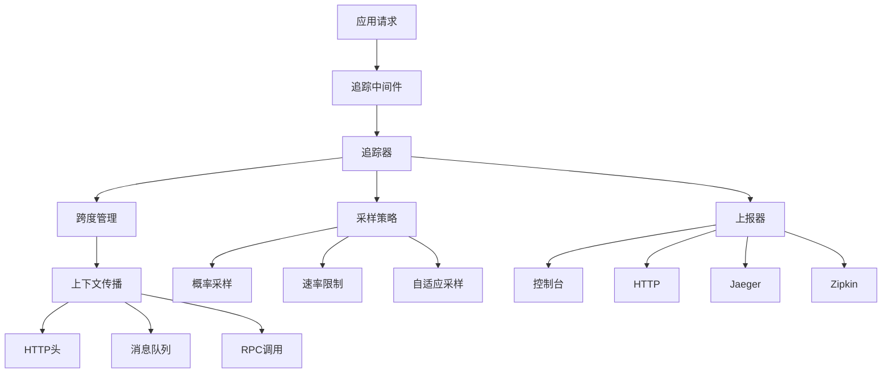

# 分布式追踪系统

## 概述

WokeFlow 的分布式追踪系统提供完整的请求链路可观测性，支持跨服务、跨进程的追踪和监控。该系统采用 OpenTracing 兼容的 API，支持多种采样策略、上报方式和上下文传播机制，能够帮助开发者快速定位性能瓶颈、故障根源和系统依赖关系。

## 核心概念

### 追踪 (Trace)
一次完整的请求链路，从客户端发起到服务端响应结束。

### 跨度 (Span)
追踪的基本单位，代表一个操作或工作单元，具有名称、开始时间、持续时间和标签。

### 上下文 (Context)
在分布式系统中传递追踪信息的载体，包含追踪ID、跨度ID等。

### 采样 (Sampling)
控制哪些请求需要被追踪，以平衡性能和可观测性。

## 架构概览



## 核心组件

### 1. 跨度 (Span)

跨度是追踪的基本单位，包含操作的执行信息。

#### 创建跨度
```javascript
import { Tracer } from './infrastructure/tracing/Tracer.js';

const tracer = new Tracer({ serviceName: 'my-service' });

// 创建根跨度
const span = tracer.createSpan('operation_name', {
  component: 'http',
  'http.method': 'GET',
  'http.url': '/api/users'
});

// 设置标签
span.setTag('user.id', '12345');
span.setTag('response.size', 1024);

// 记录日志
span.log('processing_start', { records: 100 });
span.log('processing_complete', { processed: 100 });

// 完成跨度
span.finish();
```

#### 跨度标签
- `component`: 组件名称 (http, database, redis等)
- `span.kind`: 跨度类型 (client, server, producer, consumer)
- `error`: 是否发生错误
- `http.method`: HTTP方法
- `http.status_code`: HTTP状态码
- `db.statement`: 数据库查询语句
- `db.rows_affected`: 影响的行数

### 2. 追踪器 (Tracer)

追踪器是系统的核心，负责管理跨度和协调整个追踪过程。

#### 初始化追踪器
```javascript
import { Tracer } from './infrastructure/tracing/Tracer.js';
import { HttpReporter } from './infrastructure/tracing/TracingReporter.js';
import { SamplingStrategy } from './infrastructure/tracing/SamplingStrategy.js';

// 创建上报器
const reporter = new HttpReporter({
  endpoint: 'http://jaeger:9411/api/v2/spans',
  batchSize: 50
});

// 创建采样策略
const sampling = new SamplingStrategy({
  type: 'probability',
  samplingRate: 0.1  // 10%采样率
});

// 创建追踪器
const tracer = new Tracer({
  serviceName: 'my-service',
  serviceVersion: '1.0.0',
  samplingStrategy: sampling,
  reporter: reporter,
  reportInterval: 5000  // 5秒上报间隔
});

// 启动追踪器
await tracer.start();
```

#### 创建嵌套跨度
```javascript
// 创建父跨度
const parentSpan = tracer.createSpan('http_request');

// 创建子跨度
const dbSpan = tracer.createChildSpan(parentSpan, 'database_query', {
  component: 'postgresql',
  'db.statement': 'SELECT * FROM users'
});

// 子跨度会自动关联到父跨度
dbSpan.finish();
parentSpan.finish();
```

#### 函数包装
```javascript
// 自动为函数创建跨度
const result = await tracer.traceFunction('process_data', async () => {
  // 业务逻辑
  return await processUserData(userId);
}, {
  component: 'business_logic',
  'operation.type': 'data_processing'
});
```

### 3. 采样策略 (SamplingStrategy)

采样策略控制哪些请求需要被追踪。

#### 概率采样
```javascript
const sampling = new SamplingStrategy({
  type: 'probability',
  samplingRate: 0.1  // 10%采样率
});
```

#### 速率限制采样
```javascript
const sampling = new SamplingStrategy({
  type: 'rate_limiting',
  maxSamplesPerSecond: 100  // 每秒最多100个样本
});
```

#### 自适应采样
```javascript
const sampling = new SamplingStrategy({
  type: 'adaptive',
  samplingRate: 0.1,
  adaptive: {
    enabled: true,
    targetLatency: 100,  // 目标延迟100ms
    adjustmentInterval: 60000  // 每分钟调整一次
  }
});
```

#### 基于规则的采样
```javascript
const sampling = new SamplingStrategy({
  type: 'rules_based',
  rules: [
    // 对错误请求总是采样
    {
      operationPattern: 'http.*',
      tags: { 'http.status_code': /^5\d\d$/ },
      sample: true
    },
    // 对慢请求采样
    {
      operationPattern: '.*',
      maxLatency: 1000,
      sample: true
    },
    // 默认10%采样
    {
      operationPattern: '.*',
      sample: 0.1
    }
  ]
});
```

### 4. 上报器 (TracingReporter)

负责将追踪数据发送到外部系统。

#### HTTP上报器
```javascript
const reporter = new HttpReporter({
  endpoint: 'http://jaeger:9411/api/v2/spans',
  headers: {
    'Authorization': 'Bearer token'
  },
  batchSize: 100,
  flushInterval: 5000
});
```

#### Jaeger上报器
```javascript
const reporter = new JaegerReporter({
  endpoint: 'http://jaeger:14268/api/traces',
  serviceName: 'my-service'
});
```

#### Zipkin上报器
```javascript
const reporter = new ZipkinReporter({
  endpoint: 'http://zipkin:9411/api/v2/spans'
});
```

### 5. HTTP中间件 (TracingMiddleware)

自动为HTTP请求创建跨度和注入追踪上下文。

#### Express集成
```javascript
import express from 'express';
import { TracingMiddleware } from './infrastructure/tracing/TracingMiddleware.js';

const app = express();
const tracer = new Tracer({ /* config */ });

// 使用追踪中间件
app.use(new TracingMiddleware(tracer, {
  includeHeaders: true,    // 记录请求头
  includeQuery: true,      // 记录查询参数
  includeBody: false,      // 不记录请求体（安全考虑）
  excludePaths: ['/health', '/metrics'],  // 排除健康检查
  maxBodyLength: 1000      // 请求体最大长度
}).middleware());

// 路由
app.get('/api/users', (req, res) => {
  // req.tracingSpan 包含当前请求的跨度
  const span = req.tracingSpan;

  // 在现有跨度下创建子跨度
  const dbSpan = tracer.createChildSpan(span, 'fetch_users', {
    component: 'database'
  });

  // 执行数据库查询
  // ...

  dbSpan.finish();

  res.json({ users: [] });
});
```

#### 客户端追踪
```javascript
// HTTP客户端请求追踪
const clientMiddleware = TracingMiddleware.createClientMiddleware(tracer);

const response = await axios.get('http://api.example.com/data', {
  // 中间件会自动注入追踪头
  transformRequest: [clientMiddleware]
});
```

### 6. 追踪上下文 (TraceContext)

管理追踪上下文的存储和传递。

#### 上下文管理
```javascript
import { TraceContextManager } from './infrastructure/tracing/TraceContext.js';

const contextManager = new TraceContextManager();

// 在上下文中执行异步操作
await contextManager.withContext({
  traceId: 'abc123',
  spanId: 'def456'
}, async () => {
  // 在此作用域内，所有操作都会继承追踪上下文
  const currentContext = contextManager.traceContext.getCurrent();
  console.log(currentContext.traceId); // 'abc123'
});

// 创建子上下文
await contextManager.withChildContext({
  spanId: 'new-span-id'
}, async () => {
  // 子上下文会自动设置parentSpanId
});
```

#### 上下文传播
```javascript
import { TraceContext } from './infrastructure/tracing/TraceContext.js';

// 注入上下文到HTTP头
const headers = {};
const context = { traceId: 'abc123', spanId: 'def456' };
TraceContext.inject(context, headers, 'http_headers');
// headers: { 'x-trace-id': 'abc123', 'x-span-id': 'def456' }

// 从HTTP头提取上下文
const extractedContext = TraceContext.extract(headers, 'http_headers');
```

## 使用指南

### 1. 基本设置

```javascript
// 1. 创建追踪器
const tracer = new Tracer({
  serviceName: process.env.SERVICE_NAME || 'my-service',
  serviceVersion: process.env.SERVICE_VERSION || '1.0.0',
  samplingStrategy: new SamplingStrategy({
    type: 'probability',
    samplingRate: parseFloat(process.env.TRACING_SAMPLE_RATE || '0.1')
  }),
  reporter: new HttpReporter({
    endpoint: process.env.TRACING_ENDPOINT || 'http://jaeger:9411/api/v2/spans'
  })
});

// 2. 启动追踪器
await tracer.start();

// 3. 设置HTTP中间件
app.use(new TracingMiddleware(tracer).middleware());
```

### 2. 数据库操作追踪

```javascript
// PostgreSQL查询追踪
const result = await tracer.traceFunction('db_query', async () => {
  return await pool.query('SELECT * FROM users WHERE id = $1', [userId]);
}, {
  component: 'postgresql',
  'db.statement': 'SELECT * FROM users WHERE id = ?',
  'db.user': process.env.DB_USER
});
```

### 3. 缓存操作追踪

```javascript
// Redis操作追踪
const cachedData = await tracer.traceFunction('redis_get', async () => {
  return await redis.get(`user:${userId}`);
}, {
  component: 'redis',
  'cache.key': `user:${userId}`,
  'cache.operation': 'get'
});
```

### 4. 外部API调用追踪

```javascript
// 外部服务调用追踪
const response = await tracer.traceFunction('external_api_call', async () => {
  const span = tracer.getCurrentSpan();
  span.setTag('http.method', 'GET');
  span.setTag('http.url', 'https://api.example.com/users');

  const response = await fetch('https://api.example.com/users');
  span.setTag('http.status_code', response.status);

  return await response.json();
}, {
  component: 'http_client',
  'peer.service': 'external-api'
});
```

### 5. 异步操作追踪

```javascript
// 消息队列处理追踪
messageQueue.on('message', async (message) => {
  const span = tracer.createSpan('process_message', {
    component: 'queue',
    'queue.name': 'user_events',
    'message.id': message.id
  });

  try {
    await processUserEvent(message);
    span.log('message_processed', { success: true });
  } catch (error) {
    span.setError(error);
    throw error;
  } finally {
    span.finish();
  }
});
```

### 6. 错误追踪

```javascript
try {
  const span = tracer.createSpan('risky_operation');
  // 可能出错的操作
  await riskyOperation();
  span.finish();
} catch (error) {
  // 自动为当前跨度设置错误
  const currentSpan = tracer.getCurrentSpan();
  if (currentSpan) {
    currentSpan.setError(error);
    currentSpan.finish();
  }
  throw error;
}
```

## 跨服务追踪

### 服务间调用

```javascript
// 服务A - 发送请求
app.get('/api/users/:id', async (req, res) => {
  const span = req.tracingSpan;

  // 调用服务B
  const response = await tracer.traceFunction('call_service_b', async () => {
    const headers = {};
    span.inject(headers, 'http_headers'); // 注入追踪上下文

    return await fetch('http://service-b:3000/api/user-details', {
      headers
    });
  }, {
    component: 'http_client',
    'peer.service': 'service-b'
  });

  res.json(await response.json());
});

// 服务B - 接收请求
app.get('/api/user-details', async (req, res) => {
  // 中间件会自动提取和创建跨度
  const span = req.tracingSpan; // 这是从服务A传播过来的跨度

  // 执行业务逻辑
  const details = await getUserDetails(req.query.userId);

  span.finish();
  res.json(details);
});
```

### 消息队列追踪

```javascript
// 发送消息
const sendMessage = async (queue, message) => {
  return await tracer.traceFunction('send_message', async () => {
    const span = tracer.getCurrentSpan();
    const headers = {};
    span.inject(headers, 'http_headers');

    // 将追踪头添加到消息
    const messageWithTracing = {
      ...message,
      _tracing: headers
    };

    return await queue.send(messageWithTracing);
  }, {
    component: 'queue',
    'queue.name': queue.name,
    'message.size': JSON.stringify(message).length
  });
};

// 接收消息
const processMessage = async (message) => {
  // 从消息中提取追踪上下文
  const context = TraceContext.extract(message._tracing || {}, 'http_headers');

  return await tracer.createSpanFromContext(context, 'process_message', {
    component: 'queue',
    'queue.name': 'user_events'
  }).then(span => {
    try {
      // 处理消息
      await handleUserEvent(message);
      span.log('message_processed');
    } catch (error) {
      span.setError(error);
      throw error;
    } finally {
      span.finish();
    }
  });
};
```

## 监控和告警

### 追踪统计

```javascript
// 获取追踪统计
setInterval(() => {
  const stats = tracer.getStats();
  console.log('追踪统计:', {
    spansCreated: stats.spansCreated,
    spansFinished: stats.spansFinished,
    activeSpans: stats.activeSpans,
    samplingRate: stats.samplingStrategy?.currentSamplingRate
  });

  // 上报到监控系统
  metrics.gauge('tracing_spans_created', stats.spansCreated);
  metrics.gauge('tracing_spans_active', stats.activeSpans);
}, 60000);
```

### 性能监控

```javascript
// 监控跨度持续时间
eventBus.subscribe('spanFinished', (span) => {
  if (span.duration > 5000) { // 5秒阈值
    logger.warn('慢操作检测', {
      operation: span.name,
      duration: span.duration,
      traceId: span.traceId
    });
  }

  // 按操作类型统计性能
  metrics.histogram('span_duration', span.duration, {
    operation: span.name,
    component: span.tags.get('component')
  });
});
```

### 错误追踪

```javascript
// 监控错误跨度
eventBus.subscribe('spanFinished', (span) => {
  if (span.status === 'error') {
    logger.error('操作失败', {
      operation: span.name,
      error: span.error?.message,
      traceId: span.traceId,
      duration: span.duration
    });

    // 发送告警
    await alertSystem.send('ERROR_OPERATION', {
      operation: span.name,
      error: span.error?.message,
      traceId: span.traceId
    });
  }
});
```

## 配置选项

### 环境变量

```bash
# 服务信息
SERVICE_NAME=my-service
SERVICE_VERSION=1.0.0

# 采样配置
TRACING_SAMPLE_RATE=0.1
TRACING_SAMPLE_TYPE=probability

# 上报配置
TRACING_ENDPOINT=http://jaeger:9411/api/v2/spans
TRACING_BATCH_SIZE=100
TRACING_FLUSH_INTERVAL=5000

# 性能配置
TRACING_MAX_ACTIVE_SPANS=1000
TRACING_MAX_FINISHED_SPANS=10000
TRACING_REPORT_INTERVAL=5000
```

### 程序化配置

```javascript
const tracer = new Tracer({
  serviceName: 'my-service',
  serviceVersion: '1.0.0',

  // 采样策略
  samplingStrategy: new SamplingStrategy({
    type: 'adaptive',
    samplingRate: 0.1,
    adaptive: {
      enabled: true,
      targetLatency: 200,
      adjustmentInterval: 60000
    }
  }),

  // 上报器
  reporter: new JaegerReporter({
    endpoint: 'http://jaeger:14268/api/traces',
    batchSize: 50,
    headers: {
      'Authorization': `Bearer ${process.env.JAEGER_TOKEN}`
    }
  }),

  // 性能调优
  maxActiveSpans: 1000,
  maxFinishedSpans: 10000,
  reportInterval: 5000
});
```

## 最佳实践

### 1. 跨度命名

- 使用动词-名词格式：`get_user`, `process_payment`
- 保持一致性：同一个操作在不同服务中使用相同名称
- 避免过于通用：不用`do_work`，用`calculate_invoice_total`

### 2. 标签使用

- 使用标准标签：`component`, `span.kind`, `error`
- 添加业务相关标签：`user.id`, `order.id`
- 避免过度标签：只添加有用的信息

### 3. 采样策略

- 生产环境：使用较低采样率(0.01-0.1)
- 开发环境：使用较高采样率(0.5-1.0)
- 错误场景：总是采样错误请求
- 性能监控：使用自适应采样

### 4. 上下文传播

- HTTP请求：使用`x-trace-id`, `x-span-id`头
- 消息队列：在消息体中包含追踪信息
- RPC调用：在请求元数据中传递上下文

### 5. 错误处理

- 总是设置错误标签：`span.setError(error)`
- 记录错误上下文：包括堆栈信息和相关数据
- 避免敏感信息泄露：清理错误消息中的敏感数据

### 6. 性能考虑

- 合理设置采样率，避免性能影响
- 定期清理已完成跨度
- 监控追踪系统的资源使用

## 故障排除

### 常见问题

1. **跨度没有关联**
   - 检查上下文传播是否正确
   - 验证中间件是否正确安装
   - 确认服务间调用是否注入了追踪头

2. **采样率不生效**
   - 检查采样策略配置
   - 验证采样策略是否启动
   - 确认采样决策逻辑

3. **数据不上报**
   - 检查上报器配置
   - 验证网络连接
   - 查看上报器错误日志

4. **性能影响大**
   - 降低采样率
   - 减少标签数量
   - 优化上报批次大小

### 调试技巧

```javascript
// 启用详细日志
process.env.LOG_LEVEL = 'debug';

// 查看追踪统计
setInterval(() => {
  console.log('追踪状态:', tracer.getStats());
}, 10000);

// 手动创建测试跨度
const testSpan = tracer.createSpan('debug_test');
testSpan.setTag('debug', true);
testSpan.log('test_event', { data: 'test' });
testSpan.finish();
```

## 总结

分布式追踪系统为WokeFlow提供了强大的可观测性能力，通过跨度、上下文传播和采样机制，能够完整追踪请求在分布式系统中的生命周期。合理配置和使用追踪系统，可以显著提升系统的可维护性和故障排查效率。

系统采用模块化设计，支持多种上报后端和采样策略，可以根据不同环境和需求进行灵活配置。在生产环境中使用时，建议从较低采样率开始，逐步调整以平衡可观测性和性能。
