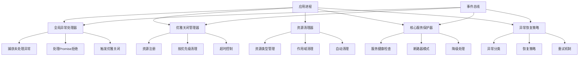

# 异常处理流程

## 概述

WokeFlow 的异常处理流程提供了一套完整的异常捕获、处理、恢复和资源清理机制，确保应用程序在面对各种异常情况时能够稳定运行并优雅地处理错误。该系统包含全局异常处理器、优雅关闭管理器、资源清理器、核心服务保护器和异常恢复策略五个核心组件。

## 架构概览



## 核心组件

### 1. 全局异常处理器 (GlobalExceptionHandler)

负责捕获和处理应用程序中未处理的异常和Promise拒绝。

#### 主要功能
- **未捕获异常处理**: 捕获 `uncaughtException` 事件
- **Promise拒绝处理**: 处理 `unhandledRejection` 事件
- **警告监控**: 监听 `warning` 事件
- **信号处理**: 处理 SIGTERM、SIGINT 等终止信号
- **紧急关闭**: 在严重异常时执行紧急关闭流程

#### 使用示例
```javascript
import { GlobalExceptionHandler } from './infrastructure/exception-handling/GlobalExceptionHandler.js';
import { EventBus } from './shared/kernel/EventBus.js';

// 创建事件总线
const eventBus = new EventBus();

// 创建异常处理器
const exceptionHandler = new GlobalExceptionHandler({
  eventBus,
  gracefulShutdown: async (signal) => {
    console.log(`收到关闭信号: ${signal}`);
    await performGracefulShutdown();
    process.exit(0);
  },
  maxUnhandledRejections: 5
});

// 安装处理器
exceptionHandler.install();

// 监听异常事件
eventBus.subscribe('uncaughtException', (event) => {
  console.error('发生未捕获异常:', event.error);
});

eventBus.subscribe('unhandledRejection', (event) => {
  console.error('未处理的Promise拒绝:', event.reason);
});
```

### 2. 优雅关闭管理器 (GracefulShutdownManager)

协调应用程序的优雅关闭过程，确保所有资源被正确清理。

#### 主要功能
- **资源注册**: 注册需要清理的资源和清理器
- **分阶段清理**: 按预定义阶段和优先级清理资源
- **超时控制**: 防止清理过程无限等待
- **事件集成**: 与全局异常处理器集成

#### 关闭阶段
1. **http_server**: HTTP服务器关闭
2. **database**: 数据库连接关闭
3. **cache**: 缓存连接关闭
4. **message_queue**: 消息队列连接关闭
5. **external_services**: 外部服务清理
6. **file_handles**: 文件句柄关闭
7. **timers**: 定时器清理

#### 使用示例
```javascript
import { GracefulShutdownManager } from './infrastructure/exception-handling/GracefulShutdownManager.js';

// 创建关闭管理器
const shutdownManager = new GracefulShutdownManager({
  shutdownTimeout: 30000, // 30秒超时
  shutdownPhases: ['http_server', 'database', 'cache', 'timers']
});

// 注册预定义清理器
shutdownManager.registerPresetCleaners();

// 注册自定义资源
shutdownManager.registerResource('my_service', {
  cleaner: async (serviceInstance) => {
    await serviceInstance.disconnect();
    console.log('自定义服务已断开连接');
  },
  priority: 25, // 优先级
  phase: 'external_services'
});

// 启动监听器
shutdownManager.startShutdownListeners();

// 手动触发优雅关闭
await shutdownManager.performGracefulShutdown('manual');
```

### 3. 资源清理器 (ResourceCleaner)

管理系统中各种资源的注册、跟踪和清理。

#### 支持的资源类型
- **timers**: 定时器资源
- **intervals**: 间隔定时器
- **streams**: 数据流
- **file_handles**: 文件句柄
- **connections**: 网络连接
- **pools**: 连接池
- **servers**: 服务器实例
- **listeners**: 事件监听器

#### 使用示例
```javascript
import { ResourceCleaner } from './infrastructure/exception-handling/ResourceCleaner.js';

// 创建资源清理器
const resourceCleaner = new ResourceCleaner();

// 初始化预定义类型
resourceCleaner.initializePresetTypes();

// 注册资源实例
const timerId = setTimeout(() => console.log('Timer fired'), 5000);
resourceCleaner.register('my_timer', 'timers', [timerId]);

const connection = await createDatabaseConnection();
resourceCleaner.register('db_connection', 'connections', connection);

// 创建资源作用域
const requestScope = resourceCleaner.createScope('http_request');

// 在作用域内注册资源
const requestTimer = setTimeout(() => {}, 1000);
requestScope.register('request_timer', 'timers', [requestTimer]);

// 请求结束时清理作用域资源
await requestScope.cleanup();

// 清理指定类型的所有资源
await resourceCleaner.cleanupByType('timers');

// 清理所有资源
await resourceCleaner.cleanupAll();
```

### 4. 核心服务保护器 (CoreServiceProtector)

保护关键服务的可用性，防止级联故障。

#### 主要功能
- **服务健康检查**: 定期检查服务健康状态
- **断路器模式**: 在服务故障时打开断路器
- **降级处理**: 提供服务降级方案
- **性能监控**: 监控服务响应时间和成功率

#### 断路器状态
- **CLOSED**: 正常状态，请求正常通过
- **OPEN**: 断开状态，直接使用降级方案
- **HALF_OPEN**: 半开状态，测试服务是否恢复

#### 使用示例
```javascript
import { CoreServiceProtector } from './infrastructure/exception-handling/CoreServiceProtector.js';

// 创建服务保护器
const serviceProtector = new CoreServiceProtector({
  failureThreshold: 5,      // 失败阈值
  recoveryTime: 30000,      // 恢复时间30秒
  healthCheckInterval: 10000 // 10秒健康检查间隔
});

// 注册核心服务
serviceProtector.registerService('database', {
  name: 'PostgreSQL Database',
  healthCheck: async () => {
    try {
      await db.query('SELECT 1');
      return true;
    } catch (error) {
      return false;
    }
  },
  fallback: async () => {
    return { status: 'degraded', data: null };
  },
  timeout: 5000,
  retries: 3
});

// 启动保护
await serviceProtector.start();

// 保护服务调用
const result = await serviceProtector.executeProtected('database', async () => {
  return await db.query('SELECT * FROM users');
});

// 获取服务状态
const status = serviceProtector.getServiceStatus('database');
console.log(`服务状态: ${status.health.status}`);
console.log(`断路器状态: ${status.circuitBreaker.state}`);
```

### 5. 异常恢复策略 (ExceptionRecoveryStrategies)

提供各种异常的自动恢复机制。

#### 预定义策略
- **connection_refused**: 连接拒绝恢复
- **dns_lookup_failed**: DNS查找失败恢复
- **connection_timeout**: 连接超时恢复
- **database_constraint_violation**: 数据库约束违反恢复
- **file_not_found**: 文件未找到恢复
- **memory_error**: 内存错误恢复
- **validation_error**: 验证错误恢复

#### 使用示例
```javascript
import { ExceptionRecoveryStrategies } from './infrastructure/exception-handling/ExceptionRecoveryStrategies.js';

// 创建恢复策略管理器
const recoveryStrategies = new ExceptionRecoveryStrategies({
  recoveryTimeout: 30000, // 30秒恢复超时
  maxHistorySize: 1000    // 最大历史记录数
});

// 初始化预定义策略
recoveryStrategies.initializePresetStrategies();

// 注册自定义策略
recoveryStrategies.registerStrategy('custom_error', {
  name: 'custom_recovery',
  condition: (error, context) => error.code === 'CUSTOM_ERROR',
  recovery: async (error, context) => {
    // 自定义恢复逻辑
    await context.customRecoveryLogic();
    return 'recovered';
  },
  maxRetries: 3,
  backoffMs: 1000
});

// 执行异常恢复
try {
  await riskyOperation();
} catch (error) {
  try {
    const result = await recoveryStrategies.recover(error, {
      reconnect: async () => await establishConnection(),
      retryable: true
    });
    console.log('恢复成功:', result);
  } catch (recoveryError) {
    console.error('恢复失败:', recoveryError);
    throw recoveryError;
  }
}

// 获取恢复统计
const stats = recoveryStrategies.getRecoveryStats();
console.log(`恢复成功率: ${(stats.successRate * 100).toFixed(1)}%`);
```

## 集成使用指南

### 1. 应用启动时的设置

```javascript
// 1. 创建事件总线
const eventBus = new EventBus();

// 2. 初始化异常处理器
const exceptionHandler = new GlobalExceptionHandler({
  eventBus,
  gracefulShutdown: async (signal) => {
    console.log(`应用正在关闭: ${signal}`);
    await shutdownManager.performGracefulShutdown(signal);
    process.exit(0);
  }
});
exceptionHandler.install();

// 3. 初始化优雅关闭管理器
const shutdownManager = new GracefulShutdownManager({ eventBus });
shutdownManager.registerPresetCleaners();
shutdownManager.startShutdownListeners();

// 4. 初始化资源清理器
const resourceCleaner = new ResourceCleaner();
resourceCleaner.initializePresetTypes();

// 5. 初始化服务保护器
const serviceProtector = new CoreServiceProtector({ eventBus });

// 6. 初始化恢复策略
const recoveryStrategies = new ExceptionRecoveryStrategies({ eventBus });
recoveryStrategies.initializePresetStrategies();

// 7. 注册核心服务
serviceProtector.registerService('database', {
  healthCheck: async () => await db.healthCheck(),
  fallback: async () => ({ status: 'degraded' })
});

// 8. 注册应用资源
shutdownManager.registerResource('database_connection', {
  cleaner: async () => await db.close(),
  priority: 20,
  phase: 'database'
});

shutdownManager.registerResource('redis_client', {
  cleaner: async () => await redis.quit(),
  priority: 30,
  phase: 'cache'
});
```

### 2. HTTP请求处理中的使用

```javascript
app.use(async (req, res, next) => {
  // 创建请求作用域
  const requestScope = resourceCleaner.createScope(`request_${req.id}`);

  // 注册请求相关资源
  const timeoutId = setTimeout(() => {
    // 处理请求超时
  }, 30000);
  requestScope.register('request_timeout', 'timers', [timeoutId]);

  try {
    // 保护核心服务调用
    const data = await serviceProtector.executeProtected('database', async () => {
      return await db.query('SELECT * FROM users');
    });

    res.json(data);
  } catch (error) {
    // 尝试恢复异常
    try {
      const recoveredData = await recoveryStrategies.recover(error, {
        retryable: true,
        reconnect: async () => await db.reconnect()
      });
      res.json(recoveredData);
    } catch (recoveryError) {
      // 恢复失败，返回错误响应
      res.status(500).json({ error: 'Service temporarily unavailable' });
    }
  } finally {
    // 清理请求作用域资源
    await requestScope.cleanup();
  }
});
```

### 3. 异步操作保护

```javascript
async function protectedAsyncOperation() {
  return await serviceProtector.executeProtected('external_api', async () => {
    const response = await fetch('https://api.example.com/data');

    if (!response.ok) {
      throw new Error(`API call failed: ${response.status}`);
    }

    return await response.json();
  }, {
    fallbackData: { status: 'cached', data: getCachedData() }
  });
}

// 使用恢复策略包装操作
async function resilientOperation() {
  try {
    return await protectedAsyncOperation();
  } catch (error) {
    return await recoveryStrategies.recover(error, {
      fallbackHosts: ['api2.example.com', 'api3.example.com'],
      testConnection: async (host) => {
        const response = await fetch(`https://${host}/health`);
        return response.ok;
      }
    });
  }
}
```

## 监控和告警

### 异常事件监听

```javascript
// 监听异常事件
eventBus.subscribe('uncaughtException', (event) => {
  console.error('未捕获异常:', event.error);
  // 发送告警通知
  await sendAlert('CRITICAL', 'Uncaught Exception', event.error.message);
});

eventBus.subscribe('serviceFailure', (event) => {
  console.warn('服务故障:', event.serviceId, event.error);
  // 记录服务故障指标
  metrics.increment('service_failures_total', 1, { service: event.serviceId });
});

eventBus.subscribe('recoveryFailed', (event) => {
  console.error('恢复失败:', event.exceptionType);
  // 发送恢复失败告警
  await sendAlert('HIGH', 'Recovery Failed', event.error);
});
```

### 健康状态监控

```javascript
// 定期检查系统健康状态
setInterval(() => {
  const serviceOverview = serviceProtector.getHealthOverview();
  const recoveryStats = recoveryStrategies.getRecoveryStats();

  // 上报指标
  metrics.gauge('system_health_score', calculateHealthScore(serviceOverview));
  metrics.gauge('recovery_success_rate', recoveryStats.successRate);

  // 检查关键指标
  if (serviceOverview.overallStatus === 'critical') {
    sendAlert('CRITICAL', 'System Health Critical', 'Multiple services are failing');
  }

  if (recoveryStats.successRate < 0.8) {
    sendAlert('WARNING', 'Low Recovery Rate', `Recovery success rate: ${(recoveryStats.successRate * 100).toFixed(1)}%`);
  }
}, 60000); // 每分钟检查一次
```

## 最佳实践

### 1. 资源管理
- **及时注册**: 在创建资源时立即注册到清理器
- **使用作用域**: 为请求或操作创建资源作用域
- **设置合适的优先级**: 确保关键资源先被清理

### 2. 服务保护
- **定义降级方案**: 为所有核心服务提供降级处理
- **合理阈值**: 根据服务特点设置合适的失败阈值
- **监控断路器**: 定期检查断路器状态并在需要时重置

### 3. 异常恢复
- **分类处理**: 根据异常类型选择合适的恢复策略
- **限制重试**: 避免过度重试导致的资源浪费
- **上下文信息**: 提供足够的上下文信息帮助恢复决策

### 4. 监控告警
- **关键事件**: 监听所有关键异常和恢复事件
- **性能指标**: 监控恢复成功率和处理时间
- **阈值告警**: 设置合理的告警阈值避免误报

### 5. 测试验证
- **异常注入**: 在测试中模拟各种异常场景
- **恢复验证**: 验证恢复策略是否按预期工作
- **性能测试**: 测试异常处理对性能的影响

## 故障排除

### 常见问题

1. **资源泄漏**
   - 确保所有资源都正确注册到清理器
   - 使用作用域管理临时资源
   - 定期检查资源清理器的统计信息

2. **服务不可用**
   - 检查断路器状态，可能需要手动重置
   - 验证降级方案是否正常工作
   - 检查服务健康检查逻辑

3. **恢复失败**
   - 验证恢复条件和上下文参数
   - 检查恢复策略的实现逻辑
   - 查看恢复历史的详细错误信息

4. **性能问题**
   - 监控异常处理的时间消耗
   - 优化健康检查的频率
   - 调整超时和重试参数

### 调试技巧

```javascript
// 启用详细日志
process.env.LOG_LEVEL = 'debug';

// 查看异常处理器状态
console.log('异常处理器状态:', exceptionHandler.getStatus());

// 查看服务保护状态
console.log('服务状态:', serviceProtector.getAllServicesStatus());

// 查看恢复统计
console.log('恢复统计:', recoveryStrategies.getRecoveryStats());

// 查看资源统计
console.log('资源统计:', resourceCleaner.getStats());
```

## 总结

异常处理流程为 WokeFlow 提供了全面的异常管理能力，通过分层的异常处理策略和自动恢复机制，确保了应用程序的高可用性和稳定性。合理配置和使用这些组件，可以显著提升系统的容错能力和用户体验。

系统采用了事件驱动的架构，各组件通过事件总线进行解耦通信，使得异常处理逻辑更加模块化和可扩展。结合监控和告警功能，可以实现对系统异常的实时响应和自动化处理。
