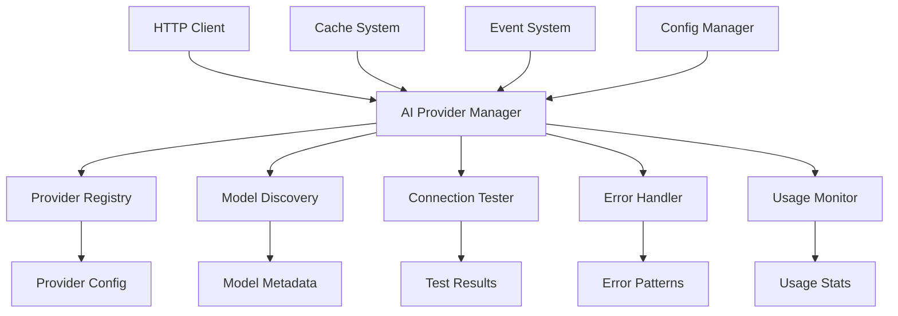
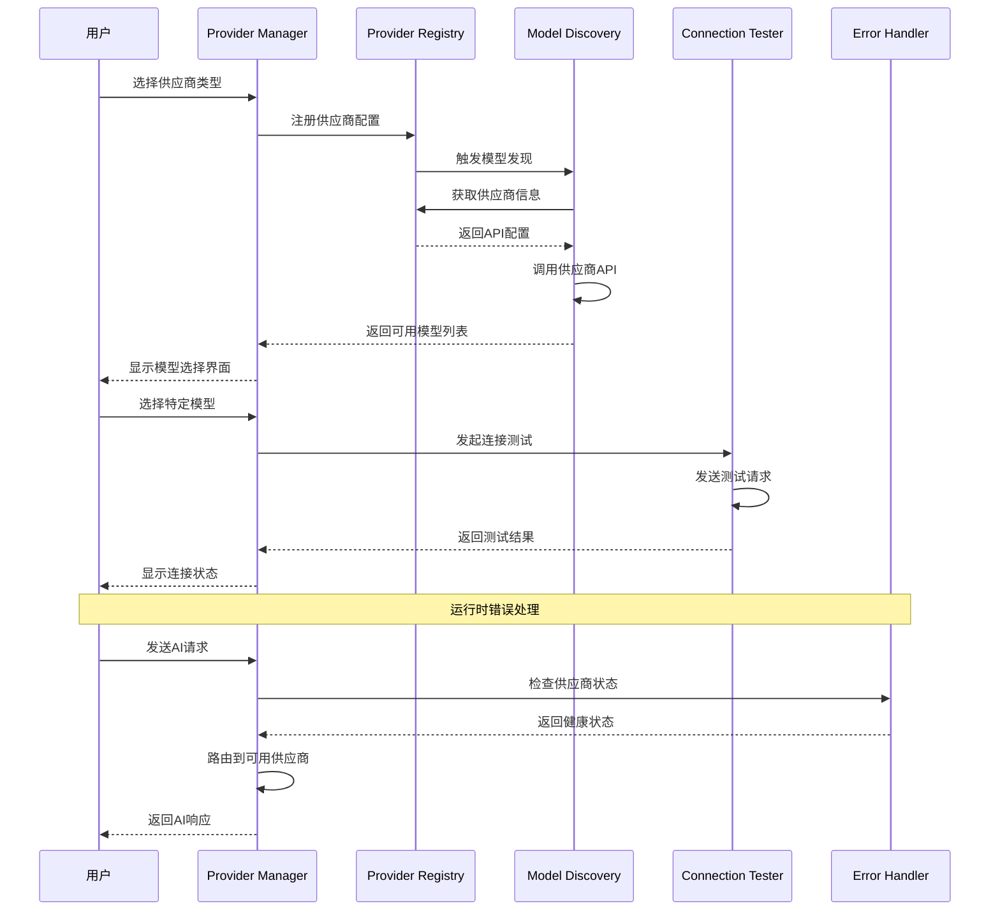
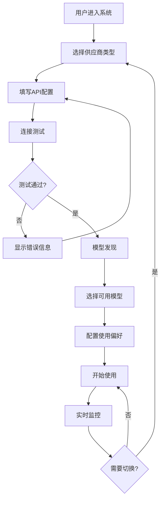

# 🤖 AI API 供应商管理系统

<div align="center">

## 🚀 智能API供应商管理平台

**统一管理多供应商AI API，支持动态配置、模型发现、连接测试和错误处理**

[📖 返回项目文档首页](../README.md) • [🌐 HTTP客户端模块](core-modules.md) • [🔧 配置管理](../modules/utilities.md)

---

</div>

## 📋 核心功能概述

AI API供应商管理系统是frys项目的重要扩展模块，专门用于管理和集成各种AI API供应商。该系统提供：

- **🔄 供应商管理**: 支持添加、配置、删除AI API供应商
- **📊 模型发现**: 自动发现和同步供应商提供的AI模型
- **🧪 连接测试**: 实时测试API连接和可用性
- **⚠️ 错误处理**: 智能错误识别和降级策略
- **📈 用量监控**: API调用统计和成本追踪
- **🔀 负载均衡**: 多供应商间的智能路由

---

## 🏗️ 系统架构设计

### 核心组件架构



### 数据流设计



---

## 🌐 支持的AI API供应商

### 主流供应商矩阵

| 供应商               | Base URL                                        | 主要模型                    | 价格文档                                                                            | 特点                     |
| -------------------- | ----------------------------------------------- | --------------------------- | ----------------------------------------------------------------------------------- | ------------------------ |
| **OpenAI**           | `https://api.openai.com/v1`                     | GPT-4, GPT-3.5              | [价格文档](https://openai.com/pricing/)                                             | 最成熟，功能全面         |
| **Anthropic Claude** | `https://api.anthropic.com/v1`                  | Claude-3, Claude-2          | [价格文档](https://www.anthropic.com/pricing/)                                      | 安全可靠，推理强         |
| **Google Gemini**    | `https://generativelanguage.googleapis.com/v1`  | Gemini-1.5, Gemini-1.0      | [价格文档](https://ai.google.dev/pricing)                                           | 多模态，Google生态       |
| **DeepSeek**         | `https://api.deepseek.com/v1`                   | DeepSeek-V2, DeepSeek-Coder | [价格文档](https://platform.deepseek.com/api-docs/pricing)                          | 高性价比，中文优化       |
| **通义千问**         | `https://dashscope.aliyuncs.com/api/v1`         | Qwen-Turbo, Qwen-Max        | [价格文档](https://help.aliyun.com/zh/dashscope/developer-reference/tongyi-qianwen) | 阿里云生态，中文擅长     |
| **文心一言**         | `https://aip.baidubce.com/rpc/2.0/ai_custom/v1` | ERNIE-4.0, ERNIE-3.5        | [价格文档](https://ai.baidu.com/ai-doc/PLATFORM/2ah9qbqo9)                          | 百度生态，知识丰富       |
| **智谱GLM**          | `https://open.bigmodel.cn/api/paas/v3`          | GLM-4, GLM-3                | [价格文档](https://open.bigmodel.cn/pricing)                                        | 清华系，学术背景         |
| **月之暗面Kimi**     | `https://api.moonshot.cn/v1`                    | Moonshot-V1                 | [价格文档](https://platform.moonshot.cn/pricing)                                    | 月之暗面出品，新兴供应商 |
| **讯飞星火**         | `https://spark-api.xf-yun.com/v3.1/chat`        | Spark-3.5, Spark-3.0        | [价格文档](https://xinghuo.xfyun.cn/sparkapi)                                       | 科大讯飞，语音AI强       |
| **MiniMax**          | `https://api.minimax.chat/v1`                   | MiniMax-Text, MiniMax-VL    | [价格文档](https://www.minimax.chat/pricing)                                        | 字节跳动，娱乐化AI       |

### 国内供应商扩展

| 供应商           | Base URL                         | 主要模型       | 价格文档                                         | 特点               |
| ---------------- | -------------------------------- | -------------- | ------------------------------------------------ | ------------------ |
| **豆包Marathon** | `https://api.marathon.edu.cn`    | Marathon-1.0   | [价格文档](https://marathon.edu.cn/pricing)      | 豆包网，教育场景   |
| **阶跃星辰**     | `https://api.stepfun.com/v1`     | Step-1, Step-2 | [价格文档](https://platform.stepfun.com/pricing) | 商汤科技，视觉AI强 |
| **零一万物**     | `https://api.01.ai/v1`           | Yi-34B, Yi-6B  | [价格文档](https://platform.01.ai/pricing)       | 01.AI，学术开源    |
| **360智脑**      | `https://api.360.cn/v1`          | 360GPT         | [价格文档](https://ai.360.cn/pricing)            | 360安全，隐私保护  |
| **华为云盘古**   | `https://api.huaweicloud.com/v1` | Pangu-3.0      | [价格文档](https://www.huaweicloud.com/pricing)  | 华为云，企业级     |

---

## 🔧 核心功能模块

### 1. 供应商注册中心 (Provider Registry)

```javascript
import { AIProviderManager } from 'frys';

const providerManager = new AIProviderManager();

// 注册OpenAI供应商
await providerManager.registerProvider({
  id: 'openai',
  name: 'OpenAI',
  type: 'openai',
  baseURL: 'https://api.openai.com/v1',
  apiKey: process.env.OPENAI_API_KEY,
  pricing: {
    url: 'https://openai.com/pricing/',
    currency: 'USD',
    models: {
      'gpt-4': { input: 0.03, output: 0.06 },
      'gpt-3.5-turbo': { input: 0.0015, output: 0.002 },
    },
  },
  config: {
    timeout: 30000,
    maxRetries: 3,
    rateLimit: 60, // requests per minute
  },
});

// 注册Claude供应商
await providerManager.registerProvider({
  id: 'claude',
  name: 'Anthropic Claude',
  type: 'anthropic',
  baseURL: 'https://api.anthropic.com/v1',
  apiKey: process.env.ANTHROPIC_API_KEY,
  pricing: {
    url: 'https://www.anthropic.com/pricing/',
    currency: 'USD',
    models: {
      'claude-3-opus': { input: 0.015, output: 0.075 },
      'claude-3-sonnet': { input: 0.003, output: 0.015 },
    },
  },
});
```

### 2. 模型发现服务 (Model Discovery)

```javascript
// 自动发现供应商可用模型
const models = await providerManager.discoverModels('openai');
console.log('发现的模型:', models);

/*
输出示例:
[
  {
    id: 'gpt-4',
    name: 'GPT-4',
    type: 'chat',
    contextLength: 8192,
    pricing: { input: 0.03, output: 0.06 },
    capabilities: ['chat', 'completion'],
    status: 'active'
  },
  {
    id: 'gpt-3.5-turbo',
    name: 'GPT-3.5 Turbo',
    type: 'chat',
    contextLength: 4096,
    pricing: { input: 0.0015, output: 0.002 },
    capabilities: ['chat', 'completion'],
    status: 'active'
  }
]
*/
```

### 3. 连接测试服务 (Connection Tester)

```javascript
// 测试供应商连接
const testResult = await providerManager.testConnection('openai');
console.log('连接测试结果:', testResult);

/*
输出示例:
{
  provider: 'openai',
  status: 'healthy',
  responseTime: 245, // ms
  models: ['gpt-4', 'gpt-3.5-turbo'],
  errorRate: 0.001,
  lastTest: '2024-01-15T10:30:00Z',
  nextTest: '2024-01-15T10:35:00Z'
}
*/

// 测试特定模型
const modelTest = await providerManager.testModel('openai', 'gpt-4');
console.log('模型测试结果:', modelTest);
```

### 4. 智能路由服务 (Smart Router)

```javascript
// 智能选择最佳供应商
const router = providerManager.getRouter();

const response = await router.route({
  model: 'gpt-4',
  messages: [{ role: 'user', content: 'Hello!' }],
  strategy: 'cost-effective', // 策略: fastest, cost-effective, reliable
  fallback: true, // 启用降级
});

console.log('路由结果:', response);
```

### 5. 用量监控服务 (Usage Monitor)

```javascript
// 获取使用统计
const usage = await providerManager.getUsage('openai');
console.log('使用统计:', usage);

/*
输出示例:
{
  provider: 'openai',
  period: '2024-01',
  totalRequests: 15420,
  totalTokens: 2847392,
  totalCost: 45.67,
  currency: 'USD',
  models: {
    'gpt-4': { requests: 2340, tokens: 456789, cost: 23.45 },
    'gpt-3.5-turbo': { requests: 13080, tokens: 2390603, cost: 22.22 }
  },
  trends: {
    daily: [...],
    weekly: [...],
    monthly: [...]
  }
}
*/
```

---

## 🎯 用户交互流程设计

### 完整使用流程



### 1. 供应商选择界面

```javascript
// 供应商选择组件
const ProviderSelector = () => {
  const [providers] = useState([
    { id: 'openai', name: 'OpenAI', icon: '🤖', status: 'healthy' },
    { id: 'claude', name: 'Claude', icon: '🧠', status: 'healthy' },
    { id: 'gemini', name: 'Gemini', icon: '💎', status: 'healthy' },
    { id: 'deepseek', name: 'DeepSeek', icon: '🔍', status: 'healthy' },
    // ... 更多供应商
  ]);

  return (
    <div className="provider-grid">
      {providers.map((provider) => (
        <ProviderCard
          key={provider.id}
          provider={provider}
          onSelect={() => handleProviderSelect(provider.id)}
        />
      ))}
    </div>
  );
};
```

### 2. API配置界面

```javascript
// API配置组件
const APIConfigForm = ({ providerId }) => {
  const [config, setConfig] = useState({
    apiKey: '',
    baseURL: '',
    organization: '',
    project: '',
  });

  const [testStatus, setTestStatus] = useState('idle');

  const handleTestConnection = async () => {
    setTestStatus('testing');
    try {
      const result = await providerManager.testConnection(providerId, config);
      setTestStatus(result.success ? 'success' : 'error');
      if (result.success) {
        // 保存配置
        await saveProviderConfig(providerId, config);
      }
    } catch (error) {
      setTestStatus('error');
    }
  };

  return (
    <form className="api-config-form">
      <InputField
        label="API Key"
        type="password"
        value={config.apiKey}
        onChange={(value) => setConfig({ ...config, apiKey: value })}
        required
      />

      <InputField
        label="Base URL (可选)"
        value={config.baseURL}
        onChange={(value) => setConfig({ ...config, baseURL: value })}
        placeholder="使用默认URL"
      />

      <Button
        onClick={handleTestConnection}
        loading={testStatus === 'testing'}
        disabled={!config.apiKey}
      >
        {testStatus === 'testing' ? '测试中...' : '测试连接'}
      </Button>

      {testStatus === 'success' && (
        <Alert type="success">连接成功！可以开始使用。</Alert>
      )}

      {testStatus === 'error' && (
        <Alert type="error">连接失败，请检查API Key和网络设置。</Alert>
      )}
    </form>
  );
};
```

### 3. 模型选择界面

```javascript
// 模型选择组件
const ModelSelector = ({ providerId }) => {
  const [models, setModels] = useState([]);
  const [loading, setLoading] = useState(true);

  useEffect(() => {
    loadModels();
  }, [providerId]);

  const loadModels = async () => {
    setLoading(true);
    try {
      const availableModels = await providerManager.discoverModels(providerId);
      setModels(availableModels);
    } catch (error) {
      console.error('加载模型失败:', error);
    } finally {
      setLoading(false);
    }
  };

  if (loading) {
    return <LoadingSpinner text="发现可用模型中..." />;
  }

  return (
    <div className="model-grid">
      {models.map((model) => (
        <ModelCard
          key={model.id}
          model={model}
          onSelect={() => handleModelSelect(model)}
          pricing={model.pricing}
        />
      ))}
    </div>
  );
};
```

---

## ⚠️ 错误处理机制

### 智能错误识别

```javascript
class AIProviderErrorHandler {
  static classifyError(error) {
    // API密钥错误
    if (error.code === 401 || error.message.includes('authentication')) {
      return {
        type: 'AUTHENTICATION_ERROR',
        message: 'API密钥无效或已过期',
        suggestion: '请检查并更新API密钥',
      };
    }

    // 配额超限
    if (error.code === 429 || error.message.includes('quota')) {
      return {
        type: 'QUOTA_EXCEEDED',
        message: 'API使用配额已用完',
        suggestion: '请检查账户余额或升级套餐',
      };
    }

    // 网络错误
    if (error.code === 'ECONNREFUSED' || error.message.includes('network')) {
      return {
        type: 'NETWORK_ERROR',
        message: '网络连接失败',
        suggestion: '请检查网络连接或稍后重试',
      };
    }

    // 模型不可用
    if (error.message.includes('model_not_found')) {
      return {
        type: 'MODEL_UNAVAILABLE',
        message: '请求的模型不可用',
        suggestion: '请选择其他可用模型',
      };
    }

    // 默认错误
    return {
      type: 'UNKNOWN_ERROR',
      message: '未知错误',
      suggestion: '请联系技术支持',
    };
  }

  static async handleError(error, context) {
    const errorInfo = this.classifyError(error);

    // 记录错误
    await logger.error('AI API调用失败', {
      ...errorInfo,
      context,
      originalError: error,
    });

    // 发送告警
    if (
      errorInfo.type === 'AUTHENTICATION_ERROR' ||
      errorInfo.type === 'QUOTA_EXCEEDED'
    ) {
      await alertManager.sendAlert({
        level: 'warning',
        title: `AI供应商错误: ${errorInfo.type}`,
        message: errorInfo.message,
        context,
      });
    }

    return errorInfo;
  }
}
```

### 降级策略

```javascript
class FallbackStrategy {
  constructor(providerManager) {
    this.providerManager = providerManager;
    this.fallbackChain = [
      { provider: 'openai', model: 'gpt-4' },
      { provider: 'openai', model: 'gpt-3.5-turbo' },
      { provider: 'claude', model: 'claude-3-sonnet' },
      { provider: 'gemini', model: 'gemini-1.5-pro' },
    ];
  }

  async executeWithFallback(request) {
    for (const option of this.fallbackChain) {
      try {
        const result = await this.providerManager.call(
          option.provider,
          option.model,
          request,
        );
        return result;
      } catch (error) {
        const errorInfo = AIProviderErrorHandler.classifyError(error);

        // 如果是不可恢复的错误，跳过
        if (
          ['AUTHENTICATION_ERROR', 'QUOTA_EXCEEDED'].includes(errorInfo.type)
        ) {
          continue;
        }

        // 记录降级信息
        logger.warn('AI调用降级', {
          from: option,
          error: errorInfo,
          attempt: this.fallbackChain.indexOf(option) + 1,
        });
      }
    }

    throw new Error('所有AI供应商都不可用，请稍后重试');
  }
}
```

---

## 📊 监控和统计

### 实时监控面板

```javascript
// 监控面板组件
const MonitoringDashboard = () => {
  const [stats, setStats] = useState({});

  useEffect(() => {
    const loadStats = async () => {
      const allStats = await providerManager.getAllStats();
      setStats(allStats);
    };

    loadStats();
    const interval = setInterval(loadStats, 30000); // 每30秒更新

    return () => clearInterval(interval);
  }, []);

  return (
    <div className="monitoring-dashboard">
      <div className="stats-grid">
        <StatCard
          title="总请求数"
          value={stats.totalRequests}
          trend={stats.requestTrend}
          icon="📊"
        />

        <StatCard
          title="总成本"
          value={`$${stats.totalCost}`}
          trend={stats.costTrend}
          icon="💰"
        />

        <StatCard
          title="平均响应时间"
          value={`${stats.avgResponseTime}ms`}
          trend={stats.latencyTrend}
          icon="⚡"
        />

        <StatCard
          title="错误率"
          value={`${(stats.errorRate * 100).toFixed(2)}%`}
          trend={stats.errorTrend}
          icon="⚠️"
        />
      </div>

      <div className="charts-container">
        <UsageChart data={stats.usageHistory} />
        <CostChart data={stats.costHistory} />
        <LatencyChart data={stats.latencyHistory} />
      </div>

      <ProviderStatusTable providers={stats.providers} />
    </div>
  );
};
```

---

## 🔧 配置和部署

### 环境变量配置

```bash
# .env 文件配置
# OpenAI 配置
OPENAI_API_KEY=sk-your-openai-key
OPENAI_ORGANIZATION=org-your-org-id

# Claude 配置
ANTHROPIC_API_KEY=sk-ant-your-claude-key

# Gemini 配置
GOOGLE_AI_API_KEY=your-gemini-key

# DeepSeek 配置
DEEPSEEK_API_KEY=sk-your-deepseek-key

# 系统配置
AI_PROVIDER_CACHE_TTL=3600000
AI_PROVIDER_MAX_RETRIES=3
AI_PROVIDER_TIMEOUT=30000
```

### Docker配置

```dockerfile
# Dockerfile
FROM node:18-alpine

# 安装系统依赖
RUN apk add --no-cache curl

# 设置工作目录
WORKDIR /app

# 复制package文件
COPY package*.json ./

# 安装依赖
RUN npm ci --only=production

# 复制应用代码
COPY . .

# 创建非root用户
RUN addgroup -g 1001 -S nodejs
RUN adduser -S appuser -u 1001

# 更改文件所有权
RUN chown -R appuser:nodejs /app
USER appuser

# 暴露端口
EXPOSE 3000

# 健康检查
HEALTHCHECK --interval=30s --timeout=3s --start-period=5s --retries=3 \
  CMD curl -f http://localhost:3000/health || exit 1

# 启动命令
CMD ["node", "src/index.js"]
```

### Kubernetes部署

```yaml
# ai-provider-deployment.yaml
apiVersion: apps/v1
kind: Deployment
metadata:
  name: ai-provider-manager
spec:
  replicas: 3
  selector:
    matchLabels:
      app: ai-provider-manager
  template:
    metadata:
      labels:
        app: ai-provider-manager
    spec:
      containers:
        - name: ai-provider-manager
          image: your-registry/frys:latest
          ports:
            - containerPort: 3000
          env:
            - name: NODE_ENV
              value: 'production'
            - name: OPENAI_API_KEY
              valueFrom:
                secretKeyRef:
                  name: ai-provider-secrets
                  key: openai-api-key
            - name: ANTHROPIC_API_KEY
              valueFrom:
                secretKeyRef:
                  name: ai-provider-secrets
                  key: claude-api-key
          resources:
            requests:
              memory: '256Mi'
              cpu: '250m'
            limits:
              memory: '512Mi'
              cpu: '500m'
          livenessProbe:
            httpGet:
              path: /health
              port: 3000
            initialDelaySeconds: 30
            periodSeconds: 10
          readinessProbe:
            httpGet:
              path: /health
              port: 3000
            initialDelaySeconds: 5
            periodSeconds: 5
```

---

## 🎯 最佳实践

### 1. 供应商选择策略

```javascript
const providerStrategy = {
  // 按成本选择
  costEffective: (models) => {
    return models.sort((a, b) => a.pricing.total - b.pricing.total)[0];
  },

  // 按速度选择
  fastest: (models) => {
    return models.sort((a, b) => a.avgLatency - b.avgLatency)[0];
  },

  // 按可靠性选择
  mostReliable: (models) => {
    return models.sort((a, b) => b.uptime - a.uptime)[0];
  },

  // 智能选择（综合评分）
  smart: (models, preferences = {}) => {
    const {
      costWeight = 0.3,
      speedWeight = 0.4,
      reliabilityWeight = 0.3,
    } = preferences;

    return models
      .map((model) => ({
        ...model,
        score:
          (1 - model.pricing.normalizedCost) * costWeight +
          (1 - model.avgLatency / 10000) * speedWeight +
          model.uptime * reliabilityWeight,
      }))
      .sort((a, b) => b.score - a.score)[0];
  },
};
```

### 2. 缓存策略

```javascript
class AIResponseCache {
  constructor(redisClient) {
    this.redis = redisClient;
    this.ttl = 3600; // 1小时
  }

  generateKey(request) {
    const hash = crypto
      .createHash('sha256')
      .update(
        JSON.stringify({
          provider: request.provider,
          model: request.model,
          messages: request.messages,
          temperature: request.temperature || 0.7,
        }),
      )
      .digest('hex');
    return `ai:response:${hash}`;
  }

  async get(request) {
    const key = this.generateKey(request);
    const cached = await this.redis.get(key);
    return cached ? JSON.parse(cached) : null;
  }

  async set(request, response) {
    const key = this.generateKey(request);
    await this.redis.setex(key, this.ttl, JSON.stringify(response));
  }
}
```

### 3. 负载均衡

```javascript
class LoadBalancer {
  constructor(providerManager) {
    this.providerManager = providerManager;
    this.weights = new Map();
  }

  // 基于权重的负载均衡
  async selectProvider(modelType, options = {}) {
    const availableProviders = await this.getAvailableProviders(modelType);

    if (availableProviders.length === 0) {
      throw new Error(`没有可用的${modelType}模型提供商`);
    }

    // 计算权重（基于响应时间、健康状态等）
    const weightedProviders = await Promise.all(
      availableProviders.map(async (provider) => ({
        provider,
        weight: await this.calculateWeight(provider, options),
      })),
    );

    // 使用加权随机选择
    return this.weightedRandomSelect(weightedProviders);
  }

  async calculateWeight(provider, options) {
    const stats = await this.providerManager.getStats(provider.id);
    const health = await this.providerManager.getHealth(provider.id);

    let weight = 100; // 基础权重

    // 响应时间权重
    if (stats.avgResponseTime < 1000) weight += 20;
    else if (stats.avgResponseTime < 3000) weight += 10;
    else weight -= 10;

    // 健康状态权重
    if (health.status === 'healthy') weight += 30;
    else if (health.status === 'degraded') weight += 10;
    else weight -= 50;

    // 错误率权重
    if (stats.errorRate < 0.01) weight += 20;
    else if (stats.errorRate < 0.05) weight += 5;
    else weight -= 20;

    return Math.max(1, weight); // 最小权重为1
  }

  weightedRandomSelect(providers) {
    const totalWeight = providers.reduce((sum, p) => sum + p.weight, 0);
    let random = Math.random() * totalWeight;

    for (const item of providers) {
      random -= item.weight;
      if (random <= 0) {
        return item.provider;
      }
    }
  }
}
```

---

## 🔮 未来规划

### 短期目标 (3个月内)

- [ ] 支持更多AI供应商 (Stability AI, Midjourney等)
- [ ] 实现更智能的模型推荐算法
- [ ] 添加批量API调用优化
- [ ] 完善监控和告警系统

### 中期目标 (6个月内)

- [ ] 支持流式响应处理
- [ ] 实现模型微调API集成
- [ ] 添加自定义模型训练支持
- [ ] 开发移动端SDK

### 长期目标 (1年内)

- [ ] 构建AI模型市场平台
- [ ] 实现联邦学习支持
- [ ] 添加边缘计算优化
- [ ] 开源核心算法库

---

<div align="center">

## 🚀 快速开始

**三步集成AI API供应商管理系统**

### 1. 安装依赖

```bash
npm install frys
```

### 2. 配置供应商

```javascript
import { AIProviderManager } from 'frys';

const manager = new AIProviderManager();

// 添加OpenAI供应商
await manager.registerProvider({
  id: 'openai',
  name: 'OpenAI',
  type: 'openai',
  apiKey: process.env.OPENAI_API_KEY,
});
```

### 3. 开始使用

```javascript
const response = await manager.call({
  provider: 'openai',
  model: 'gpt-4',
  messages: [{ role: 'user', content: '你好！' }],
});

console.log(response.choices[0].message.content);
```

---

**🎉 享受AI API供应商的统一管理体验！**

_让AI集成变得简单、可靠、高效_

</div>
