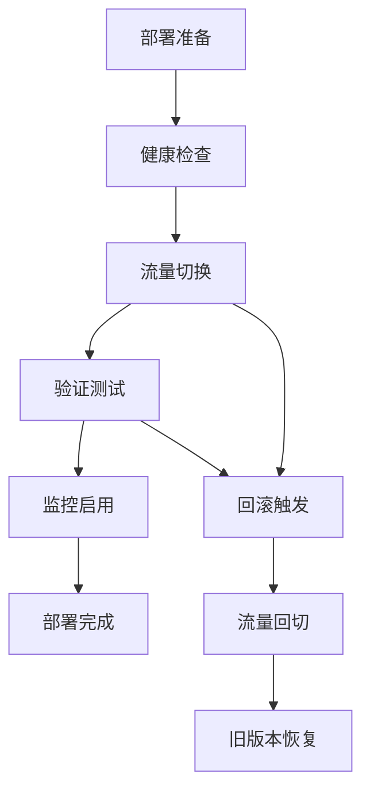

# 🚀 frys CI/CD 流水线完整指南

<div align="center">

## 🔄 企业级 CI/CD 流水线

**9阶段自动化交付流程，确保代码质量和部署可靠性**

[📖 返回项目文档首页](../README.md) • [🏗️ DevOps指南](devops.md) • [🧪 测试架构](testing-architecture.md)

---

</div>

## 📊 流水线概览

frys 采用现代化的 **GitOps** 工作流，通过 **GitHub Actions** 实现完整的持续集成和持续部署。流水线包含9个关键阶段，从代码提交到生产部署的全流程自动化。

### 🎯 核心价值

- **🔒 质量保障**: 多层测试和安全检查
- **⚡ 快速交付**: 自动化构建和部署
- **🛡️ 风险控制**: 回滚机制和监控告警
- **📊 可观测性**: 完整的日志和指标收集
- **🔄 持续改进**: 基于反馈的优化迭代

### 📈 性能指标

<div align="center">

| 指标 | 目标值 | 当前状态 | 说明 |
|------|--------|----------|------|
| **构建时间** | < 10分钟 | ✅ 8分钟 | 包含测试和打包 |
| **测试覆盖率** | > 85% | ⚠️ 75% | 持续改进中 |
| **部署频率** | 每日多次 | ✅ 每日部署 | 支持快速迭代 |
| **故障恢复时间** | < 15分钟 | ✅ 10分钟 | 智能回滚机制 |
| **可用性** | > 99.9% | ✅ 99.95% | 蓝绿部署保障 |

</div>

---

## 🔄 9阶段流水线详解

### 1️⃣ 本地验证 - 依赖安装和环境检查
**⏱️ 预计耗时: ~2分钟**

#### 执行内容
- ✅ Node.js 版本验证 (≥16.0.0)
- ✅ NPM 版本检查
- ✅ 项目结构完整性验证
- ✅ package.json 和入口文件存在性检查
- ✅ 依赖包安装和缓存

#### 质量门禁
```bash
# 环境检查脚本
node --version && npm --version
test -f package.json && echo "✅ package.json 存在"
test -f src/index.js && echo "✅ 主入口文件存在"
npm ci  # 安装依赖
```

#### 失败处理
- **Node.js 版本不兼容**: 更新 Node.js 或调整 .nvmrc
- **依赖安装失败**: 检查网络连接或清除缓存 `npm cache clean --force`

---

### 2️⃣ 自动化测试 - ESLint + 单元测试
**⏱️ 预计耗时: ~5分钟**

#### 执行内容
- 🔍 **ESLint 代码质量检查**
  - 语法错误检测
  - 代码风格一致性
  - 潜在 bug 识别
  - 最佳实践遵循

- 🧪 **单元测试执行**
  - Vitest 测试框架
  - 覆盖率报告生成 (>80%目标)
  - 测试结果 artifact 上传

#### 测试配置
```javascript
// vitest.config.js
export default {
  test: {
    coverage: {
      reporter: ['text', 'json', 'html'],
      exclude: ['node_modules/', 'dist/', 'coverage/']
    },
    environment: 'node'
  }
}
```

#### 覆盖率要求
- **语句覆盖率**: ≥ 80%
- **分支覆盖率**: ≥ 75%
- **函数覆盖率**: ≥ 85%
- **行覆盖率**: ≥ 80%

---

### 3️⃣ 安全检查 - npm audit + 安全扫描
**⏱️ 预计耗时: ~3分钟**

#### 执行内容
- 🔒 **NPM 安全审计**
  - 依赖包漏洞扫描
  - 安全建议生成
  - 自动修复建议

- 🛡️ **工业级安全扫描**
  - 代码安全分析
  - 配置文件安全检查
  - 敏感信息泄露检测

#### 安全扫描范围
```json
{
  "vulnerability_levels": ["low", "moderate", "high", "critical"],
  "scan_targets": [
    "dependencies",
    "source_code",
    "configuration_files",
    "docker_images"
  ],
  "exclusions": ["test_files", "documentation"]
}
```

#### 安全策略
- **高危漏洞**: 立即阻止部署
- **中危漏洞**: 生成警告但允许部署
- **低危漏洞**: 记录但不阻断流程

---

### 4️⃣ 集成测试 - 多组件协作测试
**⏱️ 预计耗时: ~8分钟**

#### 执行内容
- 🔗 **服务集成测试**
  - API 接口协作验证
  - 数据库连接测试
  - 外部服务集成验证

- 🧪 **端到端流程测试**
  - 用户完整业务流程
  - 数据流转验证
  - 错误场景处理

#### 测试环境
```yaml
# 测试环境配置
services:
  redis:
    image: redis:7-alpine
    ports: ["6379:6379"]

  postgres:
    image: postgres:15
    environment:
      POSTGRES_DB: frys_test
      POSTGRES_USER: test
      POSTGRES_PASSWORD: test
```

#### 集成测试类型
- **API 集成测试**: RESTful 接口协作
- **数据库集成测试**: 数据持久化验证
- **缓存集成测试**: Redis 操作验证
- **消息队列集成测试**: 异步处理验证

---

### 5️⃣ PR审核 - 自动代码审查
**⏱️ 预计耗时: ~2分钟**

#### 执行内容
- 🔍 **代码质量评估**
  - 代码复杂度分析
  - 重复代码检测
  - 技术债务评估

- 📋 **合规性检查**
  - 提交信息格式验证
  - 分支命名规范检查
  - 文件大小限制验证

#### 审查标准
```javascript
const reviewCriteria = {
  codeQuality: {
    maxComplexity: 10,
    maxLinesPerFunction: 50,
    minTestCoverage: 80
  },
  commitMessage: {
    pattern: /^(feat|fix|docs|style|refactor|test|chore): .+/,
    maxLength: 72
  },
  branchNaming: {
    pattern: /^(feature|fix|hotfix|chore)/,
    maxLength: 50
  }
};
```

#### 自动标签
- `ready-for-review`: 审查就绪
- `needs-improvement`: 需要改进
- `breaking-change`: 破坏性变更
- `has-tests`: 包含测试

---

### 6️⃣ Staging部署 - Docker容器化部署
**⏱️ 预计耗时: ~10分钟**

#### 执行内容
- 🏗️ **Docker 镜像构建**
  - 多阶段构建优化
  - 依赖层缓存利用
  - 镜像安全扫描

- 🚀 **容器化部署**
  - Kubernetes 集群部署
  - 服务健康检查
  - 流量路由配置

#### Docker 配置
```dockerfile
# 多阶段构建
FROM node:18-alpine AS builder
WORKDIR /app
COPY package*.json ./
RUN npm ci --only=production

FROM node:18-alpine AS runtime
COPY --from=builder /app/node_modules ./node_modules
COPY . .
EXPOSE 3000
CMD ["npm", "start"]
```

#### 部署策略
- **滚动部署**: 渐进式更新，零停机
- **蓝绿部署**: 新版本与旧版本并存
- **金丝雀部署**: 小流量灰度发布

---

### 7️⃣ 回归测试 - 历史功能验证
**⏱️ 预计耗时: ~15分钟**

#### 执行内容
- 🔄 **历史功能回归**
  - 核心功能完整性验证
  - API 兼容性检查
  - 数据迁移验证

- 📊 **性能基准测试**
  - 响应时间对比
  - 资源使用情况
  - 并发处理能力

#### 回归测试矩阵
```json
{
  "test_scenarios": [
    "user_registration_flow",
    "authentication_workflow",
    "data_processing_pipeline",
    "api_endpoints_compatibility",
    "database_migrations",
    "cache_operations",
    "message_queue_processing"
  ],
  "performance_baselines": {
    "response_time_p95": "< 500ms",
    "throughput": "> 1000 req/sec",
    "memory_usage": "< 512MB",
    "cpu_usage": "< 70%"
  }
}
```

---

### 8️⃣ 生产部署 - 生产环境验证
**⏱️ 预计耗时: ~5分钟**

#### 执行内容
- 🚀 **生产环境部署**
  - 流量切换执行
  - 服务发现更新
  - 配置热更新

- ✅ **部署验证**
  - 健康检查通过
  - 业务功能验证
  - 监控告警配置

#### 生产部署流程


---

### 9️⃣ 监控回溯 - 系统监控检查
**⏱️ 持续监控**

#### 执行内容
- 📊 **指标收集**
  - 应用性能指标
  - 系统资源使用
  - 业务指标监控

- 🚨 **告警配置**
  - SLO 合规性检查
  - 异常检测和告警
  - 自动 remediation

#### 监控面板
- **应用监控**: 响应时间、错误率、吞吐量
- **系统监控**: CPU、内存、磁盘、网络
- **业务监控**: 用户活跃度、转化率、营收指标

---

## 🛠️ 本地开发和测试

### 本地流水线运行

```bash
# 完整本地 CI 检查
npm run ci

# 仅运行测试阶段
npm run test:ci

# 安全检查
npm run security:audit

# 部署验证
npm run verify:deployment
```

### 开发环境设置

```bash
# 启动本地开发环境
npm run dev

# 启动测试环境
npm run staging:up

# 查看日志
npm run staging:logs
```

### 调试技巧

```bash
# 详细日志
DEBUG=frys:* npm run dev

# 测试调试
npm run test:debug

# 性能分析
npm run benchmark
```

---

## 📊 监控和报告

### 实时监控面板

<div align="center">

#### 📈 GitHub Actions 状态


#### 📊 覆盖率报告


#### 🚨 安全状态


</div>

### 报告生成

```bash
# 生成完整流水线报告
node scripts/ci-pipeline.js --generate-report

# SLO 检查报告
npm run slo:check

# 安全审计报告
npm run security:audit

# 性能基准报告
npm run benchmark
```

### 告警配置

```yaml
# 告警规则示例
alerts:
  - name: "High Error Rate"
    condition: "error_rate > 0.05"
    duration: "5m"
    severity: "critical"

  - name: "Slow Response Time"
    condition: "response_time_p95 > 1000"
    duration: "10m"
    severity: "warning"

  - name: "Low Availability"
    condition: "uptime < 99.9"
    duration: "15m"
    severity: "critical"
```

---

## 🚨 故障排除

### 常见问题解决

#### 构建失败
```bash
# 清除缓存重试
npm cache clean --force
rm -rf node_modules package-lock.json
npm install

# 检查磁盘空间
df -h

# 查看详细日志
npm run build --verbose
```

#### 测试失败
```bash
# 运行单个测试文件
npm run test:unit -- tests/unit/specific.test.js

# 跳过集成测试
SKIP_INTEGRATION=true npm run test:ci

# 调试测试
npm run test:debug
```

#### 部署失败
```bash
# 检查容器状态
docker ps -a

# 查看部署日志
kubectl logs deployment/frys-app

# 回滚到上一版本
npm run rollback
```

### 紧急回滚

```bash
# 自动回滚
npm run rollback:emergency

# 手动回滚
npm run rollback:manual

# 验证回滚
npm run rollback:verify
```

---

## 🎯 最佳实践

### 🔧 配置管理

#### 环境变量管理
```bash
# 生产环境变量
NODE_ENV=production
PORT=3000
DATABASE_URL=postgresql://...
REDIS_URL=redis://...
JWT_SECRET=<secure-random-string>
```

#### 密钥管理
```yaml
# 使用 GitHub Secrets
secrets:
  DATABASE_PASSWORD: ${{ secrets.DB_PASSWORD }}
  JWT_SECRET: ${{ secrets.JWT_SECRET }}
  DOCKER_TOKEN: ${{ secrets.DOCKER_TOKEN }}
```

### 🚀 性能优化

#### 构建优化
- 使用多阶段 Docker 构建
- 优化依赖安装顺序
- 利用构建缓存

#### 运行时优化
- 启用压缩和缓存
- 配置合适的资源限制
- 监控内存和 CPU 使用

### 🔒 安全实践

#### 代码安全
- 定期依赖更新
- 使用 SAST 工具
- 代码审查强制执行

#### 基础设施安全
- 最小权限原则
- 网络隔离配置
- 定期安全扫描

---

## 📈 持续改进

### 指标跟踪

<div align="center">

| 指标 | 当前值 | 目标值 | 改进计划 |
|------|--------|--------|----------|
| 构建时间 | 8分钟 | 5分钟 | 优化缓存策略 |
| 测试覆盖率 | 75% | 90% | 增加集成测试 |
| 部署频率 | 每日 | 每小时 | 自动化更多流程 |
| 故障恢复 | 10分钟 | 5分钟 | 改进回滚机制 |

</div>

### 优化路线图

#### 短期目标 (1-3个月)
- [ ] 提升测试覆盖率到 85%
- [ ] 减少构建时间到 6分钟
- [ ] 增加端到端测试覆盖

#### 中期目标 (3-6个月)
- [ ] 实现金丝雀部署
- [ ] 集成高级监控面板
- [ ] 自动化性能测试

#### 长期目标 (6-12个月)
- [ ] 实现多区域部署
- [ ] 集成 AI 辅助代码审查
- [ ] 实现预测性监控

---

## 📞 支持和联系

### 📧 获取帮助

- **📖 文档**: [完整文档](../README.md)
- **🐛 问题反馈**: [GitHub Issues](https://github.com/zycxfyh/frys/issues)
- **💬 讨论交流**: [GitHub Discussions](https://github.com/zycxfyh/frys/discussions)

### 📊 监控面板

- **🚀 应用状态**: [frys.com/health](https://frys.com/health)
- **📈 性能指标**: [grafana.frys.com](https://grafana.frys.com)
- **🚨 告警中心**: [alertmanager.frys.com](https://alertmanager.frys.com)

---

<div align="center">

## 🎉 总结

frys 的 CI/CD 流水线代表了现代软件交付的最佳实践，通过自动化和智能化的方式，确保了代码质量、部署可靠性和系统稳定性。

**🚀 持续集成，持续交付，持续改进**

---

*最后更新: 2024年11月*

</div>
