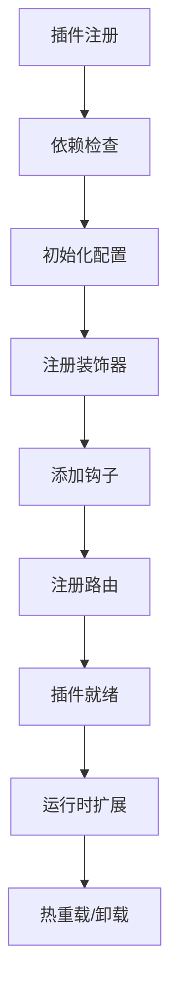

# frys 项目概述

## 📖 项目简介

frys 是一个企业级的轻量化工作流管理系统，采用"站在巨人肩膀上"的理念，集成业界领先的开源解决方案，构建高性能、可扩展、安全可靠的后端应用框架。

### 🎯 核心价值

- **开源优先**: 集成成熟开源组件而非重复造轮子
- **轻量化设计**: 精简内核 + 插件化扩展
- **企业级品质**: 高可用性、可观测性、安全合规
- **开发友好**: 完善的工具链和最佳实践

### 🚀 核心特性

| 特性              | 描述                | 优势               |
| ----------------- | ------------------- | ------------------ |
| ⚡ **高性能**     | 响应时间 < 100ms    | 优秀的用户体验     |
| 🔧 **模块化**     | 插件化架构          | 灵活扩展，按需加载 |
| 🛡️ **安全可靠**   | 企业级安全保障      | 数据安全，业务连续 |
| 📊 **可观测性**   | 全面监控和追踪      | 快速定位和解决问题 |
| 🚀 **DevOps友好** | 容器化 + 自动化部署 | 快速迭代，持续交付 |

### 📊 技术指标

- **响应时间**: P95 < 100ms
- **可用性**: 99.9% SLA
- **并发处理**: 支持 1000+ 并发请求
- **内存占用**: 基础配置 < 50MB
- **启动时间**: 冷启动 < 2秒

## 🏗️ 架构设计理念

### 1. 🪶 轻量化架构

#### 设计原则

- **最小化依赖**: 只集成必要的核心组件
- **按需加载**: 支持模块的动态加载和卸载
- **精简内核**: 核心功能聚焦，扩展功能插件化
- **高性能优化**: 内存使用优化，响应时间优化

#### 架构分层

```
frys 架构分层
├── 🎯 应用层 (Application Layer)
│   ├── 业务服务 (Business Services)
│   ├── API 控制器 (API Controllers)
│   └── 工作流引擎 (Workflow Engine)
├── 🔧 核心层 (Core Layer)
│   ├── 依赖注入容器 (Awilix)
│   ├── 插件管理系统 (fastify-plugin)
│   └── 错误监控系统 (Sentry)
├── 📚 工具层 (Utility Layer)
│   ├── 配置管理 (Configuration)
│   ├── 日志系统 (Logging)
│   ├── 缓存管理 (Caching)
│   └── 数据验证 (Validation)
└── 🔗 基础设施层 (Infrastructure Layer)
    ├── 数据库 (PostgreSQL)
    ├── 缓存 (Redis)
    ├── 消息队列 (RabbitMQ)
    └── 文件存储 (MinIO/S3)
```

#### 性能优化策略

```javascript
// 懒加载和服务预热
class ServiceManager {
  constructor() {
    this.services = new Map();
    this.preloaded = new Set();
  }

  // 懒加载服务
  async getService(name) {
    if (!this.services.has(name)) {
      const service = await this.loadService(name);
      this.services.set(name, service);
    }
    return this.services.get(name);
  }

  // 预加载核心服务
  async preloadCoreServices() {
    const coreServices = ['database', 'cache', 'logger'];

    await Promise.all(coreServices.map((service) => this.getService(service)));

    this.preloaded.add(...coreServices);
  }

  // 热重载（开发环境）
  async reloadService(name) {
    if (this.services.has(name)) {
      this.services.delete(name);
      return this.getService(name);
    }
  }
}
```

### 2. 🔌 插件化扩展

#### 插件架构设计

```javascript
// 插件接口定义
interface Plugin {
  name: string;
  version: string;
  dependencies?: string[];
  decorators?: Record<string, any>;

  init(fastify: FastifyInstance, options: any): Promise<void>;
  destroy?(): Promise<void>;
}

// 插件管理器
class PluginManager {
  private plugins = new Map<string, Plugin>();
  private loaded = new Set<string>();

  async loadPlugin(plugin: Plugin): Promise<void> {
    // 检查依赖
    await this.checkDependencies(plugin);

    // 初始化插件
    await plugin.init(this.fastify, plugin.options);

    this.plugins.set(plugin.name, plugin);
    this.loaded.add(plugin.name);
  }

  async unloadPlugin(name: string): Promise<void> {
    const plugin = this.plugins.get(name);
    if (plugin?.destroy) {
      await plugin.destroy();
    }

    this.plugins.delete(name);
    this.loaded.delete(name);
  }

  private async checkDependencies(plugin: Plugin): Promise<void> {
    if (!plugin.dependencies) return;

    for (const dep of plugin.dependencies) {
      if (!this.loaded.has(dep)) {
        throw new Error(`Plugin ${plugin.name} requires ${dep}`);
      }
    }
  }
}
```

#### 插件生命周期



### 3. 🛡️ 安全优先设计

#### 安全架构分层

```javascript
// 安全中间件栈
class SecurityMiddleware {
  constructor(private container: AwilixContainer) {}

  // 认证中间件
  async authenticate(request: FastifyRequest, reply: FastifyReply) {
    const token = this.extractToken(request);
    const user = await this.container.resolve('authService').verifyToken(token);

    request.user = user;
  }

  // 授权中间件
  async authorize(request: FastifyRequest, reply: FastifyReply, requiredRole: string) {
    const user = request.user;
    const hasPermission = await this.container.resolve('authService')
      .checkPermission(user.id, requiredRole);

    if (!hasPermission) {
      throw new ForbiddenError('Insufficient permissions');
    }
  }

  // 输入验证中间件
  async validateInput(request: FastifyRequest, schema: any) {
    const validator = this.container.resolve('validator');
    const result = validator.validate(request.body, schema);

    if (!result.isValid) {
      throw new ValidationError('Invalid input', result.errors);
    }
  }

  // 速率限制中间件
  async rateLimit(request: FastifyRequest, reply: FastifyReply) {
    const limiter = this.container.resolve('rateLimiter');
    const key = this.getClientKey(request);

    const allowed = await limiter.checkLimit(key);
    if (!allowed) {
      throw new RateLimitError('Too many requests');
    }
  }
}
```

#### 安全配置最佳实践

```javascript
// 安全配置
const securityConfig = {
  // HTTPS 配置
  https: {
    key: fs.readFileSync('./certs/server.key'),
    cert: fs.readFileSync('./certs/server.crt'),
    ca: fs.readFileSync('./certs/ca.crt'),
  },

  // CORS 配置
  cors: {
    origin:
      process.env.NODE_ENV === 'production'
        ? ['https://yourdomain.com']
        : ['http://localhost:3000'],
    credentials: true,
    maxAge: 86400,
  },

  // Helmet 安全头
  helmet: {
    contentSecurityPolicy: {
      directives: {
        defaultSrc: ["'self'"],
        styleSrc: ["'self'", "'unsafe-inline'"],
        scriptSrc: ["'self'"],
        imgSrc: ["'self'", 'data:', 'https:'],
      },
    },
    hsts: {
      maxAge: 31536000,
      includeSubDomains: true,
      preload: true,
    },
  },

  // 会话配置
  session: {
    secret: process.env.SESSION_SECRET,
    cookie: {
      secure: process.env.NODE_ENV === 'production',
      httpOnly: true,
      maxAge: 24 * 60 * 60 * 1000, // 24小时
    },
  },
};
```

### 4. 📊 可观测性设计

#### 监控指标体系

```javascript
// 应用指标收集器
class MetricsCollector {
  constructor(private registry: Registry) {}

  // HTTP 请求指标
  recordHttpRequest(method: string, path: string, status: number, duration: number) {
    this.httpRequestTotal
      .labels(method, path, status.toString())
      .inc();

    this.httpRequestDuration
      .labels(method, path)
      .observe(duration);
  }

  // 业务指标
  recordBusinessMetric(name: string, value: number, labels: Record<string, string> = {}) {
    this.businessMetrics
      .labels({ ...labels, name })
      .set(value);
  }

  // 错误指标
  recordError(type: string, message: string) {
    this.errorTotal
      .labels(type)
      .inc();

    // 发送到错误追踪系统
    Sentry.captureException(new Error(message), {
      tags: { error_type: type }
    });
  }

  // 性能指标
  recordPerformanceMetric(name: string, value: number) {
    this.performanceMetrics
      .labels(name)
      .set(value);
  }
}

// Prometheus 指标定义
const httpRequestTotal = new Counter({
  name: 'http_requests_total',
  help: 'Total number of HTTP requests',
  labelNames: ['method', 'path', 'status']
});

const httpRequestDuration = new Histogram({
  name: 'http_request_duration_seconds',
  help: 'HTTP request duration in seconds',
  labelNames: ['method', 'path'],
  buckets: [0.1, 0.5, 1, 2, 5, 10]
});

const businessMetrics = new Gauge({
  name: 'business_metrics',
  help: 'Business specific metrics',
  labelNames: ['name']
});
```

#### 日志分层架构

```javascript
// 日志配置
const loggerConfig = {
  level: process.env.LOG_LEVEL || 'info',
  format: process.env.NODE_ENV === 'production' ? 'json' : 'dev',
  transports: [
    // 控制台输出
    new winston.transports.Console({
      format: process.env.NODE_ENV === 'production'
        ? winston.format.json()
        : winston.format.combine(
            winston.format.colorize(),
            winston.format.simple()
          )
    }),

    // 文件输出
    new winston.transports.File({
      filename: 'logs/error.log',
      level: 'error',
      format: winston.format.combine(
        winston.format.timestamp(),
        winston.format.errors({ stack: true }),
        winston.format.json()
      )
    }),

    new winston.transports.File({
      filename: 'logs/combined.log',
      format: winston.format.combine(
        winston.format.timestamp(),
        winston.format.json()
      )
    })
  ]
};

// 结构化日志记录器
class StructuredLogger {
  constructor(private logger: winston.Logger) {}

  info(message: string, context: Record<string, any> = {}) {
    this.logger.info(message, {
      ...context,
      timestamp: new Date().toISOString(),
      level: 'info'
    });
  }

  error(message: string, error?: Error, context: Record<string, any> = {}) {
    this.logger.error(message, {
      ...context,
      error: error?.message,
      stack: error?.stack,
      timestamp: new Date().toISOString(),
      level: 'error'
    });
  }

  warn(message: string, context: Record<string, any> = {}) {
    this.logger.warn(message, {
      ...context,
      timestamp: new Date().toISOString(),
      level: 'warn'
    });
  }

  // 业务日志
  business(operation: string, data: Record<string, any>) {
    this.logger.info(`Business operation: ${operation}`, {
      operation,
      ...data,
      category: 'business',
      timestamp: new Date().toISOString()
    });
  }

  // 审计日志
  audit(action: string, userId: string, resource: string, details: Record<string, any>) {
    this.logger.info(`Audit: ${action}`, {
      action,
      userId,
      resource,
      ...details,
      category: 'audit',
      timestamp: new Date().toISOString()
    });
  }
}
```

## 🎨 开发最佳实践

### 1. 代码组织结构

```
src/
├── app.ts                    # 应用入口
├── server.ts                 # 服务器配置
├── container.ts              # 依赖注入容器
├── plugins/                  # 插件目录
│   ├── auth.ts              # 认证插件
│   ├── monitoring.ts        # 监控插件
│   └── validation.ts        # 验证插件
├── services/                # 业务服务
│   ├── user/
│   │   ├── user.service.ts
│   │   ├── user.repository.ts
│   │   └── user.types.ts
│   └── workflow/
│       ├── workflow.service.ts
│       ├── workflow.engine.ts
│       └── workflow.types.ts
├── controllers/             # API 控制器
│   ├── user.controller.ts
│   └── workflow.controller.ts
├── models/                  # 数据模型
├── utils/                   # 工具函数
├── middleware/              # 中间件
├── config/                  # 配置管理
├── types/                   # TypeScript 类型
└── test/                    # 测试文件
    ├── unit/
    ├── integration/
    └── e2e/
```

### 2. 错误处理策略

```javascript
// 全局错误处理
class ErrorHandler {
  static handle(error: Error, request?: FastifyRequest): ErrorResponse {
    // 业务错误
    if (error instanceof BusinessError) {
      return {
        code: error.code,
        message: error.message,
        statusCode: 400
      };
    }

    // 认证错误
    if (error instanceof AuthenticationError) {
      return {
        code: 'AUTHENTICATION_FAILED',
        message: 'Authentication failed',
        statusCode: 401
      };
    }

    // 授权错误
    if (error instanceof AuthorizationError) {
      return {
        code: 'AUTHORIZATION_FAILED',
        message: 'Insufficient permissions',
        statusCode: 403
      };
    }

    // 验证错误
    if (error instanceof ValidationError) {
      return {
        code: 'VALIDATION_FAILED',
        message: 'Invalid input data',
        errors: error.errors,
        statusCode: 422
      };
    }

    // 系统错误
    logger.error('Unhandled error', error, {
      url: request?.url,
      method: request?.method,
      userId: request?.user?.id
    });

    return {
      code: 'INTERNAL_ERROR',
      message: 'Internal server error',
      statusCode: 500
    };
  }
}

// 异步错误边界
export function asyncErrorBoundary(fn: Function) {
  return (request: FastifyRequest, reply: FastifyReply) => {
    Promise.resolve(fn(request, reply)).catch(error => {
      const errorResponse = ErrorHandler.handle(error, request);
      reply.status(errorResponse.statusCode).send(errorResponse);
    });
  };
}
```

### 3. 数据库设计原则

```sql
-- 用户表设计示例
CREATE TABLE users (
  id UUID PRIMARY KEY DEFAULT gen_random_uuid(),
  email VARCHAR(255) UNIQUE NOT NULL,
  username VARCHAR(100) UNIQUE NOT NULL,
  password_hash VARCHAR(255) NOT NULL,
  full_name VARCHAR(255),
  role VARCHAR(50) NOT NULL DEFAULT 'user',
  status VARCHAR(20) NOT NULL DEFAULT 'active',
  email_verified BOOLEAN NOT NULL DEFAULT false,
  last_login_at TIMESTAMP WITH TIME ZONE,
  created_at TIMESTAMP WITH TIME ZONE NOT NULL DEFAULT NOW(),
  updated_at TIMESTAMP WITH TIME ZONE NOT NULL DEFAULT NOW()
);

-- 索引设计
CREATE INDEX idx_users_email ON users(email);
CREATE INDEX idx_users_username ON users(username);
CREATE INDEX idx_users_status ON users(status);
CREATE INDEX idx_users_created_at ON users(created_at DESC);

-- 工作流表设计
CREATE TABLE workflows (
  id UUID PRIMARY KEY DEFAULT gen_random_uuid(),
  name VARCHAR(255) NOT NULL,
  description TEXT,
  definition JSONB NOT NULL,
  version INTEGER NOT NULL DEFAULT 1,
  status VARCHAR(20) NOT NULL DEFAULT 'draft',
  created_by UUID NOT NULL REFERENCES users(id),
  created_at TIMESTAMP WITH TIME ZONE NOT NULL DEFAULT NOW(),
  updated_at TIMESTAMP WITH TIME ZONE NOT NULL DEFAULT NOW()
);

-- 工作流实例表
CREATE TABLE workflow_instances (
  id UUID PRIMARY KEY DEFAULT gen_random_uuid(),
  workflow_id UUID NOT NULL REFERENCES workflows(id),
  status VARCHAR(20) NOT NULL DEFAULT 'running',
  input_data JSONB,
  output_data JSONB,
  error_message TEXT,
  started_at TIMESTAMP WITH TIME ZONE NOT NULL DEFAULT NOW(),
  completed_at TIMESTAMP WITH TIME ZONE,
  created_at TIMESTAMP WITH TIME ZONE NOT NULL DEFAULT NOW()
);

-- 分区表（针对大数据量）
CREATE TABLE workflow_logs (
  id UUID PRIMARY KEY DEFAULT gen_random_uuid(),
  instance_id UUID NOT NULL REFERENCES workflow_instances(id),
  level VARCHAR(20) NOT NULL,
  message TEXT NOT NULL,
  data JSONB,
  created_at TIMESTAMP WITH TIME ZONE NOT NULL DEFAULT NOW()
) PARTITION BY RANGE (created_at);

-- 创建分区
CREATE TABLE workflow_logs_2024_01 PARTITION OF workflow_logs
  FOR VALUES FROM ('2024-01-01') TO ('2024-02-01');
```

### 4. API 设计规范

```javascript
// RESTful API 设计
class UserController {
  constructor(private userService: UserService) {}

  // GET /users - 获取用户列表
  async getUsers(request: FastifyRequest, reply: FastifyReply) {
    const {
      page = 1,
      limit = 10,
      search,
      status,
      sort = 'created_at',
      order = 'desc'
    } = request.query as any;

    const result = await this.userService.findUsers({
      page: Number(page),
      limit: Number(limit),
      search,
      status,
      sort,
      order
    });

    reply.send({
      data: result.users,
      pagination: {
        page: result.page,
        limit: result.limit,
        total: result.total,
        totalPages: Math.ceil(result.total / result.limit)
      }
    });
  }

  // POST /users - 创建用户
  async createUser(request: FastifyRequest, reply: FastifyReply) {
    const userData = request.body as CreateUserRequest;

    const user = await this.userService.createUser(userData);

    reply.status(201).send({
      data: user,
      message: 'User created successfully'
    });
  }

  // GET /users/:id - 获取单个用户
  async getUser(request: FastifyRequest, reply: FastifyReply) {
    const { id } = request.params as { id: string };

    const user = await this.userService.findById(id);

    if (!user) {
      return reply.status(404).send({
        error: 'User not found'
      });
    }

    reply.send({ data: user });
  }

  // PUT /users/:id - 更新用户
  async updateUser(request: FastifyRequest, reply: FastifyReply) {
    const { id } = request.params as { id: string };
    const updateData = request.body as UpdateUserRequest;

    const user = await this.userService.updateUser(id, updateData);

    reply.send({
      data: user,
      message: 'User updated successfully'
    });
  }

  // DELETE /users/:id - 删除用户
  async deleteUser(request: FastifyRequest, reply: FastifyReply) {
    const { id } = request.params as { id: string };

    await this.userService.deleteUser(id);

    reply.send({
      message: 'User deleted successfully'
    });
  }
}
```

## 🌟 应用场景

### 1. 企业工作流管理

```javascript
// 员工入职流程
const onboardingWorkflow = {
  name: 'Employee Onboarding',
  tasks: [
    {
      id: 'create_account',
      name: 'Create User Account',
      type: 'service',
      service: 'userService.createUser',
      input: {
        email: '${employee.email}',
        role: '${employee.role}',
      },
    },
    {
      id: 'send_invitation',
      name: 'Send Invitation Email',
      type: 'service',
      service: 'emailService.sendWelcome',
      dependsOn: ['create_account'],
      input: {
        to: '${employee.email}',
        template: 'onboarding_invitation',
      },
    },
    {
      id: 'setup_workspace',
      name: 'Setup Workspace',
      type: 'parallel',
      tasks: [
        {
          id: 'create_slack_account',
          name: 'Create Slack Account',
          type: 'http',
          url: 'https://slack.com/api/users.admin.invite',
          method: 'POST',
        },
        {
          id: 'setup_gitlab_access',
          name: 'Setup GitLab Access',
          type: 'service',
          service: 'gitlabService.createUser',
        },
      ],
    },
  ],
};
```

### 2. 电商订单处理

```javascript
// 订单处理流程
const orderProcessingWorkflow = {
  name: 'Order Processing',
  tasks: [
    {
      id: 'validate_payment',
      name: 'Validate Payment',
      type: 'service',
      service: 'paymentService.validatePayment',
      input: {
        orderId: '${order.id}',
        amount: '${order.total}',
      },
    },
    {
      id: 'reserve_inventory',
      name: 'Reserve Inventory',
      type: 'service',
      service: 'inventoryService.reserveItems',
      dependsOn: ['validate_payment'],
      input: {
        items: '${order.items}',
      },
    },
    {
      id: 'calculate_shipping',
      name: 'Calculate Shipping',
      type: 'service',
      service: 'shippingService.calculateCost',
      dependsOn: ['reserve_inventory'],
      input: {
        address: '${order.shippingAddress}',
        items: '${order.items}',
      },
    },
    {
      id: 'process_payment',
      name: 'Process Payment',
      type: 'service',
      service: 'paymentService.chargeCard',
      dependsOn: ['calculate_shipping'],
      input: {
        cardToken: '${payment.cardToken}',
        amount: '${order.total + shipping.cost}',
      },
    },
    {
      id: 'ship_order',
      name: 'Ship Order',
      type: 'service',
      service: 'shippingService.createShipment',
      dependsOn: ['process_payment'],
      input: {
        orderId: '${order.id}',
        address: '${order.shippingAddress}',
      },
    },
    {
      id: 'send_confirmation',
      name: 'Send Order Confirmation',
      type: 'parallel',
      tasks: [
        {
          id: 'email_confirmation',
          name: 'Send Email Confirmation',
          type: 'service',
          service: 'emailService.sendOrderConfirmation',
        },
        {
          id: 'sms_notification',
          name: 'Send SMS Notification',
          type: 'service',
          service: 'smsService.sendOrderNotification',
        },
      ],
    },
  ],
};
```

### 3. 审批流程自动化

```javascript
// 采购审批流程
const purchaseApprovalWorkflow = {
  name: 'Purchase Approval',
  tasks: [
    {
      id: 'validate_request',
      name: 'Validate Purchase Request',
      type: 'service',
      service: 'validationService.validatePurchaseRequest',
      input: {
        request: '${purchaseRequest}',
      },
    },
    {
      id: 'auto_approval',
      name: 'Auto Approval for Small Amounts',
      type: 'condition',
      condition: '${purchaseRequest.amount <= 1000}',
      tasks: [
        {
          id: 'approve_small',
          name: 'Approve Small Purchase',
          type: 'service',
          service: 'approvalService.autoApprove',
        },
      ],
    },
    {
      id: 'manager_approval',
      name: 'Manager Approval',
      type: 'condition',
      condition: '${purchaseRequest.amount <= 5000}',
      dependsOn: ['validate_request'],
      tasks: [
        {
          id: 'notify_manager',
          name: 'Notify Manager',
          type: 'service',
          service: 'notificationService.notifyManager',
        },
        {
          id: 'wait_approval',
          name: 'Wait for Approval',
          type: 'manual',
          assignee: '${purchaseRequest.managerId}',
        },
      ],
    },
    {
      id: 'executive_approval',
      name: 'Executive Approval',
      type: 'condition',
      condition: '${purchaseRequest.amount > 5000}',
      dependsOn: ['validate_request'],
      tasks: [
        {
          id: 'notify_executive',
          name: 'Notify Executive',
          type: 'service',
          service: 'notificationService.notifyExecutive',
        },
        {
          id: 'wait_executive_approval',
          name: 'Wait for Executive Approval',
          type: 'manual',
          assignee: '${purchaseRequest.executiveId}',
        },
      ],
    },
    {
      id: 'process_purchase',
      name: 'Process Purchase',
      type: 'service',
      service: 'purchaseService.processPurchase',
      dependsOn: ['auto_approval', 'manager_approval', 'executive_approval'],
    },
  ],
};
```

## 📈 性能优化指南

### 1. 数据库优化

```javascript
// 查询优化
class OptimizedUserRepository {
  async findUsersWithPagination(options: {
    page: number;
    limit: number;
    search?: string;
    status?: string;
    sort?: string;
    order?: 'asc' | 'desc';
  }) {
    const { page, limit, search, status, sort = 'created_at', order = 'desc' } = options;

    const query = this.db('users')
      .select('*')
      .where(builder => {
        if (search) {
          builder.where('email', 'ilike', `%${search}%`)
            .orWhere('username', 'ilike', `%${search}%`)
            .orWhere('full_name', 'ilike', `%${search}%`);
        }
        if (status) {
          builder.where('status', status);
        }
      })
      .orderBy(sort, order)
      .limit(limit)
      .offset((page - 1) * limit);

    // 使用索引
    const result = await query;
    const total = await this.getTotalCount(search, status);

    return {
      users: result,
      total,
      page,
      limit
    };
  }

  // 缓存常用查询
  @Cacheable({ ttl: 300 }) // 5分钟缓存
  async getUserStats() {
    return await this.db('users')
      .select(
        this.db.raw('count(*) as total_users'),
        this.db.raw('count(case when status = \'active\' then 1 end) as active_users'),
        this.db.raw('count(case when created_at >= now() - interval \'30 days\' then 1 end) as new_users')
      )
      .first();
  }

  // 批量操作优化
  async bulkUpdateStatus(userIds: string[], status: string) {
    return await this.db('users')
      .whereIn('id', userIds)
      .update({
        status,
        updated_at: this.db.fn.now()
      });
  }
}
```

### 2. 缓存策略

```javascript
// 多层缓存策略
class CacheManager {
  constructor(
    private l1Cache: Redis, // L1: 本地缓存
    private l2Cache: Redis, // L2: 分布式缓存
    private db: Database
  ) {}

  // 多级缓存读取
  async get(key: string): Promise<any> {
    // L1 缓存检查
    let data = await this.l1Cache.get(key);
    if (data) {
      return JSON.parse(data);
    }

    // L2 缓存检查
    data = await this.l2Cache.get(key);
    if (data) {
      // 回填 L1 缓存
      await this.l1Cache.setex(key, 300, data); // 5分钟
      return JSON.parse(data);
    }

    // 数据库查询
    data = await this.db.get(key);
    if (data) {
      const serialized = JSON.stringify(data);
      // 设置不同过期时间
      await this.l1Cache.setex(key, 300, serialized);   // L1: 5分钟
      await this.l2Cache.setex(key, 3600, serialized);  // L2: 1小时
    }

    return data;
  }

  // 缓存失效策略
  async invalidate(key: string): Promise<void> {
    await Promise.all([
      this.l1Cache.del(key),
      this.l2Cache.del(key)
    ]);
  }

  // 缓存预热
  async warmUp(): Promise<void> {
    const hotKeys = await this.getHotKeys();

    for (const key of hotKeys) {
      const data = await this.db.get(key);
      if (data) {
        const serialized = JSON.stringify(data);
        await this.l2Cache.setex(key, 3600, serialized);
      }
    }
  }
}

// 缓存装饰器
function Cacheable(options: { ttl: number; key?: string }) {
  return function (target: any, propertyName: string, descriptor: PropertyDescriptor) {
    const method = descriptor.value;

    descriptor.value = async function (...args: any[]) {
      const cacheKey = options.key || `${target.constructor.name}:${propertyName}:${JSON.stringify(args)}`;
      const cacheManager = this.cacheManager;

      let result = await cacheManager.get(cacheKey);
      if (result === undefined) {
        result = await method.apply(this, args);
        if (result !== undefined) {
          await cacheManager.set(cacheKey, result, options.ttl);
        }
      }

      return result;
    };
  };
}
```

### 3. 异步处理优化

```javascript
// 异步任务队列
class AsyncTaskQueue {
  private queue: Array<() => Promise<any>> = [];
  private running = 0;
  private concurrency: number;

  constructor(concurrency = 10) {
    this.concurrency = concurrency;
  }

  async add<T>(task: () => Promise<T>): Promise<T> {
    return new Promise((resolve, reject) => {
      this.queue.push(async () => {
        try {
          const result = await task();
          resolve(result);
        } catch (error) {
          reject(error);
        }
      });

      this.process();
    });
  }

  private async process() {
    if (this.running >= this.concurrency || this.queue.length === 0) {
      return;
    }

    this.running++;
    const task = this.queue.shift()!;

    try {
      await task();
    } finally {
      this.running--;
      this.process();
    }
  }

  async waitForAll() {
    while (this.queue.length > 0 || this.running > 0) {
      await new Promise(resolve => setTimeout(resolve, 10));
    }
  }
}

// 异步工作流引擎
class AsyncWorkflowEngine {
  constructor(
    private taskQueue: AsyncTaskQueue,
    private eventEmitter: EventEmitter
  ) {}

  async executeWorkflow(workflow: WorkflowDefinition, context: any) {
    const executionId = uuidv4();
    const state = new Map<string, any>();

    this.eventEmitter.emit('workflow.started', { executionId, workflow: workflow.name });

    try {
      for (const task of workflow.tasks) {
        await this.taskQueue.add(async () => {
          await this.executeTask(task, context, state);
        });
      }

      await this.taskQueue.waitForAll();

      this.eventEmitter.emit('workflow.completed', { executionId });
      return state;

    } catch (error) {
      this.eventEmitter.emit('workflow.failed', { executionId, error });
      throw error;
    }
  }

  private async executeTask(task: TaskDefinition, context: any, state: Map<string, any>) {
    // 检查依赖
    if (task.dependsOn) {
      for (const dep of task.dependsOn) {
        if (!state.has(dep)) {
          throw new Error(`Dependency ${dep} not satisfied for task ${task.id}`);
        }
      }
    }

    // 执行任务
    const result = await this.executeTaskByType(task, context);

    // 保存结果
    state.set(task.id, result);

    this.eventEmitter.emit('task.completed', {
      taskId: task.id,
      result
    });
  }
}
```

## ❓ 常见问题

### Q: 如何选择技术栈？

**A:** 根据项目需求和团队情况选择：

- **小型项目**: 选择轻量级组件，快速启动
- **大型项目**: 选择企业级组件，保证稳定性
- **微服务架构**: 选择支持分布式部署的组件
- **云原生**: 选择云服务集成的组件

### Q: 如何处理服务依赖？

**A:** 使用依赖注入容器管理依赖关系：

```javascript
// 服务依赖图
const dependencyGraph = {
  userService: ['userRepository', 'authService', 'logger'],
  authService: ['userRepository', 'jwtService', 'cache'],
  workflowEngine: ['workflowRepository', 'taskQueue', 'eventEmitter']
};

// 循环依赖检测
function detectCircularDependencies(graph: Record<string, string[]>) {
  const visited = new Set<string>();
  const recursionStack = new Set<string>();

  function hasCycle(node: string): boolean {
    if (recursionStack.has(node)) return true;
    if (visited.has(node)) return false;

    visited.add(node);
    recursionStack.add(node);

    for (const dep of graph[node] || []) {
      if (hasCycle(dep)) return true;
    }

    recursionStack.delete(node);
    return false;
  }

  for (const node of Object.keys(graph)) {
    if (hasCycle(node)) {
      throw new Error(`Circular dependency detected involving ${node}`);
    }
  }
}
```

### Q: 如何设计可扩展的架构？

**A:** 遵循SOLID原则和设计模式：

- **单一职责**: 每个服务只负责一个功能
- **开闭原则**: 对扩展开放，对修改关闭
- **依赖倒置**: 依赖抽象而非具体实现
- **接口隔离**: 提供最小化接口
- **策略模式**: 支持运行时切换实现

```javascript
// 策略模式示例
interface NotificationStrategy {
  send(message: string, recipient: string): Promise<void>;
}

class EmailNotificationStrategy implements NotificationStrategy {
  async send(message: string, recipient: string) {
    // 发送邮件逻辑
  }
}

class SMSNotificationStrategy implements NotificationStrategy {
  async send(message: string, recipient: string) {
    // 发送短信逻辑
  }
}

class NotificationService {
  constructor(private strategies: Map<string, NotificationStrategy>) {}

  async sendNotification(type: string, message: string, recipient: string) {
    const strategy = this.strategies.get(type);
    if (!strategy) {
      throw new Error(`Unknown notification type: ${type}`);
    }

    await strategy.send(message, recipient);
  }
}
```

## 📚 相关链接

- [frys 核心架构](core-architecture.md) - 详细的架构设计文档
- [核心模块文档](core-modules.md) - 核心功能模块说明
- [业务服务文档](business-services.md) - 业务逻辑实现指南
- [测试架构文档](testing-architecture.md) - 完整的测试策略
- [DevOps 指南](devops.md) - 部署和运维指南
