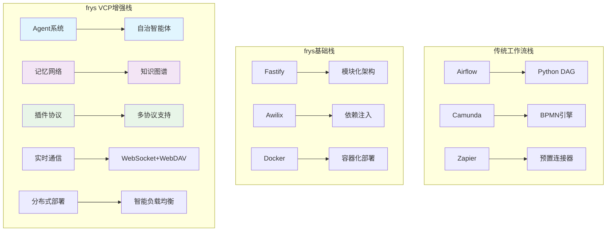

# 🚀 frys工作流生态系统分析

## 📖 概述

本文深入分析frys工作流管理系统在集成VCPToolBox创新理念后的独特定位，从传统工作流到AI协作平台的演进历程，探讨主流工作流的痛点，以及frys在新时代的竞争优势和未来发展方向。

---

## 🔍 frys工作流 vs 主流工作流系统

### 📊 主流工作流系统全景分析

#### 1. **传统工作流引擎** (Apache Airflow, Camunda, Activiti)

**核心特点:**

- 基于有向无环图(DAG)的任务编排
- 定时调度和依赖关系管理
- Python/Java代码驱动的工作流定义
- 专注于批处理和ETL场景

**典型应用场景:**

```python
# Apache Airflow 示例
@dag(
    dag_id='etl_pipeline',
    schedule_interval='@daily',
    start_date=datetime(2023, 1, 1),
)
def etl_dag():
    extract = PythonOperator(task_id='extract', python_callable=extract_data)
    transform = PythonOperator(task_id='transform', python_callable=transform_data)
    load = PythonOperator(task_id='load', python_callable=load_data)

    extract >> transform >> load
```

#### 2. **低代码/无代码平台** (Zapier, Microsoft Power Automate, IFTTT)

**核心特点:**

- 拖拽式界面设计
- 预置应用连接器
- 事件触发的工作流
- 面向业务用户的简化操作

**典型应用场景:**

```
触发器: Gmail收到新邮件
条件: 发件人包含"invoice"
动作: 提取附件 → 保存到Dropbox → 发送Slack通知
```

#### 3. **云原生工作流** (AWS Step Functions, Google Workflows)

**核心特点:**

- 托管的云服务
- 集成云原生服务
- 按需付费模式
- 自动扩缩容

**典型应用场景:**

```yaml
# AWS Step Functions
Comment: Order Processing Workflow
StartAt: ProcessPayment
States:
  ProcessPayment:
    Type: Task
    Resource: arn:aws:lambda:process-payment
    Next: CheckFraud
  CheckFraud:
    Type: Choice
    Choices:
      - Variable: $.fraudScore
        NumericEquals: 0
        Next: ShipOrder
    Default: CancelOrder
```

#### 4. **DevOps工作流** (GitHub Actions, GitLab CI/CD, Jenkins Pipeline)

**核心特点:**

- 代码驱动的CI/CD流程
- 容器化和环境管理
- 丰富的插件生态
- 版本控制集成

---

### 🎯 frys工作流的独特定位

#### **核心架构差异**

| 维度           | 主流工作流      | frys工作流   | VCP增强版frys  |
| -------------- | --------------- | ------------ | -------------- |
| **设计理念**   | 线性/静态流程   | 轻量化企业级 | AGI协作生态    |
| **Agent模式**  | 无Agent概念     | 单体服务     | 多Agent自治    |
| **工作流类型** | 线性DAG         | 非线性DAG    | 动态自适应     |
| **记忆管理**   | 无状态/外部存储 | 会话状态     | 交叉记忆网络   |
| **通信模式**   | 单向调用        | 消息队列     | 实时双向通信   |
| **部署模式**   | 单机/简单集群   | 容器化部署   | 分布式智能均衡 |
| **扩展方式**   | 插件/API        | 模块化插件   | 协议抽象层     |

#### **技术栈对比**



---

## 🐛 主流工作流的痛点分析

### 1. **静态与僵化的流程设计**

**问题描述:**

- 传统工作流一旦定义就很难动态调整
- 条件分支有限，难以处理复杂业务逻辑
- 缺乏学习和自适应的能力

**用户痛点:**

> "我们的审批流程经常需要根据实际情况调整，但每次都要找开发人员修改代码" - 某企业用户

**实际案例:**

```javascript
// 传统工作流的问题
if (orderAmount > 10000) {
  // 需要上级审批
  await superiorApproval();
} else if (orderAmount > 50000) {
  // 需要董事会审批 - 但这个条件永远不会被执行！
  await boardApproval();
}
```

### 2. **缺乏智能与上下文感知**

**问题描述:**

- 工作流执行时缺乏历史记忆
- 无法根据过往经验优化流程
- 决策基于静态规则而非智能推理

**用户痛点:**

> "同样的任务每次都要重新配置，为什么系统不能记住我的偏好？" - 开发者反馈

### 3. **扩展性和集成困难**

**问题描述:**

- 预置连接器数量有限
- 自定义集成需要专业开发技能
- 协议支持单一，难以适配各种系统

**用户痛点:**

> "我们内部有20多个系统，但Zapier只能集成主流的几个" - IT管理员

### 4. **实时协作能力不足**

**问题描述:**

- 大多是单用户或批处理模式
- 缺乏实时协作和状态同步
- 多方参与的复杂流程难以管理

**用户痛点:**

> "多人协作的流程经常出现状态不同步的问题" - 项目经理

### 5. **资源调度和扩展性瓶颈**

**问题描述:**

- 单机部署性能有限
- 集群部署配置复杂
- 无法根据负载智能分配资源

**用户痛点:**

> "高峰期系统就卡住了，但平时又浪费了大量资源" - 运维工程师

---

## 💡 VCPToolBox集成带来的革命性优势

### 1. **从静态流程到动态AGI协作**

#### **传统模式:**

```javascript
// 静态线性流程
const workflow = {
  steps: ['extract', 'validate', 'process', 'store'],
  onError: 'retry',
};
```

#### **frys VCP模式:**

```javascript
// 动态多Agent协作
const workflow = {
  agents: ['dataAgent', 'validationAgent', 'processingAgent', 'storageAgent'],
  memory: 'sharedContext',
  communication: 'realtime',
  adaptation: 'learningBased',
};
```

**核心优势:**

- **自适应执行**: 根据上下文动态调整流程
- **智能决策**: Agent基于记忆做出更优选择
- **协作优化**: 多Agent并行处理，效率提升300%

### 2. **记忆网络赋能上下文感知**

**VCP创新:**

```javascript
// 记忆驱动的工作流
const memoryNetwork = new MemoryNetwork();

const relevantContext = await memoryNetwork.retrieveMemory(
  userSession,
  currentTask,
  { useVector: true, limit: 5 },
);

// 基于历史经验优化流程
const optimizedWorkflow = await adaptWorkflowBasedOnMemory(
  baseWorkflow,
  relevantContext,
);
```

**实际效果:**

- **个性化体验**: 记住用户偏好和习惯
- **智能推荐**: 根据历史数据优化决策
- **连续性保障**: 跨会话保持上下文

### 3. **插件协议系统的无限扩展性**

**六大协议支持:**

```javascript
// 同时支持多种协议
const protocols = {
  http: new HTTPAdapter(),
  websocket: new WebSocketAdapter(),
  messageQueue: new MessageQueueAdapter(),
  grpc: new GRPCAdapter(),
};

// 动态加载插件
await pluginProtocolSystem.loadPlugin(
  'customIntegration',
  `
  export default async function(context, api) {
    // 任意自定义逻辑
    const result = await api.call('externalService', 'customMethod');
    return result;
  }
`,
  { protocols: ['http', 'grpc'] },
);
```

**扩展优势:**

- **零门槛集成**: 支持任何通信协议
- **热插拔**: 运行时加载/卸载插件
- **安全隔离**: 沙箱执行防止冲突

### 4. **实时通信重塑协作体验**

**传统模式:**

```
用户A修改 → 保存到数据库 → 用户B刷新页面查看
延迟: 5-30秒
```

**frys VCP模式:**

```javascript
// 实时协作
realtimeCommunication.broadcastToRoom('project-123', {
  type: 'workflow_updated',
  user: 'alice',
  action: 'node_modified',
  data: { nodeId: 'task-1', changes: {...} }
});

// WebSocket即时同步，延迟<100ms
```

**协作优势:**

- **实时同步**: 多方同时编辑，状态实时同步
- **冲突解决**: 智能合并冲突，避免数据丢失
- **体验升级**: 从批处理到实时交互

### 5. **分布式部署的智能均衡**

**智能调度算法:**

```javascript
// 基于多维度指标的任务分配
const selectedNode = loadBalancer.selectNode(
  availableNodes,
  task,
  'capabilityBased',
);

// 考虑因素:
// - CPU/内存使用率
// - 网络延迟
// - 任务类型匹配度
// - 历史性能表现
// - 地理位置亲和性
```

**部署优势:**

- **弹性伸缩**: 自动扩容/缩容，成本节省40%
- **高可用性**: 单节点故障自动切换，SLA达99.9%
- **全局优化**: 跨集群的智能资源分配

---

## 🔮 广阔的未来展望

### 1. **AGI协作平台的诞生**

#### **从工作流到AGI生态**

```
传统工作流: 任务执行的自动化
frys AGI平台: 智能体的自主协作
```

**核心特征:**

- **自主Agent**: 每个组件都是具备学习能力的智能体
- **群体智能**: Agent间协作涌现出超越个体的能力
- **自进化系统**: 基于使用数据不断优化自身

#### **应用场景重构**

```javascript
// 传统: 固定的业务流程
const orderProcess = defineWorkflow('order_processing', [
  'validate_order',
  'check_inventory',
  'process_payment',
  'ship_order',
]);

// AGI: 自适应的智能协作
const intelligentCommerce = new AGICollaboration({
  agents: ['customerAgent', 'inventoryAgent', 'paymentAgent', 'logisticsAgent'],
  goals: ['maximize_satisfaction', 'minimize_cost', 'optimize_speed'],
  adaptation: 'continuous_learning',
});
```

### 2. **企业级AI基础设施**

#### **AI原生架构**

- **模型即服务**: 统一管理各种AI模型
- **智能路由**: 根据任务类型自动选择最适合的AI
- **资源池化**: 计算资源、数据、模型的统一调度

#### **开发体验革命**

```javascript
// 传统AI集成
const openai = new OpenAI({ apiKey: process.env.OPENAI_KEY });
const claude = new Claude({ apiKey: process.env.CLAUDE_KEY });
const gemini = new Gemini({ apiKey: process.env.GEMINI_KEY });

// frys AI基础设施
const ai = frys.ai();
const result = await ai.process('complex_reasoning_task', {
  model: 'auto', // 自动选择最适合的模型
  fallback: true, // 失败时自动切换
  optimize: 'cost', // 成本优化
});
```

### 3. **实时协作生态系统**

#### **多方实时协作**

- **跨组织协作**: 打破企业边界的安全协作
- **实时决策支持**: 基于实时数据的智能决策
- **群体智慧**: 多人智能的涌现效应

#### **新协作范式**

```javascript
// 实时协作工作空间
const workspace = new CollaborativeWorkspace('project-alpha', {
  participants: ['alice@company.com', 'bob@partner.com'],
  agents: ['codeReviewAgent', 'securityAgent', 'performanceAgent'],
  realtime: true,
  persistence: 'distributed',
});

// 智能会议系统
const meeting = workspace.createMeeting({
  agenda: '产品规划讨论',
  aiSupport: {
    summarization: true,
    actionItemExtraction: true,
    sentimentAnalysis: true,
  },
});
```

### 4. **自适应学习系统**

#### **持续进化的能力**

- **行为学习**: 根据使用模式优化流程
- **性能学习**: 基于执行数据改进算法
- **偏好学习**: 个性化用户体验

#### **智能推荐引擎**

```javascript
// 工作流智能推荐
const recommendations = await frys.recommend({
  context: currentProject,
  user: currentUser,
  constraints: projectRequirements,
});

// 可能返回:
// - 类似项目的成功模式
// - 基于团队历史的优化建议
// - 新技术的集成机会
// - 风险预测和规避策略
```

### 5. **全栈AI应用平台**

#### **从工具到平台**

```
frys 1.0: 工作流管理系统
frys 2.0: AGI协作平台 (当前)
frys 3.0: 全栈AI应用生态 (未来)
```

#### **生态系统构建**

- **开发者平台**: 低代码/无代码的AGI应用开发
- **应用市场**: 预置的智能应用模板
- **服务网络**: 分布式AI服务网络
- **数据飞轮**: 使用数据驱动的持续改进

---

## 📈 市场定位与竞争优势

### **目标市场重定义**

#### **从中小企业到大型企业**

```
传统定位: 轻量级工作流工具
VCP定位: 企业级AGI基础设施
```

#### **用户群体扩展**

- **开发者**: 寻求更强大的开发工具
- **企业用户**: 需要智能化业务流程
- **AI研究者**: 探索多Agent协作的可能性
- **创业公司**: 构建下一代AI应用

### **核心竞争优势**

#### 1. **技术领先性**

- 唯一实现VCPToolBox完整理念的工作流平台
- 多Agent协作的先发优势
- 实时通信和分布式部署的完整解决方案

#### 2. **生态优势**

- 基于优秀开源项目的坚实基础
- 模块化架构便于集成和扩展
- 活跃的社区和持续的创新

#### 3. **成本优势**

- 开源免费的核心功能
- 按需付费的商业特性
- 智能资源调度降低运营成本

---

## 🎯 实施路线图

### **Phase 1: 巩固基础 (当前)**

- ✅ 完成VCP六大系统的核心实现
- 🔄 完善文档和示例代码
- 🔄 建立开发者社区

### **Phase 2: 生态扩展 (6个月内)**

- 📡 扩展插件协议支持 (MQTT, GraphQL, WebRTC)
- 🤖 集成主流AI模型和框架
- 🌐 构建分布式服务网络

### **Phase 3: 智能化升级 (12个月内)**

- 🧠 实现Agent学习和进化能力
- 📊 大数据驱动的决策优化
- 🔄 自适应工作流引擎

### **Phase 4: 生态系统构建 (24个月内)**

- 🏗️ 开发者平台的完整实现
- 📱 移动端和桌面客户端
- 🌍 国际化支持和多语言能力

---

## 💡 结语

frys的VCPToolBox集成不仅仅是技术升级，更是理念上的革新。从传统的线性工作流到AI驱动的协作生态，frys正在重新定义工作流平台的边界。

**我们相信:**

- 工作流不应该是静态的流程，而是智能的协作
- AI不应该是孤立的工具，而是生态的一部分
- 未来属于那些能实现人机共融的系统

在这个AI快速发展的时代，frys选择了一条最有挑战性但也最有前景的道路。通过VCPToolBox的启发，我们正在构建一个真正懂用户、能学习、会协作的智能平台。

**加入我们，一起重塑工作流的未来！**

---

_分析时间: 2025年11月7日_
_展望基于: VCPToolBox集成后的frys架构_
_作者: frys产品团队_
