# frys 系统架构图

## 概述

本文档提供了frys系统的完整架构视图，包括系统组件、数据流、部署架构和扩展策略。

## 系统总体架构

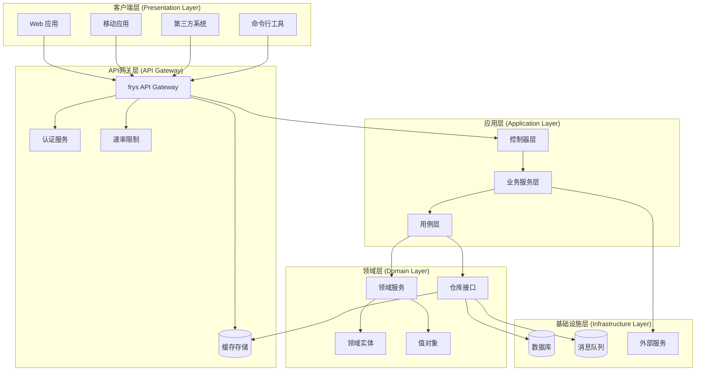

## 六边形架构 (Hexagonal Architecture)

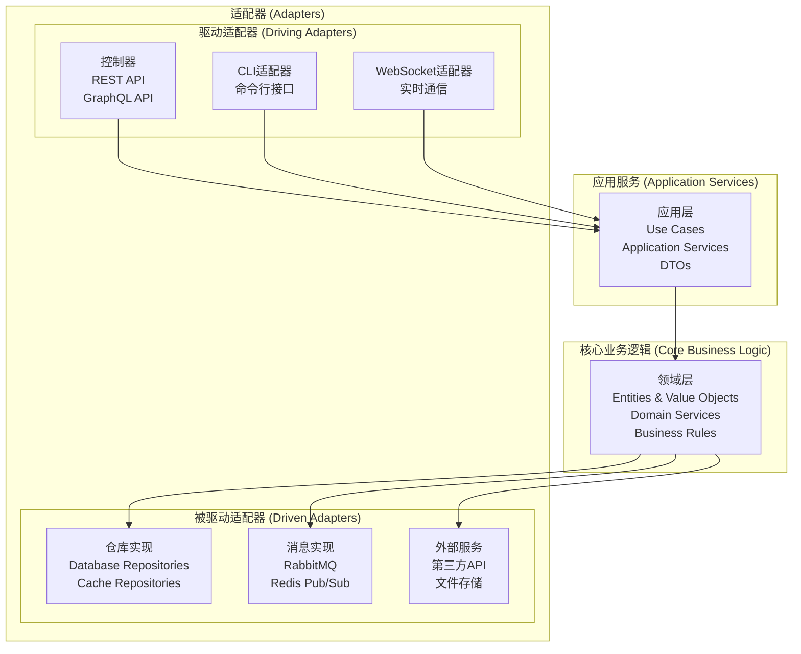

## 微服务架构视图

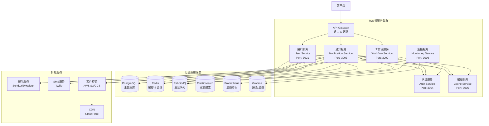

## 数据流架构

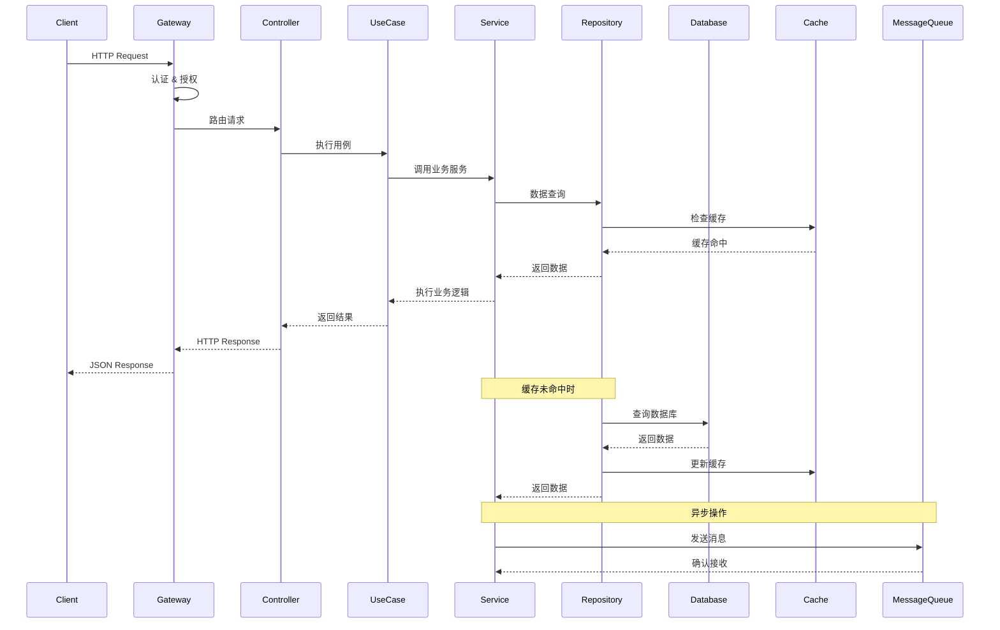

## 部署架构

### 单机部署架构

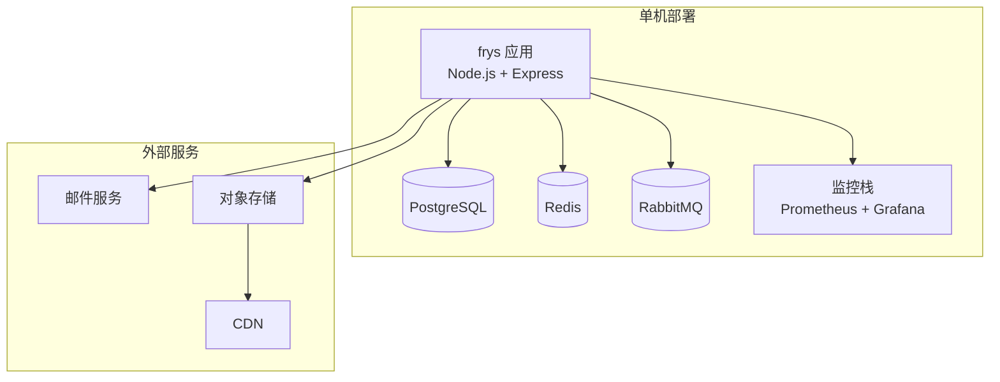

### 容器化部署架构

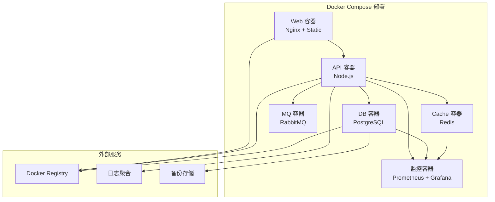

### Kubernetes 部署架构

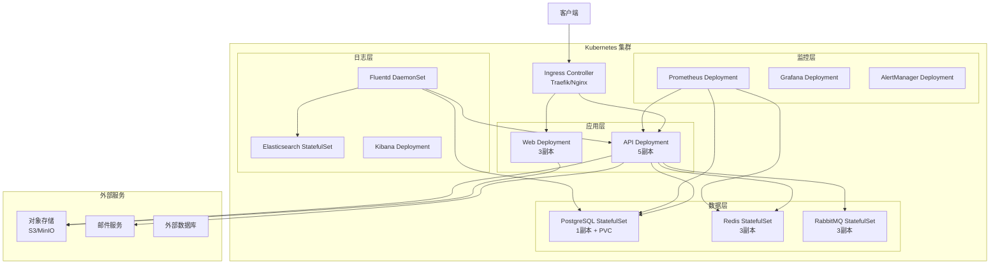

## 组件详细架构

### 缓存系统架构

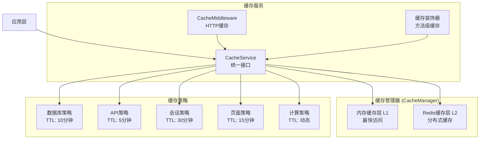

### 监控系统架构

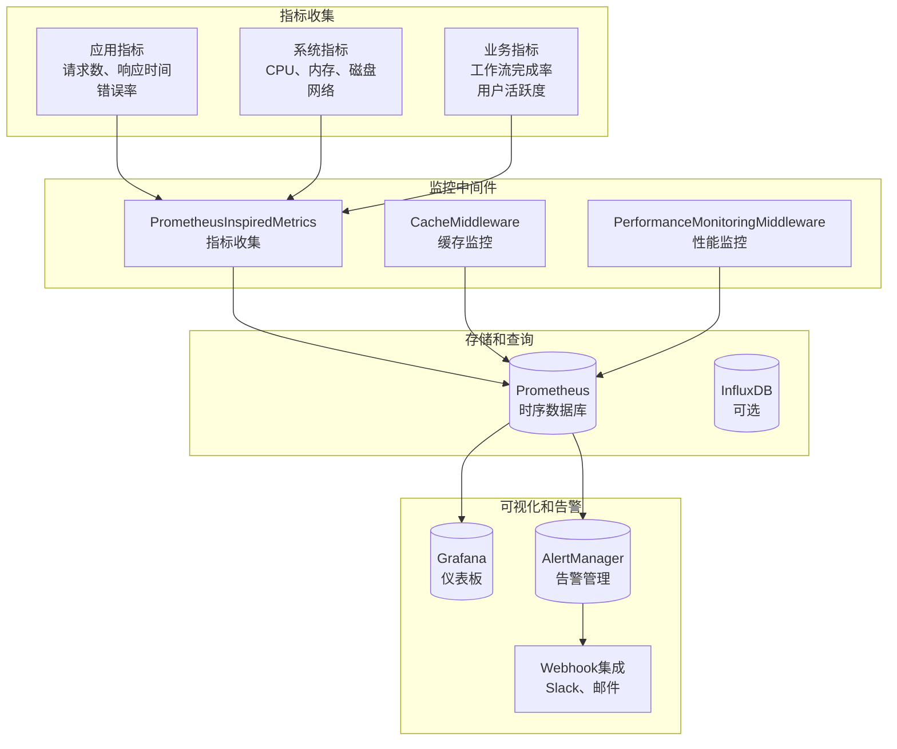

## 安全性架构

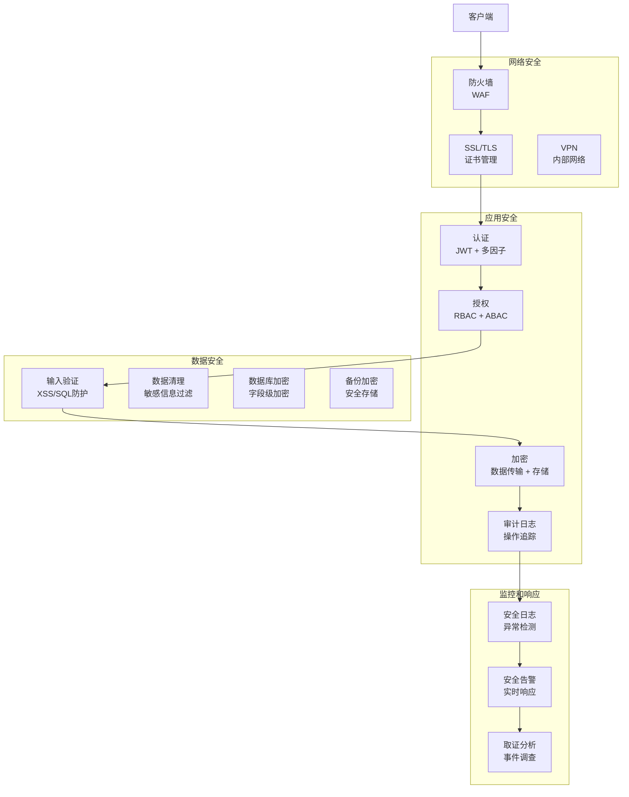

## 扩展策略

### 水平扩展

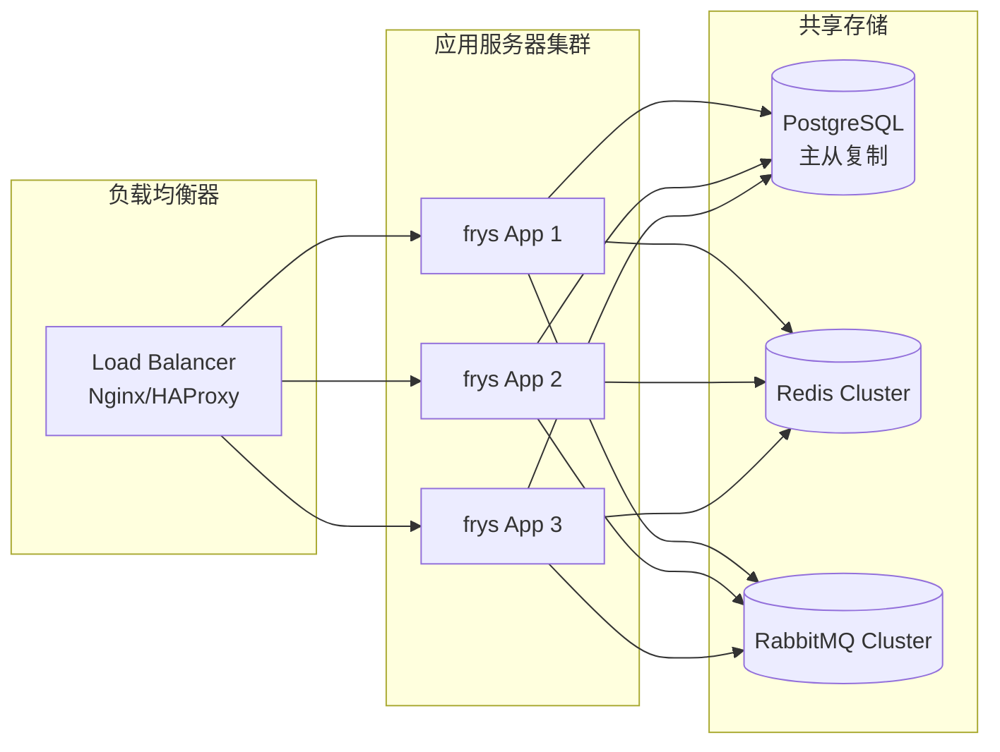

### 垂直扩展

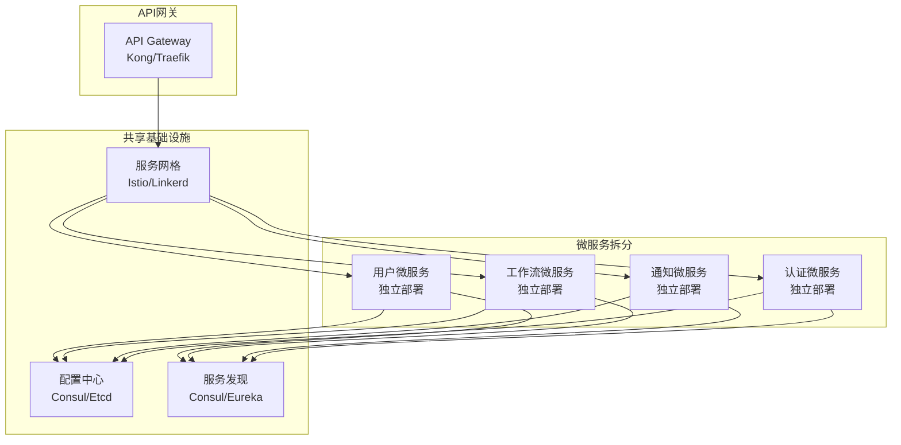

## 性能优化架构

```mermaid
graph TB
    subgraph "缓存策略"
        MULTI_LEVEL[多级缓存<br/>L1内存 + L2 Redis]
        SMART_TTL[智能TTL<br/>基于访问模式]
        PREWARMING[缓存预热<br/>启动时预热]
        INVALIDATION[智能失效<br/>事件驱动]
    end

    subgraph "数据库优化"
        CONNECTION_POOL[连接池<br/>连接复用]
        QUERY_OPTIMIZATION[查询优化<br/>索引 + 分页]
        READ_REPLICA[读写分离<br/>读副本]
        SHARDING[分片策略<br/>水平扩展]
    end

    subgraph "应用优化"
        ASYNC_PROCESSING[异步处理<br/>消息队列]
        BATCH_OPERATIONS[批量操作<br/>减少IO]
        COMPRESSION[响应压缩<br/>Gzip/Brotli]
        CDN[CDN加速<br/>静态资源]
    end

    subgraph "监控优化"
        METRICS_COLLECTION[指标收集<br/>性能监控]
        PROFILING[性能剖析<br/>热点分析]
        AUTO_SCALING[自动扩缩容<br/>智能调度]
    end

    MULTI_LEVEL --> APP[应用性能]
    SMART_TTL --> APP
    PREWARMING --> APP
    INVALIDATION --> APP

    CONNECTION_POOL --> DB[数据库性能]
    QUERY_OPTIMIZATION --> DB
    READ_REPLICA --> DB
    SHARDING --> DB

    ASYNC_PROCESSING --> ASYNC[异步性能]
    BATCH_OPERATIONS --> ASYNC
    COMPRESSION --> NETWORK[网络性能]
    CDN --> NETWORK

    METRICS_COLLECTION --> MONITOR[监控性能]
    PROFILING --> MONITOR
    AUTO_SCALING --> MONITOR
```

## 故障恢复架构

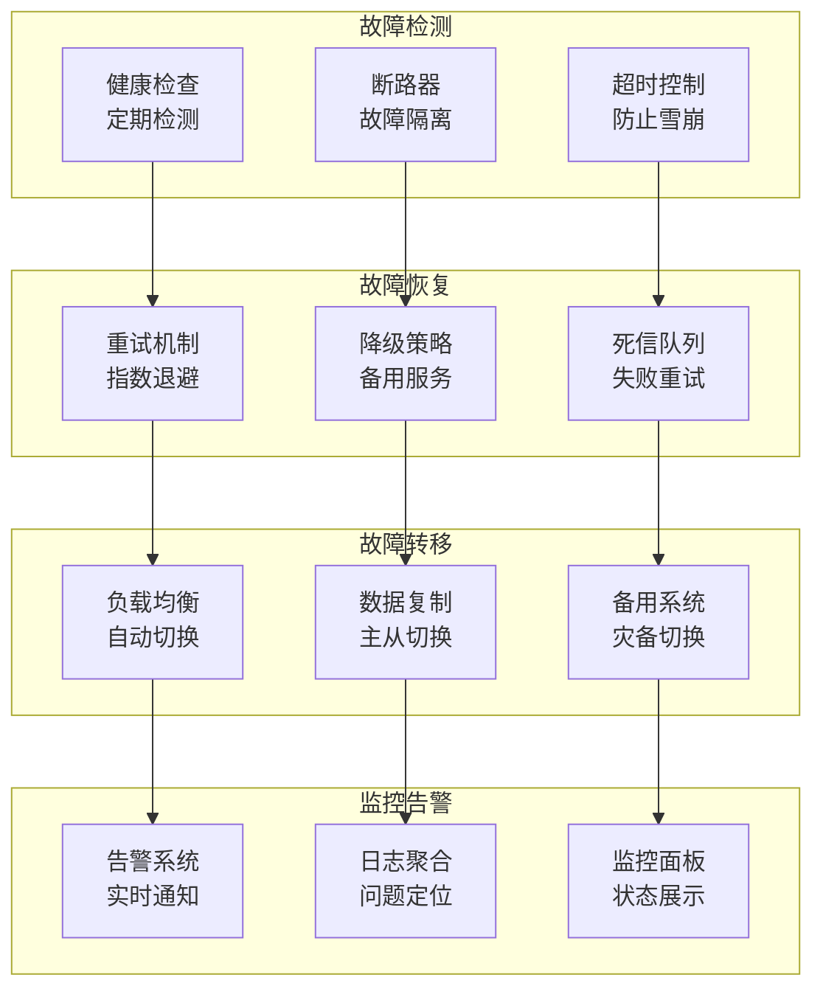

## 总结

frys采用了分层的六边形架构设计，具有以下特点：

### 架构优势
- **清晰分层**: 严格的关注点分离
- **依赖倒置**: 核心业务不依赖外部实现
- **易于测试**: 每个层都可以独立测试
- **灵活扩展**: 新功能可以通过适配器添加
- **技术栈无关**: 核心业务逻辑不绑定特定技术

### 扩展性
- **水平扩展**: 通过负载均衡和集群
- **垂直扩展**: 通过微服务拆分
- **技术升级**: 通过适配器模式平滑迁移

### 可靠性
- **故障隔离**: 断路器和超时控制
- **自动恢复**: 重试和降级策略
- **数据一致性**: 事务管理和补偿机制

### 可观测性
- **全面监控**: 应用、系统、业务指标
- **分布式追踪**: 请求链路追踪
- **智能告警**: 基于阈值的自动告警

这种架构设计确保了系统的高性能、高可用性和易维护性，为企业级应用提供了坚实的技术基础。
